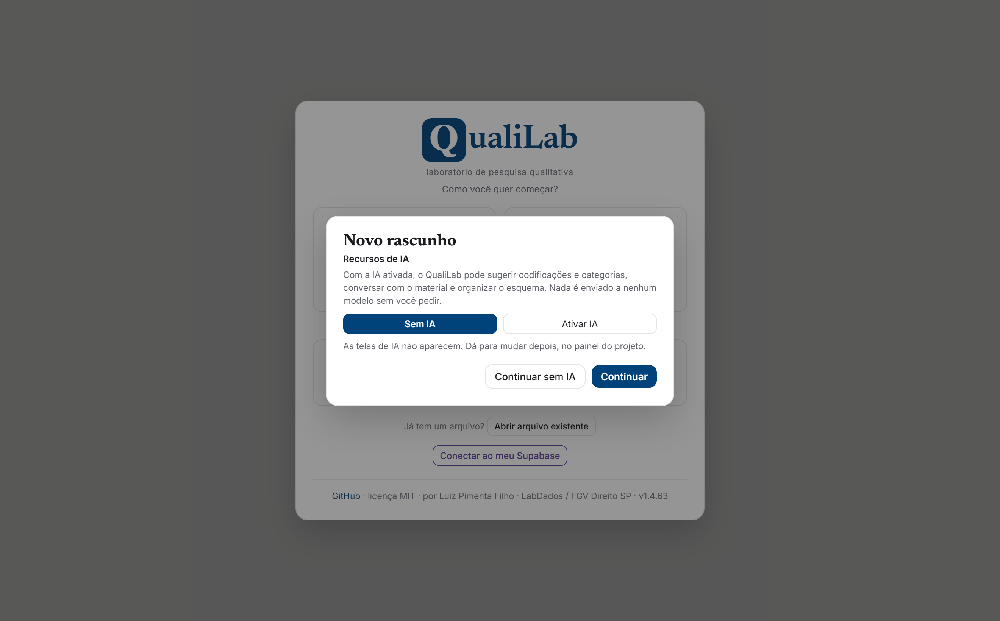

  

# QualiLab Manual

**A complete usage guide, from first access to publishing your results.**

🇧🇷 [Versão em português](MANUAL.md)

> 🌐 **A note on language.** Since v1.4.48 the **application interface exists in English**, and it follows your browser; the picker in **My account** overrides that (see [section 14](#14-my-account)). This manual gives the original Portuguese label in quotes wherever it helps — the **screenshots still show the Portuguese interface**, so use the quotes to match the images, and the images for layout rather than for wording.

This manual teaches you to *use* QualiLab step by step. For the feature list and the technical side (installation, Supabase, formats), see the [README](../README.en.md). To contribute code, see the [repository on GitHub](https://github.com/LuizPF42/QualiLab).

> QualiLab runs entirely in the browser, in a single file. There is no installation, no mandatory login, no server of its own. You can start right now at **[luizpf42.github.io/QualiLab](https://luizpf42.github.io/QualiLab)**. Want to try it before reading? **[Your first 5 minutes](#your-first-5-minutes)** get you coding right away.

---

## Contents

> ⚡ **In a hurry?** [**Your first 5 minutes**](#your-first-5-minutes), right below, get you coding before any reading. Come back later to go deeper.

0. [The idea behind QualiLab](#0-the-idea-behind-qualilab): what it is for, which problems it attacks, how to plan your use
1. [Core concepts](#1-core-concepts): the mental model before anything else
2. [Getting started](#2-getting-started): accessing, choosing where to save, creating a project
3. [The interface](#3-the-interface): header, resizing panels, keyboard and accessibility
4. [Documents](#4-documents): uploading, pasting, renaming, editing the text, viewing the original PDF and OCR
5. [Coding passages](#5-coding-passages): the heart of the tool
6. [Attributes (per-document fields)](#6-attributes-per-document-fields)
7. [Scheme](#7-scheme): organizing codes and attributes in bulk
8. [Reconciliation](#8-reconciliation): consolidating the reference layer (collective project)
9. [Reading](#9-reading): reading the corpus and the coded passages
10. [Charts](#10-charts)
11. [Memos](#11-memos): analytic notes
12. [Report](#12-report): the publication and transparency hub
13. [Collaboration](#13-collaboration): team, roles, invitations, assignment and blind coding
14. [My account](#14-my-account)
15. [Import and export](#15-import-and-export)
16. [Saving, backup and storage modes](#16-saving-backup-and-storage-modes)
17. [Coding and Analyzing with AI](#17-coding-and-analyzing-with-ai): optional AI (BYOK), opt-in and transparent
18. [Troubleshooting](#18-troubleshooting)
19. [Keyboard shortcuts](#19-keyboard-shortcuts)
20. [Glossary](#20-glossary)

---

## Your first 5 minutes

*Want to get a feel for the tool before diving into method? This is the shortest path to your first code — no account, no installation.*

1. Open **[luizpf42.github.io/QualiLab](https://luizpf42.github.io/QualiLab)** and click **Just try it (draft)** ("Só testar (rascunho)"): a project opens right away, in this browser only.
2. On the **Coding** tab ("Codificação"), click **paste text** ("colar texto") and paste a passage: an interview quote, a paragraph of a court ruling, a news story (or use **＋ upload** ("＋ enviar") for a `.txt`, `.pdf` or `.docx`).
3. **Select** with the mouse a sentence that catches your attention, **right-click** it and choose **+ Create new code** ("+ Criar novo código"). Name the theme (e.g. *access to justice*) and click **Create and apply** ("Criar e aplicar"). Done — your first coded passage.
4. Code a few more passages: **repeat the same code** where the theme returns, **create others** where new themes appear.
5. Open the **Reading** tab ("Leitura"), go to **Passages** ("Trechos") and click your code: every passage you marked appears together, side by side. That is your analysis starting to take shape.

> Liked it? Before going far, decide **where to save** your work (the draft is ephemeral — [section 16](#16-saving-backup-and-storage-modes)) and read **[section 0](#0-the-idea-behind-qualilab)** to get the most out of the tool. The rest of the manual goes deeper into each of these steps.

---

## 0. The idea behind QualiLab

*If you landed here out of nowhere, start with this section: it explains what QualiLab is for, which problems it attacks and how to put it to good use, so you can plan before you start clicking.*

### In one sentence

QualiLab is your **qualitative research laboratory in a single file**: you open a document, select a passage and you are already coding — and you have a place to **experiment** with the material (read, visualize, cross-reference, test ideas) and to **turn** the result into something other people can read and build on.

### The spirit: a laboratory, not a dead archive

The name is not decoration. A laboratory is where you **experiment**: you raise a hypothesis, mix materials, test an idea, discard what does not hold and turn what remains into something useful. QualiLab is built for that back-and-forth — not to "store" the analysis, but to **work** it.

That is why **Reading**, **Charts** and the **Interactive Report (ATI)** are not accessories bolted on at the end of the process: they are the laboratory's benches. In **Reading** you re-read the whole document with the highlights in context, or gather every passage of one code; in **Charts** you raise and knock down hypotheses looking at frequencies, coverage and co-occurrences; in the **Report** you **turn exploration into a product**: a finished report, an interactive page, a set of annotations. Exploration on one side, product on the other, and the path between the two short enough for you to go back and forth as many times as you need.

### The problems it attacks

Qualitative data analysis (QDA) tends to charge dearly in three currencies. QualiLab was designed against all three:

1. **Cost and barrier to entry.** The reference tools (ATLAS.ti, MAXQDA, NVivo) are expensive, closed, and have a learning curve that consumes hours *before* the first analysis begins. QualiLab is **free, open source (MIT), and opens directly**: no installation, no server of its own, no subscription. Load a document, select, code.

2. **The parallel spreadsheet.** Thematic coding in one tool; structured attributes (year, source, court, interviewee profile) in a separate spreadsheet. QualiLab **integrates the two**: **passage** codes (what the text says) and document **attributes** (what the document is) live in the same environment, with no tool switching.

3. **The evidence left behind.** A strong qualitative argument becomes even stronger when the reader can **see the material that supports it** — but showing that path has always been laborious: locked inside expensive tools or scattered across loose files. QualiLab shortens it: coding, attributes, memos and reconciliation are **explicit and exportable**, and you can publish them in open standards (ATI / W3C Web Annotation), **to the extent and in the format you choose**, with no vendor dependency.

### What it is for

Any **text** corpus you want to interpret systematically: interviews and transcripts, court rulings and legal filings, public policy documents, news, open-ended survey answers, minutes, reports, literature. It works solo or in a team, online or fully offline.

### What good research with QualiLab aims for

Think of these as **goals** that guide your use — not features, but what you are building:

- **Claims with grounding.** Every point supported by concrete passages, which you can show whenever you want to give the argument weight.
- **Interpretive depth _and_ structured comparability.** Memos and rich coding capture meaning; attributes let you count, cross-reference and compare. Both sides of qualitative research, in the same place.
- **Explicit authorship and inter-coder agreement.** In a team, each person codes in their own layer and the group consolidates a reference layer in Reconciliation: **disagreement becomes data**, not noise swept under the rug.
- **Control over your data.** You choose where it lives, and you know what each option implies (see *Sensitive data and responsibility*, below).

### Transparency in service of your argument

A word about transparency, because the term is loaded. Here it does **not** mean accountability, nor a promise of "replicating" an interpretive analysis: that would measure qualitative research with a yardstick that is not its own. The idea is simpler and more in your favor: **showing the evidence next to your reading of it strengthens what you argue.** When the reader can walk through the passages that support a finding, your argument gains credibility — without you giving up a comma of your interpretation.

And always with the precautions qualitative research demands: meaning is situated and constructed, not everything can or should be exposed, and the confidentiality of sources comes before anything else. That is why, in QualiLab, transparency is **optional, gradual and yours**: you decide what to show, to whom and when, and passages marked as **redaction** come out masked by default. The tool provides the means; the judgment is yours.

### Sensitive data and responsibility

Before loading any material, decide **how much of the tool you can use**, because that depends on the **sensitivity of the data**, and it is not a neutral side choice. The golden rule: **the material only leaves your device if you let it** — when working in the **cloud** (it syncs via Supabase), when using **remote AI** (it goes to the provider you choose) or when **publishing** a report. In **file** and **draft** modes, and with **local AI**, nothing leaves your computer.

> **Practical rule (safe-by-default):** when in doubt, treat the material as more sensitive. **Public or synthetic** data allows everything; **sensitive** data calls for file mode and, if using AI, **your own** key (preferably paid/institutional) with the redaction checked; **restricted** data (an ethics board that forbids it leaving, identifiable health data, sealed court records) stays **offline**, with no cloud and no remote AI. And remember: **redaction masks only what you marked by hand** (it is not automatic anonymization) and the **anonymize** option in exports merely omits authorship. The **full decision matrix** and what redaction does **not** do are in [section 16](#16-saving-backup-and-storage-modes). Read it before choosing where to save.

> **Legal notice.** QualiLab is a **personal** project, distributed under the **MIT license, without any warranty**. It does not represent the position of, nor imply any responsibility of, any institution (including FGV). The author accepts no liability for data loss, leakage or misuse. Use it at your own risk, with the ethical and legal precautions your research requires.

### How to plan your use (a minimal roadmap)

1. **State the goal** of the research in a **project memo** ([section 11](#11-memos)). It guides the coding — and it also guides the AI.
2. **Choose where the data lives** ([section 16](#16-saving-backup-and-storage-modes)) according to the sensitivity of the material and whether there is a team (re-read *Sensitive data and responsibility*, above).
3. **Choose the project type**, individual or collective ([section 2](#2-getting-started)).
4. **Bring in the documents** and fill in the **attributes** you will want to compare later ([sections 4](#4-documents) and [6](#6-attributes-per-document-fields)).
5. **Code** — let the codes emerge (inductive) or follow a prior scheme; record decisions in memos ([section 5](#5-coding-passages)).
6. **Reconcile** (in a team) or review (solo) ([section 8](#8-reconciliation)).
7. **Experiment and publish** — explore in Reading and Charts and turn it into a product through the Report ([sections 9](#9-reading)–[12](#12-report)).

### How QualiLab was made (and what to expect)

It is worth being honest about the tool's origin. QualiLab was written, **for the most part, with [Claude Code](https://claude.com/claude-code)** (Anthropic's programming AI), **guided by the author** from real problems found in his own research practice and in dialogue with the community and the qualitative methods literature. In part, the project is itself an experiment on a question: **how far can a guided AI be turned into a research tool?**

Two honest consequences follow: **bugs are to be expected** (it is young software, under active development) and **improvements are constant**. Save your work often ([section 16](#16-saving-backup-and-storage-modes)) and, if you find a problem or have an idea, report it at [github.com/LuizPF42/QualiLab](https://github.com/LuizPF42/QualiLab/issues). That feedback is part of how the tool evolves.

### A word about the AI inside QualiLab

Consistent with the above, QualiLab incorporates AI as an **assistant, never as a substitute for the researcher's judgment**, under three non-negotiable rules. **Opt-in:** AI ships off by default; nothing is sent to a model without you asking, analysis by analysis. **Transparency:** you can see the exact prompt, the AI returns **proposals** you approve or reject one by one, and it is required to **cite the source** (passage and document) of every observation. **Control:** passages marked as redaction are masked before any sending, and you use the project's key/model or **your own**. The AI speeds up reading and organizing; interpretation and decision remain yours. Details in [section 17](#17-coding-and-analyzing-with-ai).

---

## 1. Core concepts

Before clicking any button, five ideas are worth understanding. They repeat across every screen.

### Document
A text to be analyzed: an interview, a court ruling, an article, a transcript. You import it (`.txt`, `.md`, `.docx`, `.pdf`) or paste the text directly. Each row of a spreadsheet (`.csv`/`.xlsx`) can also become a document.

### Code
A label you apply to **passages** of the text ("this paragraph is about *access to justice*"). Codes are **hierarchical**: a code can hold subcodes, and those can hold their own. The **color** comes from the family (the hue) and the **shade** indicates depth. It is classic QDA thematic coding.

### Code and family: one rule only

> **A code either groups other codes, or receives passages. Never both.**

Whatever has subcodes is a **family**: it organizes, and for that reason does not receive passages directly. Whatever has no subcodes receives passages — whether a **top-level** code ("Hierarquia 0", loose at the top) or a **subcode** inside a family. The tree makes this visible: a family shows a **hollow** color swatch, outline only; whatever receives passages shows a **filled** one. In the Map, the same thing with the bubbles.

**Why this rule exists.** Without it, a code can end up being both things at once — having subcodes *and* passages of its own — and then every count becomes ambiguous: when the family shows "23", is that its own passages, its children's, or the sum? Worse, the same question reaches the analysis: comparing "Risks" with "Adoption", you are comparing sets that are not of the same kind. This is why ATLAS.ti and QualCoder also separate the two, and their argument is **methodological**, not technical.

In QualiLab the family shows the **sum of its subcodes** (the number includes the children; the tooltip says so). It keeps telling you how much that theme weighs in the material, without having passages of its own.

**You do not have to decide any of this up front.** Create codes freely while you read; a new code is born simple and receives passages. The family appears **when you decide to subdivide**: the moment a code gets its first subcode, it becomes a family — and, if it already had passages of its own, QualiLab asks right there where they should go (see [5.1](#51-creating-codes) and [7.2](#72-codes-bulk-reorganization)). Nothing is moved without you seeing it.

> **About depth.** QualiLab allows as many levels as you want (`Adoption ▸ Gains ▸ Acceleration`). The literature recommends parsimony: Bazeley suggests something like 10 to 25 top-level families and **2 to 3 levels** in total. Deeper than that and codes tend to duplicate at the lower levels, which hurts precisely the comparison coding is meant to enable.

### Attribute (per-document field)
Different from a code: a attribute describes the **whole document**, not a passage. "Year", "Court", "Source type", "Interviewee gender". It is what usually becomes a column in a parallel spreadsheet; here it is integrated. There are seven types (Closed Text, Open Text, Number, Date, Yes/No, Multiple Choice, Checkbox).

> **Code × Attribute, in one sentence:** a *code* marks a **piece** of the text; a *attribute* answers a question about the **whole document**.

> **If you come from another tool, watch the word "attribute".** It is a false friend. Here it means **document attribute**; in two of the most used tools it means the **opposite**: a grouper of codes.

| In QualiLab | MAXQDA | NVivo | QualCoder | ATLAS.ti |
|---|---|---|---|---|
| **attribute** (document attribute) | document variable | attribute (in a case classification) | attribute | *does not exist*; becomes a **document group** |
| **family** (code with subcodes) | code and subcodes | parent node and child nodes | **attribute** | **attribute** |

ATLAS.ti is the only one of the four with no document attribute: its manual recommends using **document groups** instead ("document groups can be regarded as attributes or variables"). That is why, when exporting to it, each attribute value becomes a separate group, and a free-text attribute ends up generating one group per document. It is not an export defect: it is the only representation its model admits.

On the **way back** the path is the same, inverted: when importing a `.qdpx`, each **document group** becomes a value of a *Checkbox* attribute (a document can be in several groups, and all of them show). When the group is named in the `Attribute::Value` format, the original attribute is rebuilt under its own name. A **code group does not become a family**, because here the family is defined by the code's own hierarchy: the import summary lists by name the code groups left out, so you can recreate them as subcodes if you want.

### Layers and authorship
Every coding and every attribute answer records **who** made it. There are two layers:

- **Individual**: each researcher's work, kept separate.
- **Final (reference layer)**: the team's consolidated version.

In an **individual project**, everything goes straight to the reference layer. In a **collective project**, each person works in their own individual layer and the team consolidates the reference layer on the **Reconciliation** screen.

### Roles (collective project)
- **Admin**: defines the attribute scheme, edits the reference layer, manages members, sets family colors and **redaction**, edits document **text**, **imports** material and performs the **structural and destructive** operations: **deleting** documents or codes and **merging** codes (which affect the whole team's work).
- **Member**: codes in their own layer, fills in their own attribute answers, **creates and renames** codes, and writes memos.
- **Read-only**: reads the whole project — documents, codes, the team's codings, attributes, charts, Reconciliation and Report — and **writes memos**. They do not code, do not answer attributes, do not touch the scheme, do not upload documents and do not import; the AI screens do not appear for them. This is the role for a **supervisor**, a **reviewer**, or the colleague you ask for a second reading: their opinion comes back to the team through the memos, inside the project. **Blind coding** and **assignment** restrictions apply to them exactly as they apply to a member.

> **How to assign it:** in **Project ▸ Members** ("Projeto ▸ Membros"), the admin clicks **make read-only** on that person's row (and **give coding back** to undo it). They join the project with the usual access code. A project is never left without an admin: the button refuses to demote the last one. And the **study's configuration** — the AI instructions, the stance, the saved prompts and the words ignored in the word cloud — is stored as memos but is **not** commentary: it stays with whoever coordinates the project.

> These restrictions are enforced by the **server**, not merely hidden in the interface: a member cannot (not even by calling the API directly) write to the reference layer, delete documents/codes, edit shared text, remove a code's redaction or import. Those actions require the admin role.

> Where the data lives (cloud, browser or a file on disk) is a choice **separate** from the project type. See [section 16](#16-saving-backup-and-storage-modes).

---

## 2. Getting started

> **Before loading material, a choice that cannot be undone for free: where your data will live.** In short: **file** and **draft** stay on your device and do not leave it; the **cloud** syncs across people and devices, which makes the content readable by whoever administers the database. The full matrix, by material sensitivity, is in [section 16](#16-saving-backup-and-storage-modes) — and the rule is **when in doubt, treat the material as more sensitive**.

### 2.1. How to access

| Way | How | When to use |
|---|---|---|
| **Online** | Open [luizpf42.github.io/QualiLab](https://luizpf42.github.io/QualiLab) | The normal path |
| **Installed (offline)** | [Install it as an app](#install-as-an-app-and-open-without-internet) — on Windows, **through Edge** | Opens without internet, own window, double-click on `.qualilab` files |
| **Single file** | [Download the `index.html`](https://github.com/LuizPF42/QualiLab/releases/download/alpha/index.html) and double-click it | No internet and nothing to install; sensitive data |

Once the single file is downloaded, it opens straight in the browser (`file://`) with no server needed. It only fetches the external libraries from the internet **the first time**. (If your browser policy blocks it, serve it with `python -m http.server 8000` in the file's folder.)

> **Chrome or Edge** are recommended: only they support **local File mode** (saving a `.qualilab` visible on disk) and the **automatic folder backup**. Firefox and Safari work, but fall back to draft mode (`localStorage`).

### 2.2. The entry screen

The first screen offers three paths (with the logo at the top):

1. **New file project** ("Novo em arquivo"): creates a project saved as a `.qualilab` file on your disk (Chrome/Edge): portable, offline, no cloud. Ideal for sensitive data.
2. **Sign in to the cloud** ("Entrar na nuvem"): leads to **login** (**Continue with Google**, or e-mail and password; or **Create account** ("Criar conta") on the same screen — provide a **display name**, e-mail and a password of at least 6 characters), for collaborative work synced across devices. There is **Forgot my password** ("Esqueci minha senha") to reset by e-mail. **← Back** returns to the entry screen. Under this card, a notice reminds you that, on the default server, the content is **visible to whoever administers the database**: read [section 16](#16-saving-backup-and-storage-modes) before uploading sensitive material.
3. **Just try it (draft)** ("Só testar (rascunho)"): instantly opens a **draft** project in this browser, with nothing to configure. It is ephemeral (it vanishes if you clear the site data), good for experimenting; migrate to file or cloud whenever you want (one click in the project hub).

**Created an account? The next step is a code.** On signup, QualiLab sends a **code by e-mail** and opens the **"Confirm your signup"** screen ("Confirme seu cadastro"): type **all the digits** of the code there and click **Confirm and sign in** ("Confirmar e entrar"). There is no link to click in the e-mail, and that is on purpose — corporate mailbox security filters tend to open links on their own and burn them before you do, which used to produce "invalid or expired link" for people who had never clicked. The code is **valid for one hour**. If it does not arrive, check **spam** and use **Resend code** ("Reenviar código"); once resent, only the code in the **most recent** e-mail counts (the previous one stops working). If your account was already confirmed, **"I already confirmed — let me sign in"** ("Já confirmei — quero entrar") goes back to login.

A violet button **"Connect to my Supabase"** ("Conectar ao meu Supabase") — on the entry screen and on the login — points the app at your **own Supabase server** before logging in: that is where your collective projects will live.

> A file or session already opened **reopens on its own** next time. If the app has no cloud configured, "Sign in to the cloud" does not appear and you start straight in file/draft.

### 2.3. Choose or create a project

After login (or directly, with no cloud) comes **"My projects"** ("Meus projetos"):

- **Open an existing project**: click it in the list, or click **open** ("abrir").
- **Create a project** ("Criar projeto"):
  1. Confirm **your display name**.
  2. Type the **project name**.
  3. Choose the type: **Individual Project** (solo use, everything goes straight to the reference layer, no reconciliation) or **Collective Project** (several researchers, with reconciliation).
  4. Click **Create** ("Criar").
- **Join with a code** ("Entrar com código"): to join someone else's collective project, paste the **access code** (e.g. `9F2A1C`) and click **Join** ("Entrar").
- **Local file** (Chrome/Edge): **New file…** ("Novo arquivo…") creates a `.qualilab` on disk; **Open file…** ("Abrir arquivo…") reopens an existing one. Ideal for sensitive data (no cloud, no network).

> The project type can be changed later (admin). Converting **Collective → Individual is irreversible**: it collapses all codings into a single author and keeps only the attributes' reference layer.

---

## 3. The interface

Once a project is open, the **header** has two lines:

**First line**
- The **QualiLab** brand and the *interface* **theme** button — it cycles **automatic** (follows the
  system's light/dark; the default) → **light** → **dark**. Not to be confused with the *reader*
  theme, which lives in the document bar.
- The main tabs, **grouped by subject** with thin dividers (code · read and
  organize · analyze · publish); the active tab is underlined:

| Tab | What for |
|---|---|
| **Coding** ("Codificação") | Read the document and apply codes/attributes |
| **Reconciliation** ("Reconciliação") | *(collective project only)* consolidate the reference layer |
| **Reading** ("Leitura") | Read the whole document, or every passage of one code |
| **Charts** ("Gráficos") | Frequencies, word cloud, co-occurrence etc. |
| **Memos** | Analytic notes |
| **Scheme** ("Esquema") | Organize codes and attributes in bulk |
| **Auto-coding** ("Auto-codificação") | Repeat coding (no AI) and, *(optional, BYOK)*, AI proposing coding/attribute filling/organization and inducing a attribute's definition; you approve |
| **Analyze with AI** ("Analisar com IA") | *(optional, BYOK)* analytic conversation about material you select |
| **Explore with AI** ("Explorar com IA") | *(optional, BYOK; **experimental**)* a conversation where the AI **fetches** the material on its own, instead of receiving a pre-cut selection |
| **Report** ("Relatório") | Export reports and transparency packages |

> The three **AI** screens are **opt-in**. Details in [section 17](#17-coding-and-analyzing-with-ai).

**Second line**
- The **project pill**, e.g. `rascunho · My Project · individual ▾`. The prefix shows the storage mode (`arquivo` = file / `nuvem` = cloud / `nuvem pessoal` = personal cloud / `rascunho` = draft) and the **color** reinforces where the data lives: neutral = draft (this browser), green = file on your disk, blue = cloud (default server), violet = cloud on your own Supabase, amber = cloud with no connection. Hover for the explanation (in draft mode it includes the % of browser storage used); clicking opens the **project management hub**.
- The project's **AI badge**, right after the pill: **green** when the AI features are available here, **red** when they are turned off. Clicking it offers to switch, with confirmation (see [17.7](#177-turning-ai-off-in-this-project)).
- Your **name**, **clickable in every mode** (cloud, draft and file) → My account. In offline mode, it is also the door to configure your AI key/model, local Ollama included (see [section 17](#17-coding-and-analyzing-with-ai)).
- **switch project** ("trocar projeto") / **sign out** ("sair") (cloud mode).
- **export ▾** ("exportar ▾") and **import ▾** ("importar ▾") (they appear when there are documents).

**Status bar (footer)**
The system's state lives in a thin footer, always in the same place:
- **✓ saved HH:MM** (file/draft) or the cloud state: `✓ nuvem em dia` (cloud up to date), `offline`, and —
  when the cloud fails — **`N alterações aguardando envio`** (N changes waiting to upload), clickable to retry right away
  (see [section 16](#16-saving-backup-and-storage-modes)).
- In draft mode, the **% of storage** used (turns amber near the limit).
- The **commands** button (the Ctrl+K palette) and the **shortcuts** button (the ? key map).
- On the right corner, the **version** in use (e.g. `v1.0.0`). **Quote this number when reporting a problem:** without it there is no way to know which version your browser loaded, since the app updates itself on reload. What changed in each version is in the [`CHANGELOG.md`](../CHANGELOG.md) *(in Portuguese)*.
- When a **new version** of the app has already been downloaded, the notice `nova versão
  disponível · recarregar` (new version available · reload) appears here — one click applies it.

Right below the header, **notice banners** may appear: errors (red), import in progress (with a progress bar) and the save-failure warning (see [section 16](#16-saving-backup-and-storage-modes)).

**Command palette (Ctrl+K).** On any screen, **Ctrl+K** opens a search box that takes you
straight to a **document** (type part of its name), to a **screen** or to an **action** (download
.qualilab, search across all documents). With many documents, it is the fastest path there is.
The **?** key shows the shortcut map ([section 19](#19-keyboard-shortcuts)).

> **The screen you are on lives in the address.** Switching tabs changes the browser address, and the open document and sub-tab go along. Two useful consequences: the browser's **"back" button works** (it goes to the previous screen, not out of the app), and you can **copy the address and send it to someone** — whoever opens the same project lands on the same screen, on the same document. In collective research it is the shortest way to say "look at this one".

### Resizing the panels

Every screen with a side panel has a **divider** between the panel and the content: **drag** it to
change the width. **Double-click** returns to the default. By keyboard, the divider takes focus via **Tab** and
the **← → arrows** adjust it 16 pixels at a time.

The chosen width applies to **every screen with the same panel type** (you adjust once, not
once per screen) and **survives reloading**, per browser. There are three groups:

| Panel | Where |
|---|---|
| Navigation and filters (left) | Reading, Charts, Memos, Reconciliation, Report |
| Work panel (right) | Coding, Scheme |
| AI configuration (left) | the four AI screens |

### Keyboard and accessibility

- **Code trees** (the Coding panel, Scheme and Memos): **↑ ↓** walk through, **← →** close
  and open a node, **Home/End** jump to the ends and **Enter** activates the row (selects the code or, if you
  have a passage selected, applies the code to it). The focused item gets a blue ring.
- **Dialog windows**: on opening, focus enters the window; **Tab** and **Shift+Tab** cycle **inside
  it**, without leaking to the page behind; **Esc** closes; and on closing, focus returns to the button that
  opened it.
- **Narrow screens** (phones): a notice says you can **read and consult**, but not
  code. It is not a layout limitation: applying a code depends on selecting text and opening the
  **right-click menu**, which does not exist on touch. To work, use a computer.

---

## 4. Documents

### Uploading files
On the **Coding** tab, at the top of the reader, click **＋ upload** ("＋ enviar") and choose one or more `.txt`, `.md`, `.docx` or `.pdf` files. The text is extracted and displayed for reading.

- **PDF**: the text goes through a geometric *reflow* that **detects columns** (two-column articles stop coming out scrambled), **removes repeated headers, footers and page numbers**, reassembles paragraphs and fixes end-of-line hyphenation. Tables are **not** reconstructed, and a **scanned** PDF (image only, no text layer) needs **OCR** (see below).
- **DOCX**: the structure becomes clean text (headings, paragraphs, lists with nesting by indentation, and tables as rows/columns), without dirtying the content with artificial markers. Rich formatting (bold, color) does not become style in the reader: the focus is the content to be coded.

### Paste text
Use the **paste** button (next to ＋ upload) to create a document from copied text, no file needed.

### Switch documents, rename, and edit the text
- The **button with the document's name**, at the top of the reader, opens the project's document list:
  **filter by name** (ignores accents and case), **sort** by name or by import order and,
  once you have filled in attributes, **group** by one of them. The **↑ ↓ arrows** walk the list,
  **Enter** opens the highlighted document and **Esc** closes. The sort/group choice is stored
  in this browser and carries over to your next projects.
  > The **import order** tends to look random: in a `.qdpx` it is the order of the entries inside
  > the package, not alphabetical. That is why the list comes **sorted by name** already.
- Actions on the open document live in the **⋯** menu (to the right of the search): **OCR**, **edit title and text** and **delete document**.
- **🗑 delete document** removes the open document and all its codings. There is no undo, so confirm carefully.
- **✏ edit title and text** opens the open document's edit mode: there you fix the **title** and the **extracted text**, useful when a PDF comes in dirty (a glued-together passage, a leftover footer, a broken line). **Save** writes both; **Cancel** discards.
- When you save a text edit, **the existing highlights are automatically re-anchored** to the new positions. If some coding falls exactly on the stretch you changed, the app warns before saving (those highlights may need checking).
- Editing is for **local cleanup**; corruption of the whole document (for example, an old PDF that comes out entirely without spaces) is a case for OCR, not hand fixing.
- In a **collective cloud** project, editing the text is restricted to the **administrator** (the text is shared, so editing shifts every coder's highlights).

### View the original PDF and OCR (scanned documents)
When the document came from a **PDF**, the reader gains a **▤ original** button (toggling with **≡ texto**): it shows the **actual PDF page**, with zoom and page navigation. Over the page, your highlights are drawn in the code's color; selecting a passage on the PDF page codes just like the text reader (right-click → code menu).

For a **scanned PDF** (image only), use **◫ OCR** (in the **⋯** menu): the app rebuilds the text page by page, reusing native text where it exists and reading by OCR (offline, in your browser) where it is an image, with a progress bar and a cancel option. You can also run **OCR on an area**: in original mode, the **▭ area OCR** button lets you drag a rectangle over a piece of the page; the recognized text opens in an **editable** box for you to fix before applying and coding. The first run downloads the OCR model (~15 MB) and the process is slow (a few seconds per page).

> **Extraction quality signal.** Documents whose extraction probably went wrong (empty, a PDF with no spaces between words, broken glyphs `�■□`, or low-confidence OCR) get a **⚠︎** before their name in the document list (hover to read the reason) and an amber **⚠︎ extração** pill in the reader. It is a prompt to **check and clean** (via **✏ edit**) or run **OCR** before coding that document.

> **Page numbers.** Since QualiLab keeps the passage ↔ PDF page correspondence, the original's page number (**p. N**) accompanies the passage in **Reading**, in the **Report**, in the **CSV/JSON** exports and in the **W3C** annotations, and **▤ original** opens right at the selected passage's page.

### Import many documents at once
A spreadsheet (`.csv`/`.xlsx`) becomes **one document per row**, and a **Zotero folder** becomes one document per reference with an attached PDF. The step by step for both is in [Import and export](#15-import-and-export).

---

## 5. Coding passages

This is the **Coding** screen ("Codificação"): reader on the left, **Attributes** and **Codes** panels on the right.

### 5.1. Creating codes
In the **Codes** panel (right) you create and organize the labels. A new code is born loose at the **top level** ("Hierarquia 0") and receives passages right away. You can create subcodes, rename and delete. You can also create a code **at the moment of applying** it (see below).

**When a code becomes a family.** The moment it gets its first subcode. If it had no passages yet, the change is silent — there is nothing to decide. If it **already had** them, QualiLab opens a notice asking where those passages should go, because a family does not receive them (the rule is in [Concepts](#code-and-family-one-rule-only)). You have two ways out:

- **mark, passage by passage**, the ones that belong to the new subcode;
- or **mark nothing**: they all go to a pending subcode, named by default `«Name» (geral)` — "(general)".

The second exists so you are not forced to triage 80 passages in the middle of a reading. The `(geral)` subcode **records the pending work** instead of pretending the classification was done — and you can distribute them later, calmly, in [Scheme ▸ Split into subcodes](#72-codes-bulk-reorganization).

**Right-clicking a code** (in the Coding panel) opens a menu with **✎ Edit code** ("Editar código": name,
color, saturation, redaction) and **＋ Subcode here** ("Subcódigo aqui"). It is the way to work on a code **without leaving the
coding**: with a passage selected, a left click *applies* the code, so this menu is the
only way to reach the editor without first undoing the selection.

> **Research tip.** Let the codes *emerge* from the material (the **inductive** approach, where themes are born from reading) or apply a prior theoretical scheme (the **deductive** approach). Both are valid; what matters is being aware of which one you are using. Avoid creating a code for every sentence: if a label appears only once, ask whether it is really a theme or just a detail. And, when creating a code, note in a **[memo](#11-memos)** what it *includes and excludes*: that is, in practice, your **codebook**, which keeps the coding consistent over time and across people.

### 5.2. Applying a code to a passage

1. **Select** the passage in the text with the mouse.
2. On release, a **floating bar** appears glued to the selection: your **recent** codes,
   one click each, and the **apply code ▾** button ("aplicar código ▾"), which opens the full menu. Or **right-click**
   the selection — it is the same menu, by either path.
3. In the menu, click the desired code; it is applied on the spot.
   - Or click **+ Create new code** ("+ Criar novo código"): type the name, choose whether it is a **new family (level 0)** or a **subcode of "…"**, and click **Create and apply** ("Criar e aplicar").
   - With a passage selected, the **1 to 9** keys apply one of the **recent** codes (the numbered
     list is in the Codes panel, on the right).

> When applied, the highlight appears in the text in the code's color. **The line under the highlight only appears when more than one code overlaps the same passage.** It is the overlap signal. A passage with a single code is only tinted, no line, to avoid clutter.

> **Minimap.** On the reader's right edge, a thin column shows **where the highlights are** in the
> whole document (one stroke in each code's color; search hits appear in amber).
> Click anywhere on it to jump there. In a document dozens of pages long, it is the fastest way
> to see what has been worked and what has not.

> **Already have the excerpts in a spreadsheet?** If your material is already organized as one row per document and one column per theme, with the quotation in the cell, you can bring it all in at once via **import ▾ → spreadsheet (.csv / .xlsx → code passages)**: each excerpt is located in the document's text and becomes a highlight like the ones made here. See [Coding passages in a spreadsheet](#coding-passages-in-a-spreadsheet-and-bringing-them-into-the-project-step-by-step).

### 5.3. Removing a code from a passage
You do **not** need to select again:
1. **Right-click the existing highlight.**
2. In the menu, under **Remove code** ("Remover código"; admins in a collective project see "Reject / remove code"), click the code you want to take off.

> In a collective cloud project, you only remove **your own** codings. You cannot erase another researcher's highlight. (In an individual project, everything is yours.)

### 5.4. Undo (Ctrl+Z)
**Ctrl+Z** undoes the **last coding applied** in the current session (up to the last 50). It works only on the Coding tab and outside text fields. There is no undo for other actions (deleting a document, attribute, code etc.). Those are final.

### 5.5. Redaction (masking sensitive passages)
A code can be flagged as **redaction** (in the [Scheme](#7-scheme), by an admin). Passages with that code get a **closed box** in the reader (redaction's color is black, and the border is what distinguishes it from a common highlight) and come out masked as `[trecho censurado]` ("[redacted passage]") in the **transparency outputs** ([Report](#12-report)) and in what goes to the **AI** ([section 17](#17-coding-and-analyzing-with-ai)) — useful for publishing while keeping names/sensitive data hidden.

**Where redaction does NOT apply, and why.** The **work and migration** formats (`.qualilab`, QDPX, QDC, CSV, JSON) come out **complete**, with the redacted passages in the clear. It is not an oversight: those files are how you take **your own** material to ATLAS.ti, MAXQDA or NVivo and bring it back, and masking there would destroy the original text irreversibly, besides making you **lose your own redaction work** in the migration. The **export ▾** menu says so at the moment, in amber, whenever the project uses a redaction code. For material leaving the team, use the **Report** tab.

**And redaction does not reach your screen.** While you work, the reader shows the whole text, unmasked: it is a work screen, and hiding it there would keep you from coding. Worth remembering when the computer is shared, when you project the screen in a meeting and, nowadays, when an AI assistant is given permission to **see your screen** — one authorization, and by that path the material appears as it is. No analysis software can prevent that, and QualiLab is no exception: the mask lives in the **artifacts** ([Report](#12-report)) and in what is **sent** to the AI screens, which is where the material leaves your side.

**Redaction protects what you marked, not the term.** Marking "Banca Exemplo Advogados" in one paragraph does not protect the other five mentions of the same firm. For that there is the **Repeat Coding** tab (in [Auto-coding](#172-auto-coding-five-assistants-in-tabs)): it takes the passages the code already has and shows the other **identical** occurrences in the corpus, for you to approve one by one. It does not find **variants**: "Banca Exemplo" alone, or "the firm", remain a case for [search +](#57-searching-in-the-document-and-across-the-project), where the judgment is yours. Before publishing, see [12.4](#124-before-publishing-work-in-the-lab-publish-from-a-copy).

### 5.6. Reading controls
The bar at the top of the reader adjusts **reading only** (preference saved in the browser):
- **A-** / **A+**: decreases/increases the font.
- **⬍ / ⬌**: toggles the column width (default ↔ narrow reading column).
- **◔ / ◗ / ◕**: reader theme: light / sepia / dark (independent of the interface theme).

### 5.7. Searching (in the document and across the project)
Click **🔍︎ search** ("pesquisar", the magnifying glass). Type the term: occurrences are highlighted on top of the code highlights, with **‹ previous / next ›** navigation (and **Enter** / **Shift+Enter**), wrapping around at the end.

The **+** button glued to the magnifying glass opens **search +** ("pesquisar +"): the same search, but across **every document in the project**. Results come grouped by document, each with the surrounding text so you can recognize the context; **clicking an occurrence opens that document exactly on it**, with the search already active in the reader.

The two searches share three options (the small buttons next to the field):
- **Aa**: case-sensitive. Off, `réu` and `RÉU` are the same thing (accents, however, count: `reu` does not find `réu`).
- **ab⃒**: **whole words** only: searching `reu` ignores `reunião` and `ocorreu`.
- **`.*`**: treats what you typed as a **regular expression**, for patterns instead of fixed text. E.g. `\d+/\d{4}` finds case numbers like `123/2020`; `réu|ré` finds both forms. With the option off, characters like `.` and `(` are searched literally. An invalid pattern is flagged right away.

> The options apply to both searches at once: if you turn **regex** on in **search +** and click a result, the reader opens with the same pattern and the same options.

#### Similar terms (≈ terms)

The fourth button, **≈ termos**, solves the problem of *not knowing which words the material uses for the subject*. You type the idea you are looking for (one or two words are enough) and it shows **the words of your own corpus** that live in the same field of meaning, with how many times each one appears.

Searching for *"fear of losing the job"*, it suggests **dread**, **dismissal**, **insecurity** — words the normal search would never find from what you typed, because they share no letters with your query.

The suggestions include **expressions of up to five words**, not just single words: *"crisis of the State"* brings up **crisis of democracy**, **fiscal crisis**, **Regulatory State**. They are expressions taken from your own material: only the ones that repeat make the list, because a word sequence that appears a single time is usually an accident of writing, not a term of the field.

**Click the suggestions that serve you.** Accepted terms join the search along with what you typed, and every occurrence that came from one of them is tagged `≈ word`, so you never lose sight of why that result is there. Clicking goes to the document, with the word highlighted, like any search.

> **Why suggest words instead of showing passages directly?** Because the program errs, and it is better that it err in plain sight. Rare or very abstract words sometimes produce nonsensical neighbors; seeing "forensics" in the list you simply do not click it, and you lost one second. If the error came baked into a list of passages, you would lose minutes reading material that had nothing to do with it, without knowing why.

**On the first use it needs to read the project's vocabulary**: the button appears as soon as you turn the option on. That downloads a language model (from ~113 MB to ~220 MB, depending on what your browser supports; once only — it is then kept in the browser) and walks through the corpus's words, with a progress bar and an option to interrupt. When you add or edit documents, the program tells you the corpus changed and offers to read it again.

> **Nothing leaves your computer.** Unlike the AI screens, this talks to no server: the model runs inside the browser and the vocabulary stays on your machine. It works offline after the first download and needs no API key.

### 5.8. The "Ver:" filter (whose work is shown)
The **Ver:** ("View:") selector controls **whose** highlights and attribute answers are displayed. It appears in collective projects and also when there is more than one coder (e.g. imported data with several authors). In a collective project, the options are:
- **Individuais (todos)** — everyone's individual work: overlays every researcher's highlights. You keep working normally here: the highlights you apply are yours, and each attribute field shows and edits **your** answer, with your colleagues' answers and the reference layer right below, read-only.
- **Minhas** — mine: your work only.
- **(each researcher's name)**: one colleague's work (read-only).
- **Final / gabarito** — the reference layer: the consolidated layer (read-only here; it is edited in Reconciliation).

In an individual project with more than one imported author, the selector shows **All coders** and each author's name.

> **Why are some views read-only?** When the screen shows *someone else's* answer — under **(a researcher's name)** or under **Final / gabarito** —, editing there would write under *your* identity: the field would show one value and change another. That is why those two are read-only, and the reference layer is edited in Reconciliation. Under **Individuais (todos)** and **Minhas** the field is always yours, so both are editable.

---

## 6. Attributes (per-document fields)

In the **Attributes** panel (right, on the Coding tab) you answer the attributes of the **open document**.

### The seven types
| Type | How you fill it |
|---|---|
| **Closed Text** ("Texto Fechado") | Dropdown, pick **one** |
| **Open Text** ("Texto Aberto") | Free field |
| **Number** ("Número") | Numeric field (you can type `12,5`; the app stores `12.5`) |
| **Date** ("Data") | DD / MM / YYYY, with optional parts (you can enter just the year) |
| **Yes/No** ("Sim/Não") | Two buttons |
| **Multiple Choice** ("Múltipla Escolha") | Buttons, pick **one** |
| **Checkbox** ("Caixa de Seleção") | Buttons, pick **several** |

> **Why Number and Yes/No are types, and not text.** What you write in a text field the app cannot sort or sum, and on export it reaches MAXQDA or NVivo as text — unsortable there too. As a Number, the value leaves the `.qdpx` typed (Integer or Float, depending on the values) and comes back typed; as Yes/No, it leaves as Boolean. What is **not** a number is not accepted in the field (it turns red): that is what guarantees the whole column keeps working as numbers.

Each attribute can have a **description/instruction** and enable two special options: **"Não informado"** (not informed) and **"Outros"** (others, with a free value).

> **The description is the coding instruction, and a full entry fits in it.** The field is multiline and line breaks are preserved wherever it appears, so it is worth writing there what actually governs the answers: the definition in one sentence, what counts as each value, the boundaries and tie-breakers, what to ignore. It pays off because it is **a single text for both evaluators**: it is what the human coder reads when answering and what goes into the AI screens' prompt. If you have already answered some documents and do not know how to write that entry, the [Define Attribute](#1723-define-attribute-write-the-instruction-from-what-you-already-answered) tab proposes one from your own answers.

> **Research tip.** Create a attribute only if you will **compare or count** by it later (year, court, interviewee profile). That is what feeds the filters and the [Charts](#10-charts). A attribute that never enters a comparison becomes dead weight. Think of them as the **columns** you would want in a spreadsheet to cross with the themes (which are the codes).

### Who defines them and who fills them in
- **Defining the scheme** (creating attributes, types, options): admin, under **"Manage attribute scheme"** ("Gerenciar esquema de categorias", inside the Attributes panel) or on the **Scheme → Attributes** tab.
- **Filling in**: any member answers **their own** version; the admin sets the **reference layer**.
- The displayed answer follows the **Ver:** filter (viewing another researcher's is read-only).

---

## 7. Scheme

The **Scheme** tab ("Esquema") is a full screen (no open document) for organizing everything at once. It has two sub-tabs.

### 7.1. Attributes

The same editing as the Attributes panel, but focused on building the scheme: create, edit types and options, and **reorder by dragging** the **⠿** handle (the dragged item turns translucent; a blue line shows where it will land).

**The name and the description only take effect when you click "Save" ("Salvar").** While something is unsaved, the button stays highlighted and a **discard** ("descartar") appears next to it, returning both fields to what is stored; with nothing pending, it shows **"Salvo ✓"** (Saved ✓). This is deliberate: the description is the instruction the team and the AI follow, and a bump against the field should not change the project's scheme. What you wrote is not lost if you switch screens and come back — and, when the "Manage attribute scheme" panel is collapsed, a notice in its title warns there is an unsaved change. The rest of the card (the type, the values, the "Não informado" and "Outros" checkboxes) takes effect immediately, because those are clicks you undo by clicking again.

The description field is **resizable**: drag its bottom-right corner to write the whole entry comfortably.

### 7.2. Codes (bulk reorganization)
Designed for whoever finished an open coding with **hundreds of loose codes** and wants to organize them. It is a tree with **checkboxes**; the right panel changes with the selection:

- **Single click on one code** (on the row, not the box) → edit name/color + **Promote to top level** ("Promover a Hierarquia 0", if it is a subcode) + **⑃ Split into subcodes** ("Dividir em subcódigos", if it has passages).
- **Check 2 or more** (boxes) → two actions appear:
  - **Group** ("Agrupar"): the checked ones become **children** of a code (an existing one, chosen from the list, or a new one). They stay separate, they only gain a parent. They adopt the parent's color. If the chosen parent already has passages of its own, it becomes a family and QualiLab first asks where those passages should go.
  - **Merge** ("Mesclar"): pick a **survivor** (suggestion = the most frequent); the others' codings are **reassigned** to it and the others are deleted. **Irreversible**: it confirms first. The merged codes' children are preserved (they pass to the survivor).
- **Reorder among siblings**: drag by the **⠿** handle (it only reorders within the same parent; to change parents, use **Group**).

#### Splitting a code into subcodes

The inverse of Merge, and the tool for when a code got **too wide**: you open it and distribute its passages among several new subcodes, all at once.

Select the code and click **⑃ Split into subcodes** ("Dividir em subcódigos"). The screen has:

1. **the new subcodes** — as many as you want, one per line;
2. **a table** with one passage per row and one column per subcode. Check the cells. A passage can go to **more than one** subcode: the first receives the original passage (with its note, if any) and the others receive a copy;
3. **keys 1 to 9** check the corresponding column on the focused row, and the ↑↓ arrows walk the rows. That is what makes distributing dozens of passages viable;
4. **Mutually exclusive** ("Mutuamente exclusivo"): each passage can only go to one subcode. Check it if you compute **inter-coder agreement** — the coefficient presupposes that within a single domain;
5. what you do **not** check goes to the `(geral)` subcode, whose name you can change.

At the end, the split code becomes a family (0 passages of its own) and starts showing the sum of its children. **It is an administrator action**, because it moves every researcher's codings.

> **A note on method.** The split is the moment distinctions become explicit: separating "Productivity gains" into "Research acceleration" and "Task automation", you are recording an argument about the material, not just tidying the tree. It is worth writing in each subcode's **memo** what it includes and excludes, while the criterion is fresh.

### 7.3. Viewing the codes as a Map (spatial whiteboard)

At the top of the codes panel, the **⛼ Tree / ⊞ Map** selector ("Árvore / Mapa") swaps the hierarchical list for a **spatial whiteboard**: each code becomes a **bubble** (its size reflects the number of passages; the color is the family's) and lines link parent and child. It is another way to see and reorganize the same scheme, useful when there are many codes.

- **Drag** the bubbles to position them as you like; the layout **is saved** with the project. **⤢ fit** ("ajustar") frames everything on screen; **↻ reshuffle** ("reembaralhar") recomputes the positions (overwriting the layout); **☑ lines** ("linhas") shows/hides the hierarchy links.
- **Selecting**: click a bubble; **Ctrl+click** or the **lasso** (the **▚** tool, dragging on empty space) mark several. The **✜** tool pans the view; the **mouse wheel** zooms.
- **Right-clicking** a bubble opens a menu whose target is the **destination**: create a subcode, **move** the selection into it, **merge** the selection there (the target survives), **promote** to the top, **group** under a new parent, or **delete**. They are the same operations as the Tree, with the same protections.

### 7.4. Colors and redaction (admin)
When editing a code, the admin can:
- Pick the **family color** through a **hue** control (0–359) and a **saturation** one, or **black**, propagated to the subcodes.
- Flag the code as **redaction** (forces the color black). See [5.5](#55-redaction-masking-sensitive-passages).

**Redaction follows the position in the tree.** A subcode created inside a redaction family is born redacted, and **moving or grouping** a code into it also flags it, along with its subcodes. QualiLab warns first, saying how many codes and how many passages become masked; in collective research this counts as a redaction change, so it is an admin action. The reverse path is different on purpose: taking a code out of the family does **not** unflag its redaction, because unflagging must be an explicit decision, made in the code's own **redaction** checkbox. If you **merge** a redaction code into a normal one, its passages stop being masked: QualiLab warns and asks for confirmation, but the decision is yours.

> **Important:** the Codes panel on the **Coding** tab still exists and is independent. Bulk reorganization lives only here in the Scheme, on purpose (fewer habit changes on the coding screen).

---

## 8. Reconciliation

*Collective projects only — if yours is individual, skip to [section 9](#9-reading).* This is where the team consolidates the **reference layer** from each researcher's individual work. The left column chooses between **Attributes** and **Codes**, and navigates by document, including the **(All documents)** option, which reconciles the whole project at once.

**Attributes.** For each document and attribute, you see the **reference answer** (which the admin sets) and, below it, each researcher's answer with **✓** (same as the reference) or **✗** (different). In (All documents) mode, you pick one attribute and consolidate it document by document.

**Codes.** Each **group** gathers the codings that **overlap** on the same code, with the passage and who coded it. The **"N of M · consensus"** badge shows how many coders marked that passage; when everyone agrees, the card is highlighted. You **consolidate** each group into the final layer (**Consolidar no final →**) or, if it is already there, you can **remove it from final**.

- **I agree with this code** ("Concordo com este código"): records that **you** would also apply that code to that passage. It creates a coding of yours in the **individual layer** and does not touch the reference layer — so it is the gesture of someone who **codes** (any member), while consolidating is the gesture of someone who **consolidates** (the admin). The tally rises immediately ("2 of 3" becomes "3 of 3 · consensus"), and the **undo** button next to it removes the agreement. If the passage already has a coding of yours, the card says **your coding** and offers no button: you are already in the group.
  - A coding created this way is **flagged as an agreement**, and is not confused with one you made on your own while reading the document. The distinction matters because agreeing here is deciding **while seeing the others' answers** — which serves to close the reconciliation, but is not the same evidence as two people reaching the same passage independently. It is also what makes **undo** erase only the agreement, never your original work.
- **Bulk consolidation**: when there are pending groups, **Consolidate everything done by me (N)** and **Consolidate everything (N)** appear, for the open document or, under (All documents), for the whole project (respecting the code filter). It is irreversible; the app confirms first.
- **Shortcut through the reader**: on the Coding tab, the admin can accept a highlight straight into the reference layer via **right-click → "Accept into the reference layer"** ("Aceitar no gabarito"), without passing through this screen.

The result becomes the **Final** layer, used in reports and charts when you choose the reference layer.

---

## 9. Reading

This is the screen for **re-reading what was coded** — in the material or in the scheme — in two modes, under the
sub-tabs **▤ Documents** ("Documentos") and **✎ Passages** ("Trechos"). On Coding you mark; here you read the result. The
screen opens in **Documents**; coming from a click in [Charts](#10-charts), it opens straight in the
**Passages** of the clicked code. The [**Ver:** filter](#58-the-ver-filter-whose-work-is-shown) sits on the
sub-tab bar and applies to both modes: it filters the document's highlights and the code's passages.

> This tab was called **Visualização** (Visualization) until version 1.4.6. The name changed because "visualization" is what
> the [Charts](#10-charts) tab does, and because, with the Documents mode, this one truly became a
> reading screen.

### ▤ Documents: reading the material

Pick a document on the left and read **the whole document**, with the highlights in the context where
they were made. It is the same reading the [Interactive Report](#12-report) delivers to whoever evaluates the
research, available while you work — and where you answer "what have I already done here?".

- **Hovering** a highlight shows the code and who applied it; **clicking** opens a strip below
  with the code's path, the layer (individual or reference) and the passage's **analytic note**, plus
  a shortcut to open that passage in Coding.
- The **highlights** checkbox ("grifos") turns them all off at once, to read the clean text.
- The list on the left has the same filter/sort/group as the reader, plus each document's
  **passage count** — which also makes it a map of what has **not** yet been coded. Grouped by
  a attribute, it works as a first sketch of **folders**.
- The document shown here is the same one you have open in Coding, and the
  **code →** button ("codificar →") takes you back there.

There is no coding here: selecting text applies no code and there is no context menu. To work
on the document, use Coding.

### ✎ Passages: reading the scheme

Pick a code on the left and read **every passage of it across the whole project**, in reading
typography, grouped by document. This is where you answer "what did I call X?".

> **Two counts, two questions.** In collective research, the same passage usually carries more than one
> mark: each coder's and the reference layer's. The header pill counts **passages** (pieces of
> text, what you see on screen, and the sum of the numbers next to each document); when there is more
> than one mark on the same piece, the count of **codings** appears next to it — *"2 passages · 6
> codings"*. The second is what the **code tree** on the left and the **Charts** use, so
> do not be surprised if the numbers differ: they answer different questions. Passages with different
> boundaries (one coder marked a sentence, another marked the sentence plus a bit more) count
> separately, because they are not the same piece.

Features:
- **Identical passages, a single card**: when **more than one researcher** marks the **same passage with the same code**, it appears **once**, with a **name chip per researcher** below, instead of repeated cards. Each chip carries an **×** to remove that specific marking.
- **Analytic note (●)**: a chip with **●** signals that the passage has an analytic note; click the **●** to **read the note right there**. (The note is written through the reader's context menu, under "Annotate passage".)
- **Open in the reader**: click the **passage's text** to jump to it on the Coding tab, **at the exact spot of the highlight**: it flashes for a moment so you can find it.
- **Attribute filter**: restricts to documents matching certain attributes.
- **Co-occurrence**: shows passages where two codes appear together.
- **Accept into the reference layer** *(admin, collective project)*: consolidates an individual passage straight into the final layer, without going to Reconciliation.

---

## 10. Charts

The **Charts** tab ("Gráficos") is an explorer: filters on the left, one chart at a time on the right (chosen in the tabs). All charts are drawn in SVG (no libraries) and can be **exported as SVG or PNG**.

### Available tabs
| Tab | What it shows |
|---|---|
| **Frequency** ("Frequência") | How many times each code was used |
| **Cloud** ("Nuvem") | Word cloud of the coded passages (colored by the predominant code) |
| **Co-occurrence** ("Co-ocorrência") | Matrix of code pairs that overlap |
| **Coverage** ("Cobertura") | % of the corpus covered by each code |
| **Code × attribute** ("Código × atributo") | A code crossed with a attribute (heatmap) |
| **Time** ("Tempo") | *(if there is a date attribute)* distribution over time |
| **Coders** ("Codificadores") | *(collective only)* researchers' output and agreement |

### Filters (left column)
- **By attribute**: restricts **all** charts to the documents that pass ("X of Y documents in the filter").
- **Ignore redaction** ("Ignorar censura"): **on by default**; removes redaction-code passages from the charts.
- **Bar textures** ("Texturas nas barras"): overlays hatching on the bars, to tell similar colors apart (useful
  for color blindness). It applies to the bar tabs and **is exported along in the SVG/PNG**.
- **Cloud**: a tree with checkboxes selects which codes feed the vocabulary (checking a code checks its subtree); below it, the list of **ignored words** (see further down).
- **Co-occurrence**: two selectors choose the **X** (columns) and **Y** (rows) axes; empty = the 12 most frequent.
- **Ver:** and **Top:** (10/25/50/All) refine the cut.

> **From the chart to the passages.** Click a **bar** (Frequency, Coverage, Agreement) or a **cell** (Co-occurrence, Code × attribute) to open **Reading** right at that code: the attribute filter and the "Ver:" cut travel along, so the passages shown match the chart's number.

### Ignored words in the cloud

The cloud already discards Portuguese function words (*que*, *para*, *com*...), but in an interview what dominates is usually something else: "interviewee", "researcher", "moderator", the speaker's name. The **ignored words** list ("palavras ignoradas"), in the left panel of the **Cloud** tab, solves that:

- **Click a word in the cloud itself** to take it out; it becomes an item in the list, and the **✕** next to it returns the word to the count.
- **End with `*` to catch the variations**: `entrevistad*` covers *entrevistado*, *entrevistada* and *entrevistados*. (The cloud does no lemmatization — it counts forms, not lemmas.)
- The list **belongs to the project**: it travels in the `.qualilab` and, in collective research, applies to the team, like the other method decisions.
- **Use the default list (Portuguese)** ("Usar a lista padrão (português)") can be unchecked: a corpus in another language, or an analysis where the function words are precisely the object.

The list changes **only what the cloud counts and draws** — no coding is altered.

---

## 11. Memos

The **Memos** tab holds **analytic notes** — free text you attach to a project target, shared among members and autosaved. If coding **organizes** the material, the memo is where **interpretation happens**: it is where you record what a code means, a hypothesis that came up, a doubt to resolve. Memoing early and often is one of the habits that most distinguish good qualitative analysis. The left column navigates by target:

- **Project memo**: a general project note (free scratchpad; see the AI note below).
- **Documents**: one note per document.
- **Codes**: one note per code (its definition, application rule etc.).
- **Annotated passages** ("Trechos anotados"): the note anchored to a specific **highlight** (the section appears when there is one). It is written via **right-click on the highlight → "Annotate passage (analytic note)"** ("Anotar trecho"), or here in Memos. In collective research it is **shared**: you can annotate any colleague's highlight you can see (the menu shows whose highlight it is), and the team reads and edits the same note. Under **blind coding** this does not apply, because you do not see others' highlights, nor their notes. *(For now the annotated highlight gets no mark in the coding reader; you find the note again in this section or in the [Interactive Report](#121-interactive-report-ati).)*

In the [Interactive Report (ATI)](#121-interactive-report-ati), the **passage note** is what appears when clicking a highlight, and the **code note** appears in the legend (as a tree): that is how the two feed active transparency.

**AI sections** (they appear with AI on, below the previous ones):

- **Memo for the AI** ("Memo para a IA"): the project context written **for the AI**, injected into prompts by default. It is **different** from the ordinary *Project memo*, which is **no longer sent automatically** to the AI (it became a free scratchpad): if you want the AI to take the research goal into account, write it here.
- **Saved prompts** ("Prompts salvos"): your **prompt library** (the ones you save on the [Analyze with AI](#173-analyze-with-ai-assisted-reading-of-the-material) screen): open, rename or delete each one.
- **Saved conversations** ("Conversas salvas"): each [Analyze with AI](#173-analyze-with-ai-assisted-reading-of-the-material) conversation you kept, opened in full on click.
- **Project memory** ("Memória do projeto"), the AI's **insights journal**: short memories (facts/decisions) that enter the context across sessions; you add them by hand or approve the ones the AI suggests, and toggle which ones to use.

---

## 12. Report

The **Report** tab ("Relatório") is the **publication hub**. In the left column you choose among three outputs. In a collective project, all of them respect the chosen **layer** (final reference or individual); in all of them, **redacted** passages come out masked. The transparency outputs (ATI and W3C) additionally offer **anonymize authorship**, which omits the coders' names — useful for publishing without exposing the team. *Careful: that does not anonymize the documents' content. See [Sensitive data and responsibility](#0-the-idea-behind-qualilab).*

### 12.1. Interactive Report (ATI)
A **self-contained HTML page** (no server): each document appears with its highlighted passages clickable. Clicking a **highlight** opens, in a side panel, **that passage's note** (the *per-passage analytic note* of [section 11](#11-memos)); a passage without its own note shows "no note", and the code's definition sits in the legend. **Document titles** and the **legend's codes** open, in the same panel, the document memo and the code memo. The **code legend comes as a tree** (same hierarchy as the [Scheme](#7-scheme)), collapsible and filterable, to scale to large projects; documents come collapsed. It is the equivalent of the QDR's **Annotation for Transparent Inquiry (ATI)** *overlay*, but hostable by you (e.g. GitHub Pages, Dataverse as an attachment).

### 12.2. Standard Report
A **builder**: check sections in the left column and the text assembles live. Sections: summary, document list, scheme counts and lists, code frequency, distribution by attribute, passages by code, unused codes. Then:
- **Copy text**: plain text ready to paste into Word/Google Docs.
- **Print / PDF**: opens the browser's print dialog (forcing dark ink on white, even if the app is in dark theme).
- An option to **credit QualiLab** in the summary.

### 12.3. Web Annotation (W3C)
Exports the annotations in the open **[W3C Web Annotation Data Model](https://www.w3.org/TR/annotation-model/)** standard (JSON-LD): each passage becomes an annotation with a position/quote selector + analytic note. It is the common "data language" of ATI, [hypothes.is](https://web.hypothes.is/), Anno-REP and Dataverse, interoperable without marrying any tool.

### 12.4. Before publishing: work in the lab, publish from a copy

This is the recommended workflow, and it solves a problem no tool solves on its own.

**The problem.** Redaction protects **what you marked inside the text**. It does not touch three things that travel in every output, the Interactive Report and W3C included:

- the **document title** (it is what appears as each document's header in the interactive report);
- the **attribute values** (position, city, firm, agency);
- the **memos** (it is common to note "the interviewee from Such & Such said that...").

In a real test case, the document body came out with the firm's name masked while the title said, in large letters, *"ENT-01 — Dr. Jane Doe, founding partner (Such, Such & Associates, São Paulo)"*. The mask was perfect — and useless.

**The workflow.** Keep **two projects**:

1. the **laboratory**, where you work with the material as it is (real names in the titles, everything at hand so you can find your way);
2. the **publication copy**, which is what goes out.

To create the copy: **export ▾ → .qualilab**, then create a new project (**switch project → new**) and **import ▾ → .qualilab** into it. Now clean the copy:

- **rename the documents** to labels without identification (`ENT-01`, `GF-02`): the key linking label to person stays **outside** QualiLab, with you;
- review the **attribute values**: swap "Such, Such & Associates" for "large firm", or whatever your research design requires;
- re-read the **memos**, which is where proper names appear without anyone noticing;
- check the **redaction** in the body (see below why it tends to be incomplete).

Then export from the **Report** tab. The ATI and W3C previews are **live**: what you see there is exactly what goes out, so use them as a final check.

**Why a copy and not a "publication mode" inside the app.** A deliberate decision. Such a mode would store, for every title, value and memo, a real version and a publishable version, and you would export a **transformation you cannot see**. Worse: the mapping between the two versions would itself become the most sensitive data in the project. With the copy, **what is on screen is what goes out**. It is more trustworthy precisely because it is more manual.

> **The cheapest way is prevention.** Naming documents `ENT-01` **from the start** saves all this cleanup, because there is no bulk rename: in the copy, titles are fixed one by one. Nine documents are two minutes; three hundred are not.

**One sentence to take with you:** QualiLab does **not anonymize**. It masks what you marked, in the transparency outputs and in what goes to the AI. The rest is your methodological decision, taken in the publication copy.

### 12.5. AI use statement

In the left panel there is the **"include information about AI use"** checkbox, **on by default**, next to the blind-review one. With it checked, the three outputs — Standard Report, Interactive Report and Web Annotation — carry a short block with **what your project records**.

It **reports, it does not promise**, and that is not wordsmithing: a sentence like "this project declares not using AI since such date" presupposes there was use before, which is false in the most common case — the project born without AI. The block says two things, and keeps them separate:

- whether the AI features **were available** in this project (and, when they are restricted now, to whom);
- **how many AI conversations and memories** are recorded.

Those are different facts. A project that enabled AI and never used it shows as having had the features available, **with no** recorded conversations — not as having used them. And a project that never enabled it says exactly that, with no date and no promise.

The block also carries its own limit: it describes **what went through QualiLab**, and is no technical guarantee that nothing was taken to another tool on the side.

Unchecking the box, the block simply does not go out, and the app does not insist. Worth knowing: if you used AI and do not declare it, that is your choice about how to report your research — the tool offers the honest path as the default and polices no one.

To turn AI off in the project (and not merely declare it), see [17.7](#177-turning-ai-off-in-this-project).

---

## 13. Collaboration

*(Collective project, cloud mode.)*

### Inviting people
Open the **project pill** (header) → there is the **access code**. Share it; whoever receives it joins via **"My projects" → Join with a code** ("Entrar com código"). In cloud mode, the code also shows in the pill itself (`nuvem · Project · CODE · coletivo ▾`). Whoever joins with the access code always joins as a **researcher**.

#### Role-locked invite
*(Admin only, cloud mode.)* When the person should join with a different role — a co-supervisor as **admin**, a reviewer as **read-only** — use the **Role-locked invite** card, just below the access code. Pick the role, click **Generate invite** and share the code that appears: whoever joins with it already gets that role, with nothing for you to adjust afterward.

- **Email (optional)**: fill it in and the invite is **locked** to that person — only someone joining with that email address can use the code. Anyone else gets the usual "invalid code" message, which is deliberate: the app never reveals who an invite is meant for.
- **QualiLab sends no email at all.** Delivery is yours: copy the code and send it through whatever channel you like, or click **open email** — that only composes the message (with the code and the role already written) and opens **your own** outbox, in your own mail program. Nothing goes through the server.
- Invites are **single-use** by default; tick **reusable** to let the same code serve several people (useful for a whole class joining with the same role).
- Invites are listed in the card, with the role, the recipient and how many times they have been used. **Revoke** (🗑) invalidates the code for anyone who has not joined yet.

### Managing members and the project
Still in the project pill, the admin can: see the **member list** and change roles (**admin/member**), **rename**, **clear content**, **delete** the project, change its **type** and adjust the **connection** (Supabase credentials).

### Assigning documents and blind coding
*(Admin only, collective cloud project.)* In the project hub, the **Assignment and confidentiality → Assign documents…** card ("Distribuição e sigilo → Distribuir documentos…") opens a **documents × researchers matrix**, where you mark who codes what. A **C** badge shows who has **already coded** each document; the **automatic rotation** button assigns everything at once (1 or more people per document). On its own, the matrix is just a **work plan**: it becomes a rule when you flip one of the two switches (**independent** of each other):

- **Restrictive assignment** ("Distribuição restritiva"): each researcher only **sees** the documents assigned to them. It serves to **divide the corpus** (each person minds their share, nobody codes in duplicate). A document assigned to no one stays with the administrators only; switched off, everyone sees the whole corpus.
- **Blind coding (*true blind*)** ("Codificação cega"): each researcher only **sees their own** codings and answers. For **inter-coder reliability**, assign the **same** document to two people (it becomes double-blind). While it is on, the reference layer is also hidden from members (revealing it midway contaminates); turn it off to reconcile together. Administrators keep seeing everything.

> Both rules are enforced by the **server**, not merely hidden on screen: the member cannot reach through the API what is hidden (not the passage's text, not the PDF, not the **analytic note** written on a passage they cannot see). For a member in a blind project, the **"Ver:"** filter and the **Reconciliation** tab disappear. Assignment changes show up on **reload** (not in real time). It is a **collective-cloud-only** feature (it depends on multiple researcher accounts) and does **not** travel in the `.qualilab`.

### Send to the cloud
If the active project is a **draft** or a **file**, the pill shows **"Send to the cloud"** ("Enviar para a nuvem"): it creates a new cloud project and copies everything (documents, attributes, codes, codings, memos) at once, with no manual `.qualilab` export/import.

### Real time (and its limits)
**Codings** and **attribute answers** sync live among collaborators. Changes to the **attribute scheme** or the **code tree**, though, only appear to others on a **page reload**.

---

## 14. My account

Click **your name** in the header to open **My account** ("Minha conta"; it works **in every mode**: cloud, draft and file):
- Change your **display name** (used in codings).
- Change your **password** (accounts with e-mail only; hidden in draft/file modes).
- See **all your projects** in one place, with direct actions: open, rename (admin), leave or delete (admin).
- Configure your **AI key/model** (BYOK), including **local Ollama** (see [section 17](#17-coding-and-analyzing-with-ai)).
- Choose the **interface language** (Portuguese or English) — see below.
- **Sign out** (cloud mode only).

### Interface language

QualiLab exists in **Portuguese and English**, and the default comes from **your browser**: a
browser set to Portuguese opens in Portuguese, any other language opens in English. You do not
have to configure anything — the picker in **My account** is there for choosing otherwise.
Switching **reloads the page**.

Three things worth knowing:

- The choice is **yours and stays in this browser**. It **does not travel with the project**: two
  researchers on the same team can read the **same** project in different languages.
- **Numbers and dates follow the language** (in English, `1.234` shows as `1,234`).
- **What you wrote does not change language**, and that is deliberate: document, code and
  attribute names, the values you filled in and your memos are research material and come out
  exactly as you wrote them. The **Yes/No**, **Not informed** and **Other** answers get a
  translated label on screen **without changing what is stored** — so an answer filled in in
  Portuguese and one filled in in English remain the **same** answer when coders are compared.

Two exceptions, both deliberate: the **requests QualiLab makes to the AI** stay in Portuguese
(and so do its answers), and the **redacted-passage marker** stays in Portuguese inside
**exported files**, so that the same file does not change content depending on the browser of
whoever generated it. The **transparency appendix**, on the other hand, follows the interface:
if you work in English, you hand in an English appendix.

> My account is how you reach the AI configuration in **any mode**, offline included, to point at **local Ollama**.

> Forgot your password? You do not need to be logged in: use **Forgot my password** ("Esqueci minha senha") on the access screen (see [section 18](#18-troubleshooting)). The account's **e-mail**, though, cannot be changed in the app.

---

## 15. Import and export

The **export ▾** ("exportar ▾") and **import ▾** ("importar ▾") menus sit in the header (they appear when there are documents).

### Export (the "exportar ▾" menu)
| Item | What it is |
|---|---|
| **.qualilab (full project, native)** | Everything (documents, attributes, values, codes, codings, memos) to reopen in QualiLab. It is the project's complete backup |
| **JSON (project)** | The complete project with layers and authors |
| **CSV (coded passages)** | One passage per row (document, code, layer, author) |
| **CSV (attributes per document)** | One document per row, with the attribute values. **It has a way back**: fill it in the spreadsheet and re-import, see [below](#filling-attributes-in-a-spreadsheet-and-bringing-them-back-step-by-step) |
| **QDPX (ATLAS.ti / MAXQDA / NVivo)** | The REFI-QDA standard; prefers the final layer when consolidated |
| **QDC (REFI-QDA codebook)** | The codebook only |

> **What happens to attributes in QDPX.** The REFI-QDA standard stores **one value per document per attribute**, with no author and no rich type. In practice: the **reference layer** travels (each researcher's individual answers stay only in the `.qualilab`); **Number**, **Yes/No** and **Date** leave typed (Integer/Float, Boolean, Date) and arrive sortable on the other side — but only when **all** of that attribute's values fit the type: a single "Não informado", or a date missing the day, makes the whole attribute leave as text, because a package with a value outside its type is rejected wholesale by strict importers. The other types leave as **text**, with the real type in a description only QualiLab itself reads back; and a **Checkbox** with several values travels as a single text ("a | b"), because neither MAXQDA nor NVivo has a multi-valued attribute. None of this is lost in the `.qualilab`, which is the only lossless format.

> **Passages with more than one code in QDPX.** When **you** apply two codes to the same passage, the QDPX carries **one quotation with both codes** — which is how the other tools represent it — and not two identical overlapping quotations. The passage's **analytic note** travels along and comes back whole on import. The grouping is conservative on purpose in two cases, and in both the quotation stays repeated: when the passage was coded by **different people** (the other tool reads the coder from the quotation, and merging would swap authorship) and when **two codes on the same passage each have their own note** (only one note fits per quotation).

> **All the items above leave complete, with nothing masked**, the passages flagged as **redaction** included. They are work and migration formats: whoever exports is taking their own material to another tool, and masking there would be irreversible loss. The **transparency** outputs (Interactive Report / W3C) live on the **Report** tab, not in this menu — and those do mask. Before sending anything outside the team, see [12.4](#124-before-publishing-work-in-the-lab-publish-from-a-copy).

### Import (the "importar ▾" menu)
| Item | What it brings |
|---|---|
| **.qualilab** | Merges an exported project. Into a **collective** destination, it preserves each source researcher's answers; the reference layer becomes the reference layer |
| **QDPX** | A REFI-QDA project from other tools. The attribute type the source **declares** (number, Yes/No, date) is respected; what it declares only as text is **inferred** (review it in the scheme). Attribute values enter through **both forms** the standard admits (written on the document itself, or in a "case" pointing to it), and if some attribute arrives **with no value at all** the summary says which. Includes hardened import of ATLAS.ti `.qdpx` files with PDFs |
| **.sqlite3 (Taguette)** | Taguette's native project: documents, tags (hierarchy by `/` or `.`) and passages. No attributes and no per-passage author |
| **.qdc (REFI-QDA codebook)** | The codebook only |
| **spreadsheet (.csv / .xlsx → documents + attributes)** | **Each row becomes a document**, see below |
| **spreadsheet (.csv / .xlsx → update attributes)** | **Fills in attributes of documents that already exist**, matching by name. Creates no document, see below |
| **spreadsheet (.csv / .xlsx → code passages)** | **Codes passages in documents that already exist**: each column becomes a code and each cell is the excerpt to locate in the text. Creates no document, see below |
| **Zotero folder (Zotero RDF)** | **Each reference with a PDF becomes a document**; the metadata become attributes and the reference becomes a memo, see below |

> In a **collective cloud** project, **importing is an administrator action** (an import creates shared data and can write the reference layer). In a draft, a file or an individual project, any user imports.

#### Importing a Zotero collection (step by step)
1. **In Zotero**: right-click the collection → **Export collection…** → format **Zotero RDF**, with **Export files** checked. It creates a **folder** (an `.rdf` plus a `files/` subfolder).
2. **In QualiLab**: **import ▾ → Zotero folder** ("pasta do Zotero") and pick **the whole folder** (not the `.rdf` alone: without the files there is no text to code).
3. The mapping screen shows how many references have a PDF and lets you decide three things:
   - **which metadata become attributes.** Item type, year, authors, publication and keywords come checked; language, DOI, URL and pages come unchecked. You change each one's type or leave it out, and only fields some reference filled in are shown;
   - **the document's name**: "Author (year) · title" or just the title. Since the document list is sorted by name, the first form leaves the corpus in bibliography order;
   - **whether the original PDF is kept** (it is what enables "view original", the page number on passages, and OCR).
4. Before confirming, open **"What will not come in"** ("O que não vai entrar"): there, by name, are the references without a PDF, the ones whose attachment is a saved web page instead of a PDF, and the ones whose file is not in the folder.

- The text comes out of the PDF the same way as in **＋ upload**, so everything that depends on the PDF works the same. **A PDF without a text layer (scanned) enters empty on purpose**: open the document and use **⋯ → read with OCR**.
- The **full reference, the abstract and the notes you wrote in Zotero** go to the **document's memo** ([Memos](#11-memos) tab), not to a attribute: they are your text *about* the source, and an abstract in a attribute field is unreadable.
- The **year** becomes a **Date** attribute, so the **Time** tab of the [Charts](#10-charts) starts working. When the reference's date is ambiguous (`11/13/2014` could be November 13 or December 11), QualiLab keeps **only the year** instead of guessing the day.
- **No codes or coded passages come in**: a reference library has none, and the markings made in Zotero's PDF reader do not leave in its export.

#### Importing a spreadsheet (step by step)
1. **import ▾ → spreadsheet (.csv / .xlsx)** and pick the file.
2. In the **mapping dialog**, choose each column's role: *Ignore*, **Text (content)**, **Document name**, **Document memo**, or **Attribute · <type>**.
3. It is mandatory to mark **exactly one** column as **Text**.
4. For closed attributes, the options are deduced from the observed values. Confirm with **Import**.
- Rows with no text in the content column are skipped (the summary says how many). The `.csv` detects the separator (`,`/`;`/tab); Excel imports the **first sheet**.

> **Columns that become memos.** The "Notes", "Opinion" or "Case summary" column is neither data nor an attribute: it is what **you** wrote about that row, and long text in a attribute field is unreadable. Mark it as **Document memo** and it goes to the [Memos](#11-memos) tab. You can mark **several**: the memo is then **stitched**, one block per column, in the order they appear in the spreadsheet. Each block is identified by the **column's header** (in a spreadsheet, the header is the only thing that says what that text is) — you can turn that off with a checkbox, and the dialog shows a **preview** of the result before importing. An empty cell does not become an empty block, and a row with none of those columns filled gets no memo.

#### Filling attributes in a spreadsheet and bringing them back (step by step)

Answering the same attribute across 200 documents is where the screen works against you: in a
spreadsheet, it is dragging a column. This path is the **way back** for the attributes CSV — the
outbound file is the same as the inbound one, there is no new format.

1. **export ▾ → CSV (attributes per document)**. You get one row per document, one column
   per attribute.
2. Open it in Excel (or LibreOffice) and **fill in the cells**. Do not touch the `documento` column: it is
   how each row finds its document again.
3. **import ▾ → spreadsheet (.csv / .xlsx → update attributes)** and pick the file.
4. The screen shows **what will change before writing**: how many answers will be filled in, how many
   changed (with the current value next to the new one), how many are already the same, and which rows
   matched no document. Confirm with **Apply** ("Aplicar").

What it does and does not do:

- **No document is created, renamed or deleted.** To create documents from a
  spreadsheet, use the other menu item.
- **Each row matches the document of the same name** (accents, case and extra spaces do not get in the way).
  A name that does not exist in the project, or that matches **two** documents, is skipped and listed:
  QualiLab does not choose for you. If you renamed documents after exporting, export again.
- **A blank cell erases nothing**, because the exported file already comes blank wherever nothing was
  filled. To empty answers on purpose, check **"A blank cell erases the answer"** ("Célula em branco apaga a resposta").
- **A value that does not yet exist in a closed attribute is added to its options**, and the screen says
  which ones before applying — that is where you catch a typo about to become a new option.
- **A column matching no attribute is born ignored** (the case of `n_trechos`, which is
  computed). Any column can become a **new attribute**, by choosing its type.
- **Dates**: `04/07/2013`, `2013-07-04`, `07/2013` and `2013` (year only) are all valid. What cannot be
  understood is refused and reported, never guessed.
- In a **collective** project, you choose whether you are filling the **team's reference layer** (administrator)
  or **your own answer**.

#### Coding passages in a spreadsheet and bringing them into the project (step by step)

A lot of research starts in a wide spreadsheet: **one row per document** (a law, a ruling, an
interview) and **one column per theme**, with the excerpt copied into the cell. That spreadsheet is already a
coding — just outside QualiLab. This path brings it in **without you having to
dismantle it** into a "one row per passage" list.

1. **import ▾ → spreadsheet (.csv / .xlsx → code passages)** and pick the file.
2. The **Import passages from a spreadsheet** screen shows one row per column, with content samples.
   For each one, choose the role:
   - **Document name (match)** — the column that says which document the row belongs to. QualiLab
     guesses the one that matches the most existing names;
   - **Code · *name*** — the column is a theme, and each of its cells is an excerpt from that document;
   - **Create a new code (uses the column's header)** — for a theme that does not yet exist in the project;
   - **(ignore)** — how every column is born, except the document-name one.
3. The preview answers **what will happen before writing**: how many rows matched a document,
   how many **passages will be coded**, which codes will be created, which passages were **not
   found** and which rows have **no matching document**. The list shows, passage by
   passage, the document, the code and the quotation that will be marked.
4. Confirm with **Import**.

What it does and does not do:

- **No document is created.** Each row must point to a document that **already exists**, matched
  by name (accents, case and extra spaces do not get in the way). A name that does not exist, or that matches
  **two** documents, is skipped and listed with the reason. To create documents from a
  spreadsheet, use the first menu item.
- **The passage is searched for inside the document's text**, and the coding is anchored at the right
  spot — it is not a loose quotation stored on the side. It is the same mechanism that brings the passages of
  a `.qdpx` and what the AI suggests.
- **What does not match the text stays out, and is said.** A summary you wrote instead of the
  literal quotation, or an OCR error in the document, is not shoehorned into an approximate spot: it shows on the
  not-found list, with the row and the column, and the rest of the spreadsheet enters normally. When the
  location was **approximate** (common in OCR'd PDFs), the passage comes marked with **≈** in the preview
  — worth checking those before trusting them.
- **An empty cell does nothing**, and a passage under three characters is refused.
- **Re-importing the same spreadsheet does not duplicate.** What is compared is the **pair** document + code +
  place in the text: if that passage is already coded with that code there, it is skipped. So you
  can add rows to the spreadsheet and import again. This also holds **within the same
  import**, if two columns point to the same excerpt and the same code.
- **A passage can receive more than one code** (two columns with the same excerpt and different
  codes), and a document receives as many passages as the spreadsheet holds: unlike a attribute, which
  is one answer per document, coding **accumulates**.
- **Redaction codes are not offered in the column list**: redaction is marked in the reader, looking at the
  text.
- In a **collective** project, you choose whether you are writing to the **team's reference layer** (administrator)
  or to **your own layer**.

> **Why the spreadsheet does not need to change shape.** A "one law per row, one column
> per theme" spreadsheet already contains the same information QualiLab stores as a document and passages; all that is
> missing is saying which column is which. Doing that in the mapping avoids the manual work of
> transforming the spreadsheet before importing, which is where excerpts tend to get lost or
> misaligned from the document they belong to.

> After importing from another tool, it is worth reviewing the attribute scheme (the types may have been inferred).

---

## 16. Saving, backup and storage modes

QualiLab **saves by itself** on every action. *Where* it saves depends on the mode:

| Mode | Where it lives | Indicator | When to use |
|---|---|---|---|
| **Local file** | A `.qualilab` on disk | `arquivo ·` | Sensitive data, offline, no network |
| **Draft** | The browser's `localStorage` | `rascunho ·` | Quick trials only (ephemeral) |
| **Cloud** | Supabase | `nuvem ·` | Teams, several devices |

### Install as an app (and open without internet)

> **Recommendation: on Windows, install through Edge.** Installing through Chrome works, but the
> `.qualilab` file icons come out **broken** (the Explorer's generic blank sheet) —
> a Chrome-on-Windows limitation, not QualiLab's. Edge registers the full type, with its own name
> and icon. The why and the step by step are just below.

**What this is.** QualiLab can be **installed as an application**, with no store, no installer
and nothing to download beyond what the browser already has: the browser itself keeps the site as
a program (the technology is called **PWA**, *Progressive Web App*).
It is exactly the same QualiLab at the same address, with the same data; what changes is how the **computer**
treats it: it gets its own window (no address bar or tabs), an icon in the start menu/dock, and
shows in the taskbar like any other program — instead of living as a tab lost
among thirty.

**Why installing is worth it:**

- **It opens without internet.** Installed, QualiLab opens even offline — including if you never
  visited the address again (the copy is stored at install time). With internet, it always fetches the current
  version. The heavy libraries (PDF, OCR, spreadsheet) are also kept after each one's first
  use.
- **Double-clicking a `.qualilab` opens it in QualiLab**: the file manager starts
  offering it as the program for the format, like a `.docx` opens in Word.
- **Local data becomes better protected.** For local projects with content, the app asks the
  browser for **persistent storage** — without it, the browser may clear the draft and the stored
  PDFs under disk pressure, without asking.
- **You do not freeze on an old version.** The installed app keeps updating itself; when
  there is a new version, the status bar says so (`nova versão disponível · recarregar`) and one click
  updates, losing nothing saved.
- **Uninstalling is one click** (in the app window's ⋯ menu), and it does not delete your
  `.qualilab` files.

**How to install — and, on Windows, prefer Edge.** The shortest path is the
**"Instalar o QualiLab"** (Install QualiLab) banner on the entry screen: one click on it opens the
browser's install dialog. (It only appears when installing is actually possible — it is absent in
Firefox and Safari, which do not install, and it goes away after you install.) The usual path still
works: open the QualiLab address and look for
**"Install QualiLab"** in the address bar (the install icon, at the right of the URL; in Edge,
also under ⋯ → **Apps** → **Install this site as an app**). We **strongly** recommend
installing through Edge on Windows, and the reason is concrete: Edge registers QualiLab
with the system as a complete application — the `.qualilab` file gets **its own type name and
icon** in Explorer, and the double-click integration comes whole. Installing through Chrome
everything works, but the `.qualilab` keeps the **generic blank-sheet icon** (a limitation
of Chrome on Windows, not of QualiLab). On macOS both browsers work equally well.
If you use Chrome day to day: just open the same address in Edge once, install from
there, and keep using Chrome for everything else — the installed app is independent of the browser
you browse with.

Installing **does not change where the data lives**: the modes in the table above still apply, and file
mode stays 100% on your disk. It is also **not mandatory** — everything in this manual works
the same in a browser tab.

### Data sensitivity: what is safe to enable
Before choosing the mode, decide **how much of the tool you can use** according to the **material's sensitivity**. It is not a neutral choice. First, where the material goes on each path:

- **File / Draft:** it stays **on your device** and **does not leave it**.
- **Cloud:** it goes to a **third-party server** (Supabase) to sync across people and devices. It leaves your direct control and becomes subject to the provider's terms.
- **Cloud AI:** the passages you analyze go to the **AI provider** you use, except what is flagged as **redaction**, masked before sending ([section 17](#17-coding-and-analyzing-with-ai)).
- **Publication:** what you publish (ATI report / W3C annotations) becomes **public**. Redaction is masked by default, but check before.

Use the matrix to decide (the **safe-by-default** rule: when in doubt, treat it as more sensitive):

| Level | Example | Cloud (Supabase) | Remote AI (provider) | Local AI | Publish (ATI/W3C) |
|---|---|---|---|---|---|
| **Public / synthetic** | Public rulings, already-open data, synthetic examples | OK | OK (any provider) | OK | OK |
| **Sensitive but transferable** | Interviews without a formal restriction; data you would rather protect | OK, knowingly | Prefer **your own** key (paid/institutional) and check what goes out and the redaction | Preferable | Case by case, with the redaction checked |
| **Restricted** | An ethics board that forbids it leaving, identifiable health data, sealed court records | **No** | **No** — turn AI off for that analysis | Only if **truly local** (offline + model on the machine) | **No** |

> There is an honest limit: **total privacy and the full feature set do not coexist** in a tool that runs in the browser. Restricted data pushes you into the **offline/file** corner, and that same corner is where **local AI** lives (Ollama on your machine). It is a real constraint, not a footnote.

**What redaction and anonymization do _not_ do.** QualiLab **does not detect or mask personal data in the content** of documents (names, ID numbers, health data). Two things look like "anonymization" but are **not**: **redaction** masks only the passages **you** marked (it does not sweep the text for what is sensitive); the **anonymize** option of the transparency exports merely **omits authorship**. In other words, trusting redaction is trusting that **you** marked, by hand, every identifiable detail **before every send** — and perfect discipline is not a security control. Anonymizing, obtaining consent and choosing the appropriate mode is **your responsibility**. Two concrete helps: the **Repeat Coding** tab ([5.5](#55-redaction-masking-sensitive-passages)) finds the other identical occurrences of a term you already redacted, and the **publication project** workflow ([12.4](#124-before-publishing-work-in-the-lab-publish-from-a-copy)) takes care of titles, attribute values and memos, which redaction does not reach.

### File mode (Chrome/Edge)
The project is a `.qualilab` file **visible in the file system** (any folder, external drive, encrypted volume). Zero network, zero `localStorage`, 100% offline. Start at **"My projects" → New file… / Open file…**. The app reopens the last file on the next session (with the browser's permission).

### Cloud mode (Supabase): what it is, and how the data is protected (or not)
The **cloud** keeps your project in an online database so it **syncs** across people and devices. That database runs on **Supabase**, a third-party infrastructure service (database + login) widely used by applications. QualiLab has no server of its own; it merely talks to a Supabase project.

The question that matters most is **whose Supabase it is**:

- **QualiLab's default server** (what you use when clicking "Sign in to the cloud" without configuring anything): the data goes to the **author's Supabase**. He keeps the service running and, owning the database, **can technically** access the content. It is convenient, but it means trusting your data to a personal project, with no institutional guarantee (re-read the *Legal notice* in [section 0](#0-the-idea-behind-qualilab)). The author does **not want** to be in that position with sensitive data — hence the recommendation at the end of this section.
- **Your own Supabase** (the project pill turns **violet**, "nuvem pessoal"): you point the app at a Supabase project **of yours** (creating one is free). The database becomes yours; only you and whoever you authorize hold the keys. It is still hosted by the Supabase company, but the data's owner is you. Configure it in the project hub, under **Connection (Supabase)** ("Conectar ao meu Supabase").

**What protects your data in the cloud:**
- **Login** (e-mail and password, via Supabase Auth): only account holders get in.
- **Isolation between users** (the so-called *Row Level Security*): the database rules guarantee each person only sees the **projects they are a member of**. A colleague does not see your other projects, and whoever was not invited sees nothing.
- **Encrypted transit** (HTTPS) and **encryption at rest** on Supabase's disk — the standard of any serious cloud service.

**What the cloud does NOT do:**
- **It is not end-to-end encryption.** The data stays **readable** by whoever administers the database: on the default server, that includes the **author**; on your Supabase, it includes **you**; and, in both cases, the **Supabase** company as host. The isolation above protects you from *other users*, not from the *database's owner*.
- **It keeps no copy of what you delete** on the server: deleting a project or document is final (download a `.qualilab` first).
- **It does not replace offline mode.** Since v1.4.7, what you **write** without a connection is stored and uploads by itself (see the box below), but **reading** still requires a network: with no connection, opening a not-yet-loaded document or switching projects does not work. To truly work without internet, use **file mode**.

> **If the cloud fails, you do not lose what you were doing.** When the server does not respond for a transient reason (connection dropped, server down), the change **stays stored in this browser and remains on screen**; it uploads by itself as soon as the cloud responds. The header shows **how many are waiting** — click there to retry right away. You can keep working, and **closing the tab does not lose the queue**: it comes back when you reopen the project. This covers day-to-day work (codings, attribute answers, notes, saved AI conversations and memories). **Structural** changes — creating/deleting documents, changing the code scheme, project management and imports — fail loudly right away, on purpose: in collective research, replaying them minutes later would produce a state nobody asked for. And if the cloud **definitively rejects** a change (your role in the project changed, or someone deleted the target), a notice shows what was rejected, with a shortcut to download a `.qualilab` before redoing it.

The same logic of trust as [section 17.5](#175-where-your-data-goes-providers-and-configuration) applies, then: the cloud is great for collaborating and syncing, but using it means **trusting the content to whoever administers the database**. For **sensitive** data, prefer **your own Supabase**, **file mode** or the **local draft**, where the content does not pass through someone else's server — and that holds **also when you use AI**, because with **your** key the browser talks straight to the provider, no middleman ([17.1](#171-how-the-ai-works-here)). What AI changes is the other end: the **provider you choose** sees the material sent ([17.5](#175-where-your-data-goes-providers-and-configuration)).

> **Original PDFs in the cloud.** Storing the original PDF's *bytes* in the cloud (for "view original"/OCR on another device) is **optional** and asks for **explicit consent** on upload, because then whoever administers the database becomes able to open the **whole PDF**, not just the text you coded. Unchecked, only the text and the coding go up. For sensitive data, keep the PDF in **file mode**.

### Automatic folder backup (draft mode, Chrome/Edge)
Keeps a `backup-automatico.qualilab` always up to date in a folder of yours, as a mirror of the `localStorage`. Enable it under **project pill → Automatic folder backup → Choose folder…** ("Backup automático em pasta → Escolher pasta…").

### Saving/downloading manually
**export ▾ → .qualilab (full project, native)** downloads the whole project at any time, in any mode. Good for versions and manual backups. (The same file is offered by the error banner's shortcut, when autosave fails.)

### When saving fails
If the browser cannot write (`localStorage` full, folder permission revoked, disk removed), a **persistent red banner** appears warning that the latest changes were **not** saved, with a shortcut to **download a .qualilab** right away. It only disappears when saving works again. **Do not ignore this warning**: download the backup before continuing.

### Cloud mode offline
The header shows `offline` (amber) when the connection drops and, next to it, **how many changes are waiting to upload**. **You can keep coding**: what you write is stored in this browser and uploads by itself when the cloud responds again (it is the queue described in the box above, and it survives closing the tab).

What does **not** work without a network is **reading** what was not yet loaded: opening a document you did not open this session, or switching projects. That is why cloud mode **does not replace file mode** for truly offline work — and, if you are going to spend a long time without a connection, download a `.qualilab` first, as insurance.

---

## 17. Coding and Analyzing with AI

> The AI screens are **opt-in** and sit in the header. The principles of [section 0](#0-the-idea-behind-qualilab) apply here as **rules**: opt-in, transparency, and the AI never decides for you. Nothing is sent to an AI provider without you configuring a key and asking for the analysis.

QualiLab's AI does not "code by itself" and does not write to your project without permission. It appears on three screens: *Auto-coding* (assistants that **propose** changes to your project, which you review item by item), *Analyze with AI* (reading and interpretation of material you select) and *Explore with AI* (the AI fetches the material on its own; see [17.6](#176-explore-with-ai-the-ai-asks-for-the-material-instead-of-receiving-it)). In all of them, the result is a **proposal** or a **text** you review. Applying any change is always an act of yours.

It is the longest chapter of the manual, so here is the map:

| | |
|---|---|
| [17.1](#171-how-the-ai-works-here) | **how it works here** — where the call goes, whose key it is, the visible prompt, the size limits and the cost |
| [17.2](#172-auto-coding-five-assistants-in-tabs) | **Auto-coding** — the five assistants, one per subsection (17.2.1 to 17.2.5) |
| [17.3](#173-analyze-with-ai-assisted-reading-of-the-material) | **Analyze with AI** — the conversation about material you select |
| [17.4](#174-setting-up-your-key-optional) | **setting up your key** |
| [17.5](#175-where-your-data-goes-providers-and-configuration) | **where your data goes** — the providers, and what to trust in each |
| [17.6](#176-explore-with-ai-the-ai-asks-for-the-material-instead-of-receiving-it) | **Explore with AI** — the AI asks for the material instead of receiving it |
| [17.7](#177-turning-ai-off-in-this-project) | **turning AI off** in this project |

> **If you will not use AI**, the only part that matters is [17.7](#177-turning-ai-off-in-this-project), which turns the panels off and makes the Report state that. The rest of the manual does not depend on this chapter.

### 17.1 How the AI works here

- **Where the call goes.** With **your** key (the normal case, see the next item), the **browser talks straight to the provider** you chose: the material **passes through no QualiLab server**. Two exceptions, one at each end: **local Ollama** goes straight to **your machine** (nothing leaves it); and a **Custom**/**Azure** endpoint that does not allow browser calls (the CORS rule belongs to whoever serves the API) makes the call be **redone** by a function on this project's server (the Supabase Edge Function `ai-ask`) — which then sees the material of that one send. The AI card in **My account** says, for **your** configuration, which path it takes. For where **each provider** sends the data, and what that implies for sensitive material, see [17.5](#175-where-your-data-goes-providers-and-configuration).
- **Whose key it is (BYOK).** The default is **you bringing your own key** and model, configured in **My account** (see 17.4). They live **only in this browser**: the key accompanies only the request to the provider, and is stored on no server. (An instance hosting its own copy can, optionally, configure a **server key**; its calls then go through the `ai-ask` function, which is what holds that key. The public version has none.)
- **Seeing and configuring the prompt (⚙).** Every AI screen has, at the top, the **⚙ Configure Prompt** button ("Configurar Prompt"). It opens the **exact preview** of what will be sent, section by section (role, memos, memory, material, rules, task), with the active model, the counts, the **token and cost estimate (≈ R$, Brazilian reais)** and a **copy prompt** button. In the same panel you adjust what the AI receives: on the *Coding* screens, the **AI-specific instructions**, the **injected memos** and the **project memory**; in *Analyze*, all that **plus** the methodological **stance** (see [17.3](#173-analyze-with-ai-assisted-reading-of-the-material)). **Nothing leaves the browser without passing through here.** It is the concrete face of the transparency rule.
- **Supported providers** (with your own key): **Gemini**, **OpenAI**, **Anthropic**, **Azure OpenAI**, **Custom** ("Personalizado": any API compatible with the OpenAI `/chat/completions` format — DeepSeek, Mistral, hosted Qwen, or your own Ollama/vLLM server exposed at a public URL) and **local Ollama** (a model on your own machine, called **directly by the browser**, no server in between, see [17.5](#175-where-your-data-goes-providers-and-configuration)).
- **Redaction always before sending.** Passages of codes flagged as **redaction** ([5.5](#55-redaction-masking-sensitive-passages)) are replaced by `[trecho censurado]` ("[redacted passage]") **before** the material leaves the browser. In *Analyze with AI*, you can opt to include a specific redaction code in that one analysis (explicit opt-in, per code).
- **Response tuning.** The AI comes calibrated for focused, consistent answers (not "creative" ones), suited to analysis. You do not need to configure anything.
- **Size limits (and the notice when material is cut).** There is a cap per send: about **400,000 characters (~133 pages) per document** and **600,000 in total (~200 pages)**. A generous selection fits (several interviews, a whole ruling, all the passages of one code), but not the whole corpus at once. What goes beyond is **cut to fit**, and the cut comes in two kinds, with very different effects:
  - **the whole selection went over the total**: the **last items on the list are left out entirely** (in a coding assistant, the documents left out get no suggestion at all). In *Organize Codes* the cut is different: the **code list always goes whole** and what shrinks is the passage sample;
  - **one document went over the per-document cap**: it goes in, but **only through its first ~133 pages**. The rest of the text does not reach the AI. Here the way out is not selecting less: it is **splitting the document** into smaller ones.

  **Whenever something is cut, a yellow banner appears on screen**, in the configuration column, saying how many documents were left out and how many entered only partially. The **⚙ Configure Prompt** preview shows the size in pages and marks in the text the exact point of the cut. Trust the notice, not the silence: without it, a result built on half the material looks like a complete result.
- **Cost estimate.** With **your own** paid key, **⚙ Configure Prompt** shows, **before sending**, the approximate cost of the send (**≈ R$**, next to the token estimate), so you know the estimated price *before* running. And, in *Analyze with AI*, **every response** carries its **estimated cost** (in R$, with the conversation's running total). Both are **ceiling estimates** (they do not discount caching); the pre-send one also **assumes a response size** (actual output varies). **When a screen fires several calls** — the blind evaluation of *Suggest Attributes* and *Define Attribute*, which reads one document at a time —, the estimate sums **all** of them, and a note next to the number says how many; the material bar keeps measuring the **largest** call, which is the one that can be cut. In *Define Attribute*, the **test on the held-out documents** is another click and has its own estimate, next to the button. The exchange rate and, for providers without a price table, your own rate are adjusted in **My account**. With **local Ollama** the cost is zero.

> ⚠️ **The AI can err and make things up.** Treat every output as a hypothesis to check against the cited passage. That is exactly why the rule is "the AI proposes, you decide".

### 17.2 Auto-coding: five assistants in tabs

The **Auto-coding** screen ("Auto-codificação") gathers **five assistants** in tabs, at the top: **Suggest Coding** ("Sugerir Codificação", which opens by default), **Repeat Coding** ("Repetir Codificação"), **Suggest Attributes** ("Sugerir Categorização"), **Define Attribute** ("Definir Categoria") and **Organize Codes** ("Organizar Códigos"). All follow the same pattern: the assistant **proposes**, you **approve or reject item by item**, and **nothing is written without your confirmation**.

> **One of the five uses no AI.** **Repeat Coding** ([17.2.5](#1725-repeat-coding-no-ai)) is mechanical: it needs no key, sends nothing out and works offline. That is why the screen is called "Auto-coding" and not "Code with AI". (Until v1.4.37 it was called "Codificar Automaticamente".) The other four are the ones that talk to the provider, and what follows below (prompt, cost, redaction) applies to them. The **Memo for the AI** and the project memory enter as context ([section 11](#11-memos)), redaction is masked, and the **⚙ Configure Prompt** button shows the whole prompt and lets you adjust the *AI-specific instructions*, the *injected memos* and the *project memory* (see [17.1](#171-how-the-ai-works-here)). If the response is too long and comes truncated, QualiLab keeps the complete items and discards only the last (incomplete) one.

The **⚙ Configure Prompt** button (at the top of each assistant) opens the window below. On top are the **controls**: **AI-specific instructions** ("Instruções próprias à IA", guidance that enters every prompt, shared with Analyze with AI), **Injected memos** ("Memos injetados", by default the *Memo for the AI*; you can include others) and the **Project memory** ("Memória do projeto", toggling which insights enter the context). Below, the **exact preview of what will be sent**: the active model, the material count (in **pages**), **how many redaction codes were masked**, the **token and cost estimate (≈ R$)** and the prompt **section by section** (role and principles, memos, project memory, material), with the cut point marked in the text when the material did not fit. A **copy prompt** button takes it all to the clipboard. **Nothing leaves the browser without passing through here**: it is the concrete face of the transparency rule.

#### 17.2.1 Suggest Coding: the second coder

*(The tab that opens by default.)* The AI acts as a **second coder**: it reads the documents and points out **passages that fit existing codes but escaped** your first reading. It **does not create new codes**. Select the **documents** and the **codes** it may use.

For each proposed passage, the AI **copies the passage from the text**, and QualiLab **locates it in the document** (it becomes a real highlight). Each item shows the passage, the code and a **"new"** badge (or **"≈ approximate location"** when the match is not exact). Passages already coded with that code are **not** re-proposed (the AI sees the existing coding); passages that could not be located in the text are discarded and counted. Redaction is never coded. On approving and applying, each passage becomes a **coding** in your layer. Check it in the Coding tab's reader.

#### 17.2.2 Suggest Attributes: fill in existing attributes

The AI **does not create attributes**: it helps **fill in the value** of the attributes you already defined (in the Scheme), document by document. Select on the left which **attributes** and which **documents** enter; the AI reads the text and, for closed-option types, suggests **exactly one** of the valid options.

Attributes come **before** documents because their choice feeds the **"no value (N)"** filter ("sem valor"), next to "all" and "clear": one click selects only the documents where at least one of the checked attributes is still empty — which tends to be the work that remains. Each document on the list shows how many attributes are missing there, or **"complete"** when none is.

The important detail: the AI receives what is **already filled in** and only returns **differences** or **empty fields**: if it agrees with the current value, it proposes nothing. Each suggestion shows a badge: **"already applied"** (with the current value → the suggested one) or **"empty"** (a new fill). Approve the ones you want and apply: the values enter your answer layer (or the reference layer, in an individual project), as if you had typed them on the Coding tab.

**The "Blind evaluation" checkbox changes what this tab is.** In the use described above the AI **sees** what you already filled in: great as a cheap checker, and useless as a measure, because whoever sees the answer key before answering is not being evaluated. Checking the box, the AI answers **all** the selected attributes **without seeing any answer of yours**, and the comparison with your reference is done **here, afterwards** — not by it. It is **one call per document** (so that a document landing at the end of a long list does not answer in a different context than one landing at the start), which is why the progress bar counts documents.

The result is an **agreement scoreboard**, attribute by attribute, with four columns kept separate on purpose: **agrees**, **diverges**, **the AI did not answer** and **no reference**. Only the first two enter the count. "The AI did not answer" is a network failure, a malformed response or a value that did not fit the type/options — counting that as error would lower the number for the wrong reason; **"no reference"** is a document you have not answered yet, where there is nothing to compare against (those answers appear right below as fill-in suggestions, as in the normal mode).

How to read the number — and this is also said on screen: it measures **agreement with that reference**, not correctness — where the two diverge, what may be incomplete is the **attribute's definition**, but your answer may be too; and, with few cases, it does not tell 27 from 28. Read it as an order of magnitude, not a grade. In blind mode **there is no follow-up conversation**, on purpose: you do not refine a measurement by chatting with the one being measured. What you refine is the attribute's **definition** — and that is what the next tab is for. Switching modes **clears the conversation**, because the two answer different questions.

One last difference, visible in **⚙ Configure Prompt**: in blind mode the prompt does **not** carry the *Memo for the AI* nor the *project memory*. They are free-text fields where an answer of yours may be written, and a memory entry may even have been proposed by the AI in a round where it saw the filled-in values — that alone would make the scoreboard measure the memory of the leak instead of the definition. The two sections appear in the preview **declared as omitted**, instead of vanishing without explanation.

#### 17.2.3 Define Attribute: write the instruction from what you already answered

*The answers you already gave **contain** the rule you applied; what is missing is writing it down.* This tab reads a sample of the documents you already answered in one attribute and proposes its **definition** — the same **description/instruction** field of the [Scheme](#7-scheme) that the human coder reads and that enters the AI screens' prompt. It mainly serves the **cold start**: with no definition written there is nothing to refine, and that is where a "check and adjust" loop does not help.

How it works, in order:

1. **Pick the attribute.** Next to it the tab says how many documents have been answered. With fewer than **six** it refuses to run, and explains why: with so few cases any text would come out as conjecture dressed as criterion.
2. **Set the sample:** how many **training** cases and how many **held out**. The held-out ones are separated **before any call** and **do not enter the prompt** — they are where the rule can be tested later, because memorizing a case the AI has already seen shows up as a hit. The sample is **balanced by value** (with 90 "No" and 10 "Yes", a random sample would teach "almost always No"), and a card shows the split that actually came out, value by value.
3. **Propose a definition.** It runs in two stages: first a **location pass** — one short call per training case, which **decides nothing**, only copies from the document the literal passage that supports the answer **you** already gave (it is what makes a long corpus fit an induction) — and then the call that writes the entry.
4. **Edit and apply.** The text comes in an editable field; **Apply to the attribute** ("Aplicar à categoria") writes it. Since the definition is part of the scheme, writing it requires **administrator** permission.

Along with the definition come three lists, and the first is what pays for the feature:

- **Cases the rule does not explain.** The AI is required to apply its own rule to every case received and to list the ones where it would give an answer **different from yours** — without bending the rule to explain them all. Either your coding is inconsistent at those points, or there is a criterion you apply without having noticed: in both cases, that is where the work is. **An empty list is grounds for suspicion, not praise**: a rule that explains 100 out of 100 has almost always memorized the examples.
- **Points the examples do not settle.** Where the cases do not suffice, the AI is forbidden from filling in with what sounds reasonable; the point is declared open, and writing the choice is yours.
- **Cases with nothing in the text supporting the answer.** This falls out of the location pass for free, which judges nothing. It may be an answer that came from outside the document, a filling mistake, or bad text extraction.

**The test on the held-out cases, and the loop.** With the definition in the field, the **Test the definition** button ("Testar a definição") answers the held-out documents **blind** and compares them with what you answered. It is the **same engine and the same scoreboard** as the previous tab's blind evaluation, on purpose: the two numbers measure the same thing and can be compared. It tests the **field's text** (the draft), not what is stored — the whole point is knowing before applying — and it warns if you edit the text after the test. Where the definition erred, each case appears with your answer next to the AI's, and a button **redoes the induction including those cases**: they enter the next round's training, and the new held-out cases come only from documents that **never entered any prompt**.

Three limits worth knowing before trusting the number:

- **This tab requires your own key** (My account). The output is tool-structured and talks straight to the provider, without passing through the server function.
- **After several rounds the number tends to become optimistic**: the held-out set is new each round, but your choices came to depend on what you saw. For a clean measure, set aside documents you will not use in any round — that is method, not a button.
- **The "who already entered a prompt" bookkeeping lasts the session**: switching attributes or leaving the screen restarts the count.

The **five induction rules** (write an instruction, not a description; the rule must hold for case 101; only write criteria the cases support; declare what could not be explained; the anatomy of the entry) are fixed and go in every prompt. They appear in full in **⚙ Configure Prompt** and can be edited there: they are the floor, not a shackle — a rule that does not serve your study gets edited. The edit lasts **the session** and is not stored in the project.

#### 17.2.4 Organize Codes: tidy the codebook

Helps whoever finished an open coding with **dozens or hundreds of loose codes** to tidy the scheme, in the spirit of *grounded theory* (theory built from the data itself). The AI reads the **complete code list** (with hierarchy and passage counts) and, optionally, a **sample of up to 3 passages per code**, and proposes **operations**, each with its justification:

| Operation | What it does |
|---|---|
| **Merge** | Fuses redundant codes into one |
| **Group** | Gathers codes under a family (existing or new) |
| **Move** (reparent) | Changes a code's parent |
| **Rename** | Suggests a better name |
| **Promote** | Raises a subcode to the top level |

The operations appear **inside the AI's response** (in the chat), each with approve/reject; apply the approved ones to change the scheme. Refine by asking for adjustments in a follow-up. **Redaction** codes stay out of this reorganization (they are not an analytic attribute).

#### 17.2.5 Repeat Coding (no AI)

This tab **uses no AI**: it needs no key, sends nothing out, works offline and its result is always the same. It takes the passages a code **already has** and shows the other **identical** occurrences of them across the whole project, for you to approve one by one.

How to use it: select one or more **codes** on the left and click **Find occurrences** ("Procurar ocorrências"). Each result shows the document and the passage **with its surrounding text**, which is what lets you decide whether that occurrence deserves the code. Approve or reject item by item and click **Apply** ("Aplicar"). Occurrences you already applied stay marked and leave the count, so clicking again duplicates nothing.

Details that matter:

- **"Whole word" comes on by default.** Without it, a short term matches inside another word ("Tal" inside "Total"). The three buttons (`Aa` case-sensitive, `ab⃒` whole word, `.*` regular expression) are the same as the search's.
- **Occurrences that already carry that code are ignored** and appear only in the count ("N already coded with this code"). If a different code already covers the passage, the proposal still stands: two codes on the same passage is legitimate.
- **It finds identical text, not variants.** If you marked "Banca Exemplo Advogados", this tab does **not** find "Banca Exemplo" or "the firm". For those, use [search +](#57-searching-in-the-document-and-across-the-project) and decide case by case: only you know whether "the firm" is the same office.
- It serves **any code**, not just redaction. It is especially useful with recurring terms (a party's name, an agency, a boilerplate phrase). With codes whose passages are long sentences, finding nothing is normal — a long sentence rarely repeats verbatim.

**Why it exists.** Redaction protects **what you marked**, and it is easy to mark a name on one page and let the other five mentions slip. The alternative would be QualiLab warning "there are N unprotected occurrences", and that was **discarded on purpose**: such a warning, when it finds nothing, reads as "all clear", which the tool has no way to guarantee (identification also happens by combining clues, not just by name). A list of proposals for you to approve promises none of that, because the one deciding is you.

### 17.3 Analyze with AI: assisted reading of the material

Helps **interpret** the material, always **citing sources**, in an iterative **conversation**. You choose the **scope** (what material enters) and describe a **task** (the question or the analysis request). Useful conversations can be **saved**: they then appear on the **Memos** tab, under "Saved conversations".

The screen is a **chat**. In the **top bar** are the **⚙ Configure Prompt** button (left, see below) and the **Material** selector (the scope). On the **left** you select the material (documents in a list, or a **code tree** with colors and counts) and check/uncheck the redaction. On the **right** are the **Task** (in the header, collapsible), the **conversation** and the **message box fixed at the bottom**. Responses come formatted (headings, lists) and, while the AI thinks, an animated indicator shows. *(On first use, a notice invites you to open "Configure Prompt" before analyzing.)*

**The Task (what you want the AI to do).** The task field is **free text**, and this is where the essence lives: **the best results come from the task _you_ write**, in your words and with your research question. There is no pre-made "right" task: the analysis is yours, and the AI answers what you ask.

To avoid starting from zero (or for inspiration), the **prompt library ▾** button ("biblioteca de prompts ▾") offers two things: QualiLab's **example prompts** and the **prompts you yourself saved**. Any item **inserts** into the field as an **editable starting point**: adjust it before sending. When you put together a request that works well, click **✦ save** ("salvar") to keep it (it then appears here and on the **Memos → "Saved prompts"** tab, where you can rename or delete it): that is how you build **your own library**, which is the goal. The **example prompts** (a starting point, not a closed menu) vary with the scope:

- **Documents** (the full text of the chosen documents): *Emerging themes* · *Analytic synthesis* · *The unexpected* · *Differences between cases*.
- **Passages + Code** (each code's passages, treated as an analytic attribute): *What is in the code* · *Coherence & saturation* · *Code vs. definition* · *Differences between cases*.
- **Documents + Passages + Code** (the coding read in context, a "second reading"): *What escaped* · *Validation in context* · *Passage in context* · *Contextualized synthesis*.

**Configuring the prompt (⚙).** The **⚙ Configure Prompt** button (at the top) opens the panel where you adjust the AI's **voice** and check **exactly** what will be sent:

- **Stance** ("Postura", Role and principles): the analysis's **methodological lens**, in a single click. *Default* (privileging no approach), *Inductive* (builds attributes from the material itself), *Deductive* (evaluates the material in light of the existing code scheme), *Abductive* (seeks the explanation that best accounts for the data, the unexpected included) or *Custom* (opens a field for you to describe the stance in your own words). Each stance's text appears right below the buttons, and enters the prompt as part of the AI's role.
- **AI-specific instructions**: guidance that enters **every** prompt (e.g. "prioritize the interviewees' language"). *(Shared with the coding screens.)*
- **Injected memos**: which memos the AI receives. By default, the **Memo for the AI** ([section 11](#11-memos)); you can include others (project, document, code or passage).
- **Project memory**: toggles which entries of the **insights journal** ([section 11](#11-memos)) enter this analysis's context.
- **Attributes as metadata**: optionally, attaches each document's filled-in attributes (the case's attributes), so the AI can situate each voice. Off by default.
- **Preview and provenance**: below the controls, the prompt appears **section by section**, with the active **model**, the counts (material in **pages**) and the **token and cost estimate (≈ R$)**, and a **copy prompt** button. If the material does not fit, the cut is announced on screen and marked in the preview's text (see [17.1](#171-how-the-ai-works-here)).

**Step by step:**
1. Open the **Analyze with AI** tab.
2. At the top, choose the **scope** and, on the left, **select the material** (there is a collapsible attribute filter, to check many documents at once; codes come as a tree).
3. Write the **Task** (right), from scratch or starting from a **prompt library** suggestion. If you want, open **⚙ Configure Prompt** to set the stance and check the preview.
4. Click **Start Analysis** ("Iniciar Análise"); then **refine by follow-up** as many times as you like, through the message box at the bottom. "Analyze again" restarts with the current selection; "Clear conversation" resets it.
5. **Save** the conversations worth keeping (the *Save Conversation (Memos)* button). They then appear under **Memos → Saved conversations**, opening in full.

The AI receives, along, each code's **memo** and (if you flip the *Attributes as metadata* toggle in Configure Prompt) each document's **filled-in attributes**, to anchor every observation in its **source** (document, author, layer) — consistent with the idea, back in [section 0](#0-the-idea-behind-qualilab), of keeping the evidence next to the interpretation.

> **The "Suggest memories" button.** At the end of a conversation, it asks the AI to propose short entries for the **Project memory** ([section 11](#11-memos)): facts or decisions worth remembering across sessions. You approve, edit or reject each one before it is written.

### 17.4 Setting up your key (optional)

Under **My account → AI (your key and model)**:
1. Choose the **provider**.
2. For *Azure*, *Custom* or *local Ollama*, provide the **base URL** (Ollama's comes pre-filled with `http://localhost:11434/v1`).
3. Paste **your API key** (required — the app uses **your** key; local Ollama usually needs none). When **switching providers**, the fields come cleared: key, model and base URL belong to one provider. Returning to the saved provider **restores** its configuration, and the card warns if a pasted key looks like another provider's.
4. Choose the **model** (or the *deployment* name, on Azure; on Ollama, type the name of the downloaded model, e.g. `qwen2.5:14b`). In general, bigger models are more capable, but slower and pricier.
5. **save** ("salvar"), or **clear** ("limpar") to remove your key.

The same card also holds the **US$→R$ exchange rate** and, for providers without a price table (*Custom*/*Azure*), **your own rate** per million tokens, used in the cost estimate ([17.1](#171-how-the-ai-works-here)).

> Your key stays **only in this browser** (it is stored on no server); it only accompanies the request the browser itself makes to the provider.

### 17.5 Where your data goes: providers and configuration

With your own key, the browser sends the material **straight** to the **provider you chose** (Gemini, OpenAI, Anthropic, Azure or Custom), passing through no QualiLab server. All follow the **same logic**: QualiLab sends the material, the provider processes and returns — and it is **at the provider** that the trust decision lives. Two exceptions: **local Ollama**, where the browser talks to the model on your own machine and **nothing** goes to the internet; and a **Custom**/**Azure** endpoint that refuses browser calls, in which case the call is redone by a function on this project's server (Supabase `ai-ask`), which then sees that send's material (the key is still not stored there).

**Retention and training: trust the provider, not the clause.** You have no way to audit what a provider does with your material; it comes down to believing its policy, which changes over time and lives on technicalities ("we don't train, but we retain for safety"). So the most honest rule is not memorizing who trains:

> **Rule of thumb:** *if you would not submit this data in a chat with ChatGPT / Gemini / Claude, even with "use my data" turned off, do not submit it through the API.* Going through the API changes the policy's details, not the fact that the data leaves for a third party you have to **trust**.

When the answer is "I don't trust them", do not swap one promise for another. Swap it for something that **does not depend on trust**: **contractual zero retention** (institutional, with real legal recourse) or **local** (Ollama, where the data does not leave the machine).

For the record, what the policies *say* today (and it can change): **free and consumer** tiers (the **free Google AI Studio key** included) tend to **train** on your content, and Google itself warns "do not send sensitive information"; the **OpenAI and Anthropic APIs** say they do **not** train by default, but **retain** for days. This serves to choose among low-risk options, not to trust sensitive data to a promise.

**Local Ollama, in practice.** Since the browser calls `localhost` directly (bypassing any server), two browser security rules come into play: you must **authorize the app's origin** when starting Ollama (with `OLLAMA_ORIGINS`) and, if the app is on **HTTPS**, some browsers block the call to `http://localhost`. The most reliable path is **running the app locally** (the downloaded `index.html`, or `python -m http.server 8000`). Then there is no conflict. The technical details are in the [README](../README.en.md).

> **For restricted data**, the only combination that keeps everything on your machine is **local Ollama with the app running locally**, offline. Small local models are less accurate, but for the tasks that require a strict format QualiLab already enables a mode that forces the correct output.

### 17.6 Explore with AI: the AI asks for the material, instead of receiving it

> Until v1.4.37 this screen was called **MCP/RAG** (the mechanism's technical name). What it does has not changed.

> **This screen is experimental**, and the app says so on it. It works and alters nothing, but it is QualiLab's newest surface: the response format and the tool set may still change between versions. Do not use it as the only record of an analysis — whatever you want to keep, keep in a memo or in the report.

On the other AI screens **you assemble the selection** before asking: you choose documents, codes, scope, and the AI receives it ready. Here it is the opposite: you ask, and **the AI fetches the material on its own**, requesting what it needs through a set of reading tools — read a document, search a term, list a code's passages, see the memos. **Every request appears on screen**, with the tool, the arguments and a summary of what came back.

That changes the kind of question that fits. On the other screens you ask about material you have already delimited; here you can ask about the **whole** corpus without knowing in advance where the answer is:

- *"Which documents talk about deadlines, and how does the theme appear in each?"*
- *"Compare how the coders used the Risks family."*
- *"Find passages that contradict the note I wrote on the project."*

**What it can and cannot do.** All the tools are **read-only**: none creates, changes or deletes anything in your project. Redaction applies here as it applies everywhere — flagged passages arrive masked, and the mask preserves the text's length, so positions stay correct. And the screen shows **what was actually requested**, not what the AI says it requested: if the answer claims something no reading supports, the call list gives it away.

**It requires your key** (see [17.4](#174-setting-up-your-key-optional)), and it consumes more than the other screens: each question becomes several trips to the provider, because the AI reads, thinks and reads again. There are automatic ceilings — on reading steps and on the amount of material — and, when one is hit, the screen says so instead of stopping without explanation.

**When to prefer the other screens.** If you already know which material you want to analyze, *Analyze with AI* is more direct and cheaper. This screen wins when the question is one of **search**: when finding the material is part of the problem.

#### Without paying per token: the same tools inside the assistant you already subscribe to

This screen charges **your API key**, per token. If you already pay for a **Claude** (Pro/Max) or **ChatGPT** subscription, there is a path that **costs nothing beyond it**: instead of QualiLab talking to the model, the **assistant you already use** reads your corpus.

The reason this exists is a limitation that is not ours: **a subscription is not an API credential**. Paying for Claude or ChatGPT does not give you a key another program can use — they are separate charges. So, for subscribers, the cheap path is the inverse: not bringing the model to QualiLab, but **taking the corpus to the assistant**.

That is done by an add-on you install into your assistant, distributed at **[LuizPF42/QualiLab-plugin](https://github.com/LuizPF42/QualiLab-plugin)** — its own repository, with each client's installation instructions. It is **not part of QualiLab**: it is a separate program that reads the `.qualilab` files you export ([section 15](#15-import-and-export)). You point it at a **folder**, and the assistant lists the projects inside it.

It offers **the same tools as this screen** — literally the same code — with the same vocabulary and the same rules: **read-only**, nothing is changed in your file, and redaction arrives masked just the same.

> **One honest caveat, and it differs by client.** In the Claude **chat**, the mask is a real boundary: the add-on is the only path to your corpus. In an **agentic** client (one that runs tasks and touches files), the assistant has file tools of its own, and the `.qualilab` stores the text **raw** — if it opens the file from outside, redaction does not reach it. There the mask is a respected convention, not a lock.

### 17.7 Turning AI off in this project

Not every research project wants AI around, and there are two quite different reasons for that: the research that needs to **declare** it did not use it (to the ethics board, to the reviewer, to the article's reader), and the coordination that fears **model coding entering as human judgment** — which contaminates inter-coder agreement, saturation, everything. QualiLab serves both with a single switch, changing its **scope**.

**The question comes at creation.** Every new project — in the cloud, in a file or a draft — asks whether the AI features should be available. The option that **comes pre-selected is "No AI"** ("Sem IA"): enabling requires changing the choice, and leaving the window without answering **keeps it off**. In the header, **between the project pill and your name**, a badge always shows this project's AI state — red when it is off, green when it is on. Clicking it offers to switch, with confirmation. You can also change it under **Project → AI features** ("Recursos de IA", clicking the project pill):

| choice | who keeps the AI screens |
|---|---|
| **Enabled** ("Ativados") | everyone |
| **Admins only** ("Só para administradores") | the coordination; the other researchers do not |
| **Disabled** ("Desativados") | nobody, you included |

*Disabled* includes you on purpose: it is what lets you tell the team "nobody here uses it, me included", and it is what keeps the door from being reopened in the rush of a deadline.

**What disappears, and what stays.** The AI screens leave the header, along with the configuration that only serves them (the **Memo for the AI** and the **Saved prompts**, on the Memos screen). ⚠️ **The [Repeat Coding](#1725-repeat-coding-no-ai) tab goes with them, even though it uses no AI at all** — it lives inside the *Auto-coding* screen, and the screen leaves whole. Worth knowing because it is the tool [section 5.5](#55-redaction-masking-sensitive-passages) recommends for closing the redaction (finding the other identical occurrences of an already-redacted term). With AI off, that work goes back to [search +](#57-searching-in-the-document-and-across-the-project), case by case. What **stays** is the record of what already happened: the **saved conversations** and the **project memory** remain where they were. Hiding the record would be the opposite of the transparency the statement promises — and it is what the report counts.

**The decision travels with the project.** It rides inside the `.qualilab`: saving as a file, reopening later or sending to the cloud preserves what you chose. Importing material from a no-AI project into a project with AI on does **not** change your configuration (the decision belongs to the receiving project, not to the arriving file), but the import summary notes that the material came from such a project. And AI conversations stored in a file **do not enter** a project that disabled AI — the summary says how many were left out, and why.

**The report starts saying so.** See [12.5](#125-ai-use-statement).

> **This is not a technical barrier, and it is important that you read it that way.** Anyone can copy a passage and paste it into another tool, and no software prevents that. What the switch does is take **bulk** work out of the application — and it is volume that shifts an analysis, not a one-off query: three passages copied by hand do not move inter-coder agreement; two hundred suggestions accepted in one sweep replace an entire coder's judgment. **Whoever turns AI off should not read "100% manual" as proof of anything.** It is also the trade to make with open eyes: with the screens open you **see** how much AI came in; with them closed much less comes in, and what comes in from outside arrives indistinguishable from manual work.

---

## 18. Troubleshooting

**The app does not load / blank screen when opening the downloaded file.**
It needs internet the **first time** (to download the libraries). If your browser policy blocks `file://`, serve it from a local server: `python -m http.server 8000` in the `index.html` folder.

**I do not see "New file…" or the folder backup.**
Those features use the File System Access API, which only exists in **Chrome/Edge**. On Firefox/Safari, use cloud or draft mode.

**Red banner "the latest changes were NOT saved."**
Storage filled up or became unavailable. Click **download .qualilab** immediately; then free up space (draft mode is capped at ~5–10 MB) or migrate to **file**/**cloud** mode.

**A colleague does not see my new codes / attributes.**
The attribute scheme and the code tree do not sync live — ask them to **reload the page**. (Codings and attribute answers do sync.)

**I imported a `.qdpx` and the attributes came with the wrong type.**
Types are inferred when the file comes from another tool. Adjust them under **Scheme → Attributes** (or "Manage scheme").

**I imported a `.qdpx` and all the attribute answers are under my name.**
A REFI-QDA format limitation: it stores no attribute authorship (only passage authorship). To preserve per-researcher authorship, use the native `.qualilab`.

**I deleted a code/attribute/document by accident.**
There is no undo for that (Ctrl+Z only covers the last *passage coding*). Restore from a `.qualilab` backup, if you have one.

**I created the account and cannot sign in / the code is not accepted.**
Signup confirmation is by **typed code**, not by link: the e-mail brings a number, and you type it on the **"Confirm your signup"** screen ("Confirme seu cadastro"). Type **all** its digits. If refused, the most common reason is that it **expired** (it lasts one hour) or that you are reading an old e-mail after asking to **Resend code** — in that case only the **most recent** e-mail's code counts. Check **spam**. If the account is already confirmed, use **"I already confirmed — let me sign in"** and log in normally.

**I forgot my password.**
On the cloud access screen, click **Forgot my password** ("Esqueci minha senha"), provide the account's e-mail and send. A link arrives by e-mail that opens QualiLab straight on the **create a new password** screen. Done, you are in. The link lasts a short time and can be used once; if you get "Link expired", ask for another on the same screen. Check **spam**. For safety, the on-screen message is the same whether or not an account exists with that e-mail (the app does not confirm who is registered).

If you see **"The server hit this hour's e-mail limit"**, it is not a problem with your account:
the server has an hourly sending quota, shared between signup confirmations and password
recoveries, and it ran out. Wait a few minutes and try again; if it persists, tell
whoever administers the server (the quota goes up by configuring their own SMTP).

**The AI did not mention some documents I selected (or stopped midway through one).**
The selection went past what fits in one send and was cut. Go back to the configuration column and look for the **yellow banner**: it says how many documents were left **out** (those get no suggestion at all) and how many entered **only through their first ~133 pages**. For the ones left out, select fewer documents and run again; for a document too long, split it into smaller ones. The limits and what each cut means are in [17.1](#171-how-the-ai-works-here).

**The PDF imported with scrambled text.**
Very visual PDFs (columns, tables, scans) can extract poorly. Tables are not reconstructed. When possible, prefer `.docx`/`.txt`, or paste the clean text.

---

## 19. Keyboard shortcuts

| Shortcut | Where | Action |
|---|---|---|
| **Right-click** on a selection | Coding | Menu to apply/create a code (the floating bar over the selection opens the same menu) |
| **Right-click** on a highlight | Coding | Remove code / Annotate passage |
| **Ctrl+K** | Any screen | Command palette: go to a document, screen or action |
| **?** | Any screen (outside a text field) | Shortcut map |
| **1 … 9** | Coding, with a passage selected | Apply one of the recent codes |
| **Ctrl+Z** | Coding | Undo the last coding (applied or removed) |
| **Enter** / **Shift+Enter** | Search (🔎) | Next / previous occurrence |
| **Enter** / **Esc** | Renaming a document | Confirm / cancel |
| **Delete** / **Backspace** | Coding | Delete the focused highlight (click a highlight to focus it) |
| **↑ ↓** | Code tree | Walk through the codes |
| **← →** | Code tree | Close / open the node |
| **Home** / **End** | Code tree | First / last visible code |
| **Enter** / **Space** | Code tree | Select the code (or apply it, if a passage is selected) |
| **Tab** / **Shift+Tab** | Dialog window | Cycle through the controls, without leaving the window |
| **Esc** | Dialog window | Close (focus returns to the button that opened it) |
| **← →** | Panel divider | Adjust the width (16 px per press) |
| **Double-click** | Panel divider | Return to the default width |

---

## 20. Glossary

- **Code**: a label applied to a passage; hierarchical (family → subcodes).
- **Attribute / attribute**: a property of the whole document (seven field types).
- **Coding**: one application of one code to one specific passage (with author and layer).
- **Layer**: *individual* (each researcher's) or *final* (the consolidated reference).
- **Reference layer** ("gabarito"): the team's consolidated final layer.
- **Reconciliation**: the screen where the team consolidates the reference layer (collective project).
- **Memo**: an analytic note per project/document/code/passage.
- **Redaction** ("censura"): a code that masks sensitive passages in the transparency outputs and in what goes to the AI. The work formats (`.qualilab`, QDPX, QDC, CSV, JSON) leave complete — see [5.5](#55-redaction-masking-sensitive-passages).
- **Co-occurrence**: two codes applied to the same passage (or overlapping).
- **Mode (storage)**: where the data lives (file, draft or cloud).
- **Project type**: individual (no reconciliation) or collective.
- **Role**: admin (sets scheme/reference layer/members) or member.
- **REFI-QDA / QDPX / QDC**: the open interchange standard between QDA tools.
- **ATI**: *Annotation for Transparent Inquiry*, the QDR's transparency method.
- **W3C Web Annotation**: the open annotation data standard (the base of ATI, hypothes.is etc.).
- **Opt-in**: a feature off by default that only acts when you trigger it (the AI rule in QualiLab).
- **BYO-key** (*bring your own key*): using your own API key from an AI provider (the default in QualiLab; stored only in your browser).
- **Explore with AI** (until v1.4.37, "MCP/RAG"): the (experimental) screen where the AI **asks for** the material it needs, instead of receiving a selection you assembled beforehand; each of its requests stays visible. See [17.6](#176-explore-with-ai-the-ai-asks-for-the-material-instead-of-receiving-it).
- **Provider / LLM**: the language-model service the AI calls (Gemini, OpenAI, Anthropic, Azure, an OpenAI-compatible one, or **local Ollama** on your own machine).
- **Local Ollama**: a language model running on your machine (via [Ollama](https://ollama.com/)), called **directly by the browser**, no server in between — the option where the material **does not leave your computer**.

---

QualiLab, your own lab for qualitative research. Developed by <a href="https://orcid.org/0000-0002-5165-6232">Luiz Pimenta Filho</a> (LabDados / FGV Direito SP). MIT License.

