

  

# Manual do QualiLab

**Guia completo de uso, do primeiro acesso à publicação dos resultados.**

Este manual ensina a *usar* o QualiLab passo a passo. Para a lista de recursos e a parte técnica (instalação, Supabase, formatos), veja o [README](README.md). Para contribuir com o código, veja o [CLAUDE.md](CLAUDE.md).

> O QualiLab roda inteiro no navegador, num único arquivo. Não há instalação, login obrigatório nem servidor próprio. Você pode começar agora mesmo em **[luizpf42.github.io/QualiLab](https://luizpf42.github.io/QualiLab)**. Quer experimentar antes de ler? Os **[Primeiros 5 minutos](#primeiros-5-minutos)** colocam você a codificar já.

---

## Índice

> ⚡ **Com pressa?** Vá direto aos [**Primeiros 5 minutos**](#primeiros-5-minutos) e volte depois para aprofundar.

0. [A ideia do QualiLab](#0-a-ideia-do-qualilab): para que serve, que problemas ataca, como planejar o uso
1. [Conceitos fundamentais](#1-conceitos-fundamentais): o modelo mental antes de tudo
2. [Começando](#2-começando): acessar, escolher onde salvar, criar projeto
3. [A interface](#3-a-interface): cabeçalho, redimensionar painéis, teclado e acessibilidade
4. [Documentos](#4-documentos): enviar, colar, renomear, editar o texto, ver o PDF original e OCR
5. [Codificação de trechos](#5-codificação-de-trechos): o coração da ferramenta
6. [Categorias (atributos do documento)](#6-categorias-atributos-do-documento)
7. [Esquema](#7-esquema): organizar códigos e categorias em lote
8. [Reconciliação](#8-reconciliação): consolidar o gabarito (projeto coletivo)
9. [Leitura](#9-leitura): ler o corpus e os trechos codificados
10. [Gráficos](#10-gráficos)
11. [Memos](#11-memos): notas analíticas
12. [Relatório](#12-relatório): o hub de publicação e transparência
13. [Colaboração](#13-colaboração): equipe, papéis, convites, distribuição e codificação cega
14. [Minha conta](#14-minha-conta)
15. [Importar e exportar](#15-importar-e-exportar)
16. [Salvamento, backup e modos de armazenamento](#16-salvamento-backup-e-modos-de-armazenamento)
17. [Codificar e Analisar com IA](#17-codificar-e-analisar-com-ia): IA opcional (BYOK), opt-in e transparente
18. [Solução de problemas](#18-solução-de-problemas)
19. [Atalhos de teclado](#19-atalhos-de-teclado)
20. [Glossário](#20-glossário)

---

## 0. A ideia do QualiLab

*Se você caiu de paraquedas aqui, comece por esta seção: ela explica para que serve o QualiLab, que problemas ele ataca e como tirar bom proveito dele, para você planejar o uso antes de sair clicando.*

### Em uma frase

QualiLab é o seu **laboratório de pesquisa qualitativa em um único arquivo**: você abre um documento, seleciona um trecho e já codifica, e tem onde **experimentar** com o material (ler, visualizar, cruzar, testar ideias) e **transformar** o resultado em algo que outras pessoas possam ler e aproveitar.

### O espírito: um laboratório, não um arquivo morto

O nome não é enfeite. Laboratório é onde se **experimenta**: você levanta uma hipótese, mistura materiais, testa uma ideia, descarta o que não se sustenta e transforma o que sobra em algo útil. O QualiLab é feito para esse vaivém, não para "guardar" a análise, mas para **mexer** nela.

Por isso **Leitura**, **Gráficos** e o **Relatório Interativo (ATI)** não são acessórios pregados no fim do processo: são as bancadas do laboratório. Em **Leitura** você relê o documento inteiro com os grifos no contexto, ou junta todos os trechos de um código; em **Gráficos** você levanta e derruba hipóteses olhando frequências, cobertura e co-ocorrências; no **Relatório** você **transforma a exploração em produto**: um relatório pronto, uma página interativa, um conjunto de anotações. Exploração de um lado, produto do outro, e o caminho entre os dois curto o bastante para você ir e voltar quantas vezes precisar.

### Os problemas que ele ataca

A análise qualitativa de dados (QDA) costuma cobrar caro em três moedas. O QualiLab foi desenhado contra as três:

1. **Custo e barreira de entrada.** As ferramentas de referência (ATLAS.ti, MAXQDA, NVivo) são caras, fechadas e têm uma curva de aprendizado que consome horas *antes* de a primeira análise começar. O QualiLab é **gratuito, de código aberto (MIT) e abre direto**: sem instalação, sem servidor próprio, sem assinatura. Carregou um documento, selecionou, codificou.

2. **A planilha paralela.** Codificação temática numa ferramenta; atributos estruturados (ano, fonte, tribunal, perfil do entrevistado) numa planilha à parte. O QualiLab **integra os dois**: códigos de **trecho** (o que o texto diz) e **categorias** do documento (o que o documento é) convivem no mesmo ambiente, sem alternar de ferramenta.

3. **A evidência que fica para trás.** Um argumento qualitativo forte fica ainda mais forte quando quem lê pode **ver o material que o sustenta**, mas mostrar esse caminho sempre foi trabalhoso: preso em ferramentas caras ou espalhado por arquivos soltos. O QualiLab encurta esse caminho: codificação, categorias, memos e reconciliação ficam **explícitos e exportáveis**, e dá para publicá-los em padrões abertos (ATI / W3C Web Annotation), **na medida e no formato que você escolher**, sem depender de nenhum fornecedor.

### Para o que serve

Qualquer corpus de **texto** que você queira interpretar de forma sistemática: entrevistas e transcrições, decisões e peças judiciais, documentos de política pública, notícias, respostas abertas de survey, atas, relatórios, literatura. Funciona sozinho ou em equipe, online ou totalmente offline.

### O que uma boa pesquisa com o QualiLab quer alcançar

Pense nestes como **objetivos** que orientam o uso, não recursos, mas o que você está construindo:

- **Afirmações com lastro.** Cada ponto apoiado em trechos concretos, que você pode mostrar quando quiser dar peso ao argumento.
- **Profundidade interpretativa _e_ comparabilidade estruturada.** Memos e codificação rica capturam o sentido; categorias permitem contar, cruzar e comparar. Os dois lados da pesquisa qualitativa, no mesmo lugar.
- **Autoria explícita e acordo entre codificadores.** Em equipe, cada um codifica na sua camada e o grupo consolida um gabarito na Reconciliação: o **desacordo vira dado**, não ruído varrido para baixo do tapete.
- **Controle sobre os seus dados.** Você escolhe onde eles ficam, e sabe o que cada opção implica (veja *Dados sensíveis e responsabilidade*, abaixo).

### Transparência a serviço do seu argumento

Uma palavra sobre transparência, porque o termo é carregado. Aqui ela **não** significa prestação de contas, nem a promessa de "replicar" uma análise interpretativa: isso seria medir a pesquisa qualitativa por uma régua que não é a dela. A ideia é mais simples e mais a seu favor: **mostrar a evidência ao lado da leitura que você faz dela fortalece o que você defende.** Quando quem lê pode percorrer os trechos que sustentam um achado, o seu argumento ganha credibilidade, sem que você abra mão de uma vírgula da sua interpretação.

E sempre com as cautelas que a pesquisa qualitativa exige: o sentido é situado e construído, nem tudo pode ou deve ser exposto, e o sigilo das fontes vem antes de qualquer coisa. Por isso, no QualiLab, a transparência é **opcional, gradual e sua**: você decide o que mostrar, para quem e quando, e os trechos marcados como **censura** saem mascarados por padrão. A ferramenta oferece os meios; o juízo é seu.

### Dados sensíveis e responsabilidade

Antes de carregar qualquer material, decida **o quanto da ferramenta você pode usar**, porque isso depende da **sensibilidade do dado**, e não é uma escolha lateral neutra. A regra de ouro: **o material só sai do seu dispositivo se você deixar**, ao trabalhar em **nuvem** (sincroniza via Supabase), ao usar **IA remota** (vai ao provedor que você escolher) ou ao **publicar** um relatório. Nos modos **arquivo** e **rascunho**, e com a **IA local**, nada sai do seu computador.

> **Regra prática (safe-by-default):** na dúvida, trate o material como mais sensível. Dado **público ou sintético** libera tudo; dado **sensível** pede o modo arquivo e, se usar IA, a **sua própria** chave (de preferência paga/institucional) com a censura conferida; dado **vedado** (comitê de ética que proíbe saída, saúde identificável, segredo de justiça) fica **offline**, sem nuvem e sem IA remota. E lembre: a **censura mascara só o que você marcou à mão** (não é anonimização automática) e **anonimizar** nas exportações apenas omite a autoria. A **matriz de decisão completa** e o que a censura **não** faz estão na [seção 16](#16-salvamento-backup-e-modos-de-armazenamento). Leia antes de escolher onde salvar.

> **Aviso legal.** O QualiLab é um projeto **pessoal**, distribuído sob licença **MIT, sem qualquer garantia**. Não representa posição nem implica responsabilidade de qualquer instituição (incluindo a FGV). O autor não se responsabiliza por perda de dados, vazamento ou uso indevido. Use por sua conta e risco, com as cautelas éticas e legais que a sua pesquisa exige.

### Como planejar o uso (um roteiro mínimo)

1. **Declare o objetivo** da pesquisa num **memo de projeto** ([seção 11](#11-memos)). Ele orienta a codificação, e também orienta a IA.
2. **Escolha onde os dados ficam** ([seção 16](#16-salvamento-backup-e-modos-de-armazenamento)) conforme a sensibilidade do material e se há equipe (releia *Dados sensíveis e responsabilidade*, acima).
3. **Escolha o tipo de projeto**, individual ou coletivo ([seção 2](#2-começando)).
4. **Traga os documentos** e preencha as **categorias** que vai querer comparar depois ([seções 4](#4-documentos) e [6](#6-categorias-atributos-do-documento)).
5. **Codifique**, deixe os códigos emergirem (indutivo) ou siga um esquema prévio; registre decisões em memos ([seção 5](#5-codificação-de-trechos)).
6. **Reconcilie** (em equipe) ou revise (sozinho) ([seção 8](#8-reconciliação)).
7. **Experimente e publique**, explore em Leitura e Gráficos e transforme em produto pelo Relatório ([seções 9](#9-leitura)–[12](#12-relatório)).

### Como o QualiLab foi feito (e o que esperar)

Vale ser honesto sobre a origem da ferramenta. O QualiLab foi escrito, **em sua maior parte, com o [Claude Code](https://claude.com/claude-code)** (a IA de programação da Anthropic), **guiado pelo autor** a partir de problemas reais encontrados na própria prática de pesquisa e no diálogo com a comunidade e a literatura de métodos qualitativos. Em parte, o projeto é ele mesmo um experimento sobre uma pergunta: **até onde dá para transformar uma IA guiada numa ferramenta de pesquisa?**

Disso decorrem duas consequências honestas: **bugs são esperados** (é software jovem, em desenvolvimento ativo) e **as melhorias são constantes**. Salve o seu trabalho com frequência ([seção 16](#16-salvamento-backup-e-modos-de-armazenamento)) e, se encontrar um problema ou tiver uma ideia, relate em [github.com/LuizPF42/QualiLab](https://github.com/LuizPF42/QualiLab/issues). Esse retorno é parte de como a ferramenta evolui.

### Uma palavra sobre a IA dentro do QualiLab

Coerente com o que foi dito acima, o QualiLab incorpora IA como **assistente, nunca como substituta do julgamento do pesquisador**, sob três regras inegociáveis. **Opt-in:** a IA fica desligada por padrão; nada é enviado a um modelo sem você pedir, análise a análise. **Transparência:** você pode ver o prompt exato, a IA devolve **propostas** que você aprova ou recusa uma a uma, e ela é obrigada a **citar a fonte** (trecho e documento) de cada observação. **Controle:** trechos marcados como censura são mascarados antes de qualquer envio, e você usa a chave/modelo do projeto ou a **sua própria**. A IA acelera leitura e organização; a interpretação e a decisão continuam suas. Detalhes na [seção 17](#17-codificar-e-analisar-com-ia).

---

## 1. Conceitos fundamentais

Antes de clicar em qualquer botão, vale entender cinco ideias. Elas se repetem em todas as telas.

### Documento
Um texto a ser analisado: uma entrevista, uma decisão judicial, um artigo, uma transcrição. Você importa (`.txt`, `.md`, `.docx`, `.pdf`) ou cola o texto direto. Cada linha de uma planilha (`.csv`/`.xlsx`) também pode virar um documento.

### Código
Um rótulo que você aplica a **trechos** do texto ("este parágrafo fala de *acesso à justiça*"). Códigos são **hierárquicos**: um código pode conter subcódigos, e estes podem conter os seus. A **cor** vem da família (o matiz) e a **tonalidade** indica a profundidade. É a codificação temática clássica de QDA.

### Código e família: uma regra só

> **Um código ou agrupa outros códigos, ou recebe trechos. Nunca as duas coisas.**

Quem tem subcódigos é uma **família**: ela organiza, e por isso não recebe trechos diretamente. Quem não tem subcódigos recebe trechos — seja um código de **Hierarquia 0** (solto no topo) ou um **subcódigo** dentro de uma família. Na árvore isso é visível: a família aparece com o quadradinho de cor **vazado**, só o contorno; quem recebe trechos aparece **preenchido**. No Mapa, a mesma coisa com as bolhas.

**Por que essa regra existe.** Sem ela, um código pode acabar sendo as duas coisas ao mesmo tempo — ter subcódigos *e* trechos próprios —, e aí toda contagem fica ambígua: quando a família mostra "23", são os trechos dela, os dos filhos, ou a soma? Pior, a mesma pergunta atinge a análise: ao comparar "Riscos" com "Adoção", você está comparando conjuntos que não são do mesmo tipo. É por isso que o ATLAS.ti e o QualCoder também separam as duas coisas, e o argumento deles é **metodológico**, não técnico.

No QualiLab a família mostra a **soma dos subcódigos** (o número inclui os filhos; o tooltip avisa). Assim ela continua dizendo quanto aquele tema pesa no material, sem ter trechos próprios.

**Você não precisa decidir nada disso na frente.** Crie códigos à vontade enquanto lê; um código novo nasce simples e recebe trechos. A família aparece **quando você decide subdividir**: no instante em que um código ganha o primeiro subcódigo, ele vira família — e, se já tiver trechos próprios, o QualiLab pergunta ali mesmo para onde eles vão (veja [5.1](#51-criar-códigos) e [7.2](#72-códigos-reorganização-em-lote)). Nada é movido sem você ver.

> **Sobre a profundidade.** O QualiLab permite quantos níveis você quiser (`Adoção ▸ Ganhos ▸ Aceleração`). A literatura recomenda parcimônia: Bazeley sugere algo como 10 a 25 famílias no topo e **2 a 3 níveis** no total. Mais fundo que isso e os códigos tendem a se duplicar nos níveis baixos, o que atrapalha justamente a comparação que a codificação deveria permitir.

### Categoria (atributo do documento)
Diferente do código: a categoria descreve o **documento inteiro**, não um trecho. "Ano", "Tribunal", "Tipo de fonte", "Gênero do entrevistado". É o que normalmente vira coluna numa planilha paralela; aqui fica integrado. Há sete tipos (Texto Fechado, Texto Aberto, Número, Data, Sim/Não, Múltipla Escolha, Caixa de Seleção).

> **Código × Categoria, em uma frase:** *código* marca um **pedaço** do texto; *categoria* responde uma pergunta sobre o **documento todo**.

> **Se você vem de outra ferramenta, atenção à palavra "categoria".** Ela é um falso amigo. Aqui significa **atributo do documento**; em duas das ferramentas mais usadas significa o **oposto**: um agrupador de códigos.

| No QualiLab | MAXQDA | NVivo | QualCoder | ATLAS.ti |
|---|---|---|---|---|
| **categoria** (atributo do documento) | variável de documento | atributo (numa classificação de caso) | atributo | *não existe*; vira **grupo de documentos** |
| **família** (código com subcódigos) | código e subcódigos | nó-pai e nós-filhos | **categoria** | **categoria** |

O ATLAS.ti é o único dos quatro que não tem atributo de documento: o manual dele recomenda usar **grupos de documentos** no lugar ("document groups can be regarded as attributes or variables"). É por isso que, ao exportar para ele, cada valor de categoria vira um grupo separado, e uma categoria de texto livre acaba gerando um grupo por documento. Não é um defeito da exportação: é a única representação que o modelo dele admite.

Na **volta** o caminho é o mesmo, invertido: ao importar um `.qdpx`, cada **grupo de documentos** vira valor de uma categoria do tipo *Caixa de Seleção* (um documento pode estar em vários grupos, e todos aparecem). Quando o grupo tem nome no formato `Categoria::Valor`, a categoria original é reconstruída com o nome dela. Já **grupo de códigos não vira família**, porque aqui a família é definida pela hierarquia do próprio código: o resumo do import lista pelo nome os grupos de códigos que ficaram de fora, para você recriá-los como subcódigos se quiser.

### Camadas e autoria
Toda codificação e toda resposta de categoria registra **quem** fez. Há duas camadas:

- **Individual**: o trabalho de cada pesquisador, separado.
- **Final (gabarito)**: a versão consolidada da equipe.

Em **projeto individual**, tudo já vai direto para o gabarito. Em **projeto coletivo**, cada um trabalha na sua camada individual e a equipe consolida o gabarito na tela de **Reconciliação**.

### Papéis (projeto coletivo)
- **Admin**: define o esquema de categorias, edita o gabarito, gerencia membros, define as cores de família e a **censura**, edita o **texto** dos documentos, **importa** material e faz as operações **estruturais e destrutivas**: **excluir** documentos ou códigos e **mesclar** códigos (que afetam o trabalho de toda a equipe).
- **Membro**: codifica na sua camada, preenche as próprias respostas de categoria, **cria e renomeia** códigos, e escreve memos.

> Essas restrições são impostas pelo **servidor**, não apenas escondidas na interface: um membro não consegue (nem por chamada direta à API) escrever no gabarito, excluir documentos/códigos, editar o texto compartilhado, remover a censura de um código ou importar. Essas ações exigem o papel de admin.

> Onde os dados ficam (nuvem, navegador ou arquivo no disco) é uma escolha **separada** do tipo de projeto. Veja a [seção 16](#16-salvamento-backup-e-modos-de-armazenamento).

---

## Primeiros 5 minutos

*Quer sentir a ferramenta na mão antes de mergulhar no método? Este é o caminho mais curto até o seu primeiro código, sem criar conta nem instalar nada.*

1. Abra **[luizpf42.github.io/QualiLab](https://luizpf42.github.io/QualiLab)** e clique em **Só testar (rascunho)**: um projeto abre na hora, só neste navegador.
2. Na aba **Codificação**, clique em **colar texto** e cole um trecho: uma fala de entrevista, um parágrafo de decisão, uma notícia (ou use **＋ enviar** para um `.txt`, `.pdf` ou `.docx`).
3. **Selecione** com o mouse uma frase que lhe chame atenção, clique com o **botão direito** e escolha **+ Criar novo código**. Dê um nome ao tema (ex.: *acesso à justiça*) e clique em **Criar e aplicar**. Pronto, seu primeiro trecho codificado.
4. Codifique mais alguns trechos: **repita o mesmo código** onde o tema volta, **crie outros** onde surgem temas novos.
5. Abra a aba **Leitura**, vá em **Trechos** e clique no seu código: todos os trechos que você marcou aparecem juntos, lado a lado. É a sua análise começando a tomar forma.

> Gostou? Antes de ir longe, decida **onde salvar** o trabalho (o rascunho é efêmero, [seção 16](#16-salvamento-backup-e-modos-de-armazenamento)) e leia a **[seção 0](#0-a-ideia-do-qualilab)** para tirar o máximo da ferramenta. O resto do manual aprofunda cada um destes passos.

---

## 2. Começando

### 2.1. Como acessar

| Forma | Como | Quando usar |
|---|---|---|
| **Online** | Abra [luizpf42.github.io/QualiLab](https://luizpf42.github.io/QualiLab) | O caminho normal |
| **Offline** | [Baixe o `index.html`](https://github.com/LuizPF42/QualiLab/releases) e dê duplo clique | Sem internet, dados sensíveis |

Ao baixar, o arquivo abre direto no navegador (`file://`) sem precisar de servidor. Ele só busca as bibliotecas externas pela internet **na primeira vez**. (Se a sua política de navegador bloquear, sirva com `python -m http.server 8000` na pasta do arquivo.)

> **Chrome ou Edge** são recomendados: só neles funciona o **modo Arquivo local** (salvar um `.qualilab` visível no disco) e o **backup automático em pasta**. Firefox e Safari funcionam, mas caem para o modo rascunho (`localStorage`).

### 2.2. A tela de entrada

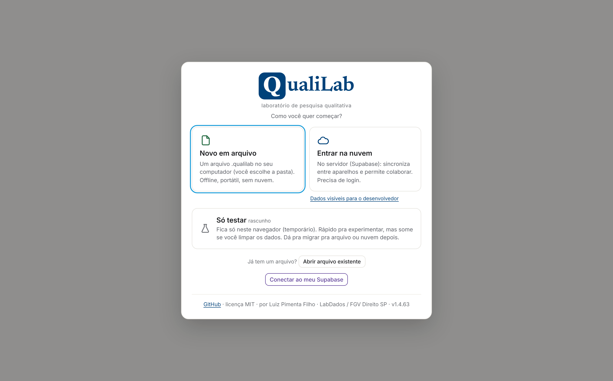

A primeira tela oferece três caminhos (com o logo no topo):

1. **Novo em arquivo**: cria um projeto salvo como arquivo `.qualilab` no seu disco (Chrome/Edge): portátil, offline, sem nuvem. Ideal para dados sensíveis.
2. **Entrar na nuvem**: leva ao **login** (**Continuar com Google**, ou e-mail e senha; ou **Criar conta** na mesma tela, informe um **nome de exibição**, e-mail e senha de no mínimo 6 caracteres), para trabalho colaborativo e sincronizado entre dispositivos. Há **Esqueci minha senha** para redefinir por e-mail. **← Voltar** retorna à tela de entrada. Sob esse cartão, um aviso lembra que, no servidor padrão, o conteúdo fica **visível para quem administra o banco**: vale ler a [seção 16](#16-salvamento-backup-e-modos-de-armazenamento) antes de subir material sensível.
3. **Só testar (rascunho)**: abre na hora um projeto de **rascunho** neste navegador, sem configurar nada. É efêmero (some se você limpar os dados do site), bom para experimentar; migre para arquivo ou nuvem quando quiser (um clique no hub do projeto).

**Criou uma conta? O passo seguinte é um código.** Ao criar a conta, o QualiLab manda um **código por e-mail** e abre a tela **"Confirme seu cadastro"**: digite ali **todos os números** do código e clique em **Confirmar e entrar**. Não há link para clicar no e-mail, e isso é de propósito — filtros de segurança de caixas corporativas costumam abrir os links sozinhos e queimá-los antes de você, o que dava "link inválido ou expirado" em quem nunca tinha clicado. O código **vale por uma hora**. Se ele não chegar, veja o **spam** e use **Reenviar código**; tendo reenviado, vale o do e-mail **mais recente** (o anterior deixa de valer). Se a sua conta já estava confirmada, **"Já confirmei — quero entrar"** volta ao login.

Um botão violeta **"Conectar ao meu Supabase"** (na tela de entrada e no login) aponta o app para o **seu próprio servidor Supabase** antes de logar: é onde ficam os seus projetos coletivos.

> Um arquivo ou sessão já aberto **reabre sozinho** na próxima vez. Se o app não tiver nuvem configurada, "Entrar na nuvem" não aparece e você começa direto em arquivo/rascunho.

### 2.3. Escolher / criar um projeto

Depois do login (ou direto, sem nuvem) aparece **"Meus projetos"**:

- **Abrir um projeto existente**: clique nele na lista, ou em **abrir**.
- **Criar projeto**:
  1. Confirme o **seu nome de exibição**.
  2. Digite o **nome do projeto**.
  3. Escolha o tipo: **Projeto Individual** (uso solo, tudo vai direto pro gabarito, sem reconciliação) ou **Projeto Coletivo** (vários pesquisadores, com reconciliação).
  4. Clique em **Criar**.
- **Entrar com código**: para participar de um projeto coletivo de outra pessoa, cole o **código de acesso** (ex.: `9F2A1C`) e clique em **Entrar**.
- **Arquivo local** (Chrome/Edge): **Novo arquivo…** cria um `.qualilab` no disco; **Abrir arquivo…** reabre um existente. Ideal para dados sensíveis (sem nuvem, sem rede).

> O tipo do projeto pode ser mudado depois (admin). Converter **Coletivo → Individual é irreversível**: colapsa todas as codificações num único autor e mantém só o gabarito das categorias.

---

## 3. A interface

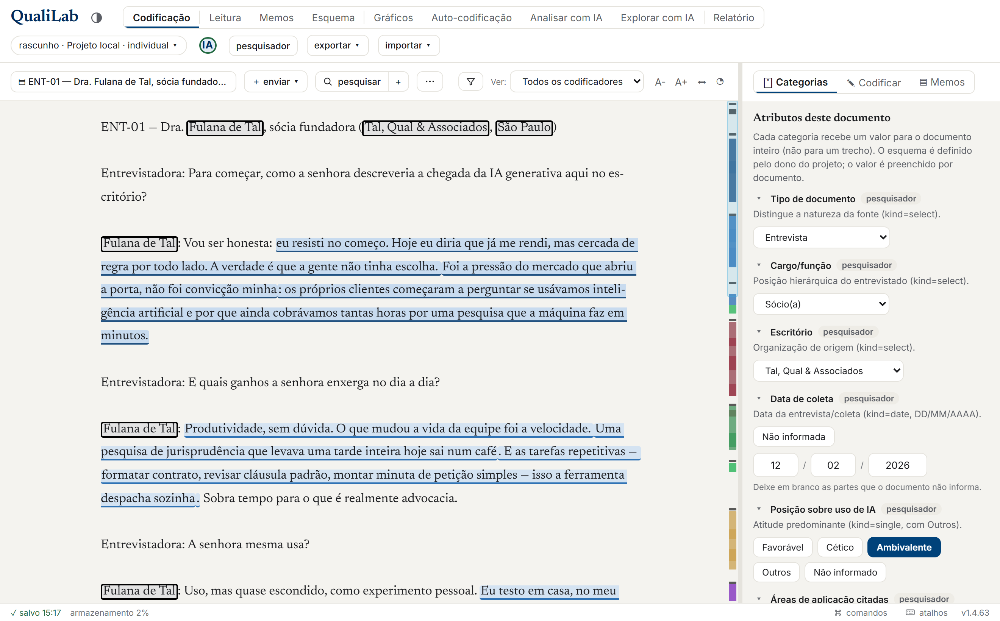

Depois de abrir um projeto, o **cabeçalho** tem duas linhas:

**Primeira linha**
- **QualiLab** (volta ao GitHub) e o botão de tema escuro/claro da *interface* (**☀︎/⏾**, não confundir com o tema do *leitor*, que fica na barra do documento).
- As abas principais (`.seg`):

| Aba | Para quê |
|---|---|
| **Codificação** | Ler o documento e aplicar códigos/categorias |
| **Reconciliação** | *(só projeto coletivo)* consolidar o gabarito |
| **Leitura** | Ler o documento inteiro, ou todos os trechos de um código |
| **Gráficos** | Frequências, nuvem, co-ocorrência etc. |
| **Memos** | Notas analíticas |
| **Esquema** | Organizar códigos e categorias em lote |
| **Codificar Automaticamente** | Repetir codificação (sem IA) e, *(opcional, BYOK)*, IA propondo codificação/categorização/organização e induzindo a definição de uma categoria; você aprova |
| **Analisar com IA** | *(opcional, BYOK)* conversa analítica sobre o material que você seleciona |
| **MCP/RAG** | *(opcional, BYOK; **experimental**)* conversa em que a IA **busca** o material sozinha, em vez de receber um recorte pronto |
| **Relatório** | Exportar relatórios e pacotes de transparência |

> As três telas de **IA** são **opt-in**. Detalhes na [seção 17](#17-codificar-e-analisar-com-ia).

**Segunda linha**
- A **pílula do projeto**, ex.: `rascunho · Meu Projeto · individual ▾`. O prefixo mostra o modo de armazenamento (`arquivo`/`nuvem`/`nuvem pessoal`/`rascunho`) e a **cor** reforça onde os dados estão: neutra = rascunho (neste navegador), verde = arquivo no seu disco, azul = nuvem (servidor padrão), violeta = nuvem no seu próprio Supabase, âmbar = nuvem sem conexão. Passe o mouse para a explicação (em modo rascunho, inclui o % usado do armazenamento do navegador); clicar abre o **hub de gestão do projeto**.
- O **selo de IA** do projeto, logo depois da pílula: **verde** quando os recursos de IA estão disponíveis aqui, **vermelho** quando estão desativados. Clicar nele oferece trocar, com confirmação (veja [17.7](#177-desligar-a-ia-neste-projeto)).
- Seu **nome**, **clicável em todos os modos** (nuvem, rascunho e arquivo) → Minha conta. Em modo offline, é também a porta de entrada para configurar a sua chave/modelo de IA, inclusive o Ollama local (veja a [seção 17](#17-codificar-e-analisar-com-ia)).
- **trocar projeto** / **sair** (modo nuvem).
- **exportar ▾** e **importar ▾** (aparecem quando há documentos).
- Indicadores `offline` / `sincronizando…` e, quando a nuvem falha, **`N alterações aguardando envio`** — clique para tentar na hora (modo nuvem; veja a [seção 16](#16-salvamento-backup-e-modos-de-armazenamento)).
- No canto direito, a **versão** em uso (ex.: `v1.0.0`). **Cite esse número ao relatar um problema:** sem ele não há como saber qual versão o seu navegador carregou, já que o app se atualiza sozinho ao recarregar. O que mudou em cada versão está no [`CHANGELOG.md`](../CHANGELOG.md).

Logo abaixo do cabeçalho podem aparecer **faixas de aviso**: erro (vermelho), importação em andamento (com barra de progresso) e o aviso de falha de salvamento (veja a [seção 16](#16-salvamento-backup-e-modos-de-armazenamento)).

> **A tela em que você está mora no endereço.** Trocar de aba muda o endereço do navegador, e o documento aberto e a sub-aba vão junto. Daí duas coisas úteis: o **"voltar" do navegador funciona** (leva à tela anterior, não sai do app), e dá para **copiar o endereço e mandar a alguém** — quem abrir o mesmo projeto cai na mesma tela, no mesmo documento. Em pesquisa coletiva é o jeito mais curto de dizer "olha este aqui".

### Redimensionar os painéis

Toda tela com um painel lateral tem uma **divisa** entre o painel e o conteúdo: **arraste** para
mudar a largura. **Duplo clique** volta ao padrão. Pelo teclado, a divisa recebe foco pelo **Tab** e
as **setas ← →** ajustam de 16 em 16 pixels.

A largura escolhida vale para **todas as telas do mesmo tipo** de painel (você ajusta uma vez, não
uma por tela) e **sobrevive ao recarregamento**, por navegador. São três grupos:

| Painel | Onde |
|---|---|
| Navegação e filtros (à esquerda) | Leitura, Gráficos, Memos, Reconciliação, Relatório |
| Painel de trabalho (à direita) | Codificação, Esquema |
| Configuração de IA (à esquerda) | as quatro telas de IA |

### Teclado e acessibilidade

- **Árvores de códigos** (painel da Codificação, Esquema e Memos): **↑ ↓** percorrem, **← →** fecham
  e abrem um nó, **Home/End** vão às pontas e **Enter** ativa a linha (seleciona o código ou, se você
  tem um trecho selecionado, aplica o código nele). O item em foco ganha um anel azul.
- **Janelas de diálogo**: ao abrir, o foco entra na janela; **Tab** e **Shift+Tab** circulam **dentro
  dela**, sem vazar para a página atrás; **Esc** fecha; e ao fechar o foco volta para o botão que a
  abriu.
- **Telas estreitas** (celular): aparece um aviso dizendo que dá para **ler e consultar**, mas não
  para codificar. Não é limitação de layout: aplicar um código depende de selecionar texto e abrir o
  **menu do botão direito**, que não existe no toque. Para trabalhar, use um computador.

---

## 4. Documentos

### Enviar arquivos
Na aba **Codificação**, no topo do leitor, clique em **＋ enviar** e escolha um ou mais arquivos `.txt`, `.md`, `.docx` ou `.pdf`. O texto é extraído e exibido para leitura.

- **PDF**: o texto passa por um *reflow* geométrico que **detecta colunas** (artigos em duas colunas deixam de sair embaralhados), **remove cabeçalhos, rodapés e números de página** repetidos, remonta parágrafos e corrige a hifenização de fim de linha. Tabelas **não** são reconstruídas, e PDF **digitalizado** (imagem, sem camada de texto) precisa de **OCR** (veja abaixo).
- **DOCX**: a estrutura vira texto limpo (títulos, parágrafos, listas com o aninhamento por indentação, e tabelas em linhas/colunas), sem sujar o conteúdo com marcadores artificiais. A formatação rica (negrito, cor) não vira estilo no leitor: o foco é o conteúdo a codificar.

### Colar texto
Use o botão de **colar** (ao lado de ＋ enviar) para criar um documento a partir de texto copiado, sem arquivo.

### Trocar de documento, renomear e editar o texto
- O **botão com o nome do documento**, no topo do leitor, abre a lista de documentos do projeto:
  **filtre por nome** (ignora acento e maiúscula), **ordene** por nome ou pela ordem de importação e,
  quando você já preencheu categorias, **agrupe** por uma delas. As **setas ↑ ↓** percorrem a lista,
  **Enter** abre o documento em destaque e **Esc** fecha. A escolha de ordenar/agrupar fica guardada
  neste navegador e vale para os próximos projetos.
  > A **ordem de importação** costuma parecer aleatória: num `.qdpx` ela é a ordem das entradas dentro
  > do pacote, não a alfabética. Por isso a lista já vem **ordenada por nome**.
- As ações sobre o documento aberto ficam no menu **⋯** (à direita da busca): **OCR**, **editar título e texto** e **excluir documento**.
- **🗑 excluir documento** remove o documento aberto e todas as suas codificações. Não há desfazer, então confirme com cuidado.
- **✏ editar título e texto** abre o modo de edição do documento aberto: nele você corrige o **título** e o **texto extraído**, útil quando um PDF vem com sujeira (um trecho grudado, um rodapé que sobrou, uma linha quebrada). **Salvar** grava as duas coisas; **Cancelar** descarta.
- Ao salvar uma edição do texto, **os grifos já feitos são reancorados automaticamente** às novas posições. Se alguma codificação cair exatamente sobre o trecho que você mexeu, o app avisa antes de salvar (esses grifos podem precisar de conferência).
- Editar serve para **limpeza local**; corrupção do documento inteiro (por exemplo, um PDF antigo que sai inteiro sem espaços) é caso de OCR, não de correção à mão.
- Em projeto **coletivo na nuvem**, editar o texto é restrito ao **administrador** (o texto é compartilhado, então a edição desloca os grifos de todos os codificadores).

### Ver o PDF original e OCR (documentos digitalizados)
Quando o documento veio de um **PDF**, o leitor ganha um botão **▤ original** (que alterna com **≡ texto**): ele mostra a **página do PDF de verdade**, com zoom e navegação de páginas. Sobre a página, os seus grifos aparecem desenhados na cor do código; selecionar um trecho na página do PDF codifica igual ao leitor de texto (botão direito → menu de códigos).

Para **PDF digitalizado** (escaneado, só imagem), use o **◫ OCR** (no menu **⋯**): o app reconstrói o texto página a página, aproveitando o texto nativo onde existe e lendo por OCR (offline, no seu navegador) onde é imagem, com barra de progresso e opção de cancelar. Também dá para fazer **OCR de uma área**: no modo original, o botão **▭ OCR de área** deixa você arrastar um retângulo sobre um pedaço da página; o texto lido abre num quadro **editável** para você corrigir antes de aplicar e codificar. A primeira vez baixa o modelo de OCR (~15 MB) e o processo é lento (alguns segundos por página).

> **Sinal de qualidade da extração.** Documentos com extração provavelmente ruim (vazios, PDF sem espaços entre palavras, glifos quebrados `�■□` ou OCR de baixa confiança) ganham um **⚠︎** antes do nome na lista de documentos (passe o mouse para ler o motivo) e uma pílula âmbar **⚠︎ extração** no leitor. É um aviso para **conferir e limpar** (pelo **✏ editar**) ou rodar **OCR** antes de codificar aquele documento.

> **Números de página.** Como o QualiLab guarda a correspondência trecho ↔ página do PDF, o número da página (**p. N**) do original acompanha o trecho na **Leitura**, no **Relatório**, nos exports **CSV/JSON** e nas anotações **W3C**, e o **▤ original** abre já na página do trecho selecionado.

### Importar muitos documentos de uma vez
Uma planilha (`.csv`/`.xlsx`) vira **um documento por linha**. Veja [Importar e exportar](#15-importar-e-exportar).

---

## 5. Codificação de trechos

Esta é a tela **Codificação**: leitor à esquerda, painéis de **Categorias** e **Códigos** à direita.

### 5.1. Criar códigos
No painel **Códigos** (direita) você cria e organiza os rótulos. Um código novo nasce solto em **Hierarquia 0** e já recebe trechos. Você pode criar subcódigos, renomear e excluir. Também dá para criar um código **na hora de aplicar** (veja abaixo).

**Quando um código vira família.** No momento em que ele ganha o primeiro subcódigo. Se ele ainda não tinha trechos, a mudança é silenciosa — não há nada a decidir. Se **já tinha**, o QualiLab abre um aviso perguntando para onde vão esses trechos, porque família não os recebe (a regra está em [Conceitos](#código-e-família-uma-regra-só)). Você tem duas saídas:

- **marcar trecho a trecho** os que pertencem ao subcódigo novo;
- ou **não marcar nada**: todos vão para um subcódigo de pendência, chamado por padrão `«Nome» (geral)`.

A segunda existe para você não ser obrigado a triar 80 trechos no meio de uma leitura. O `(geral)` **registra a pendência** em vez de fingir que a classificação foi feita — e dá para distribuí-los depois, com calma, em [Esquema ▸ Dividir em subcódigos](#72-códigos-reorganização-em-lote).

**Botão direito num código** (no painel da Codificação) abre um menu com **✎ Editar código** (nome,
cor, saturação, censura) e **＋ Subcódigo aqui**. É o caminho para mexer num código **sem sair da
codificação**: com um trecho selecionado, o clique esquerdo *aplica* o código, então esse menu é a
única forma de chegar ao editor sem antes desfazer a seleção.

> **Dica de pesquisa.** Deixe os códigos *emergirem* do material (a abordagem **indutiva**, em que os temas nascem da leitura) ou aplique um esquema teórico prévio (a abordagem **dedutiva**). As duas são válidas; o que importa é ter consciência de qual você está usando. Evite criar um código para cada frase: se um rótulo aparece uma única vez, pergunte se é mesmo um tema ou só um detalhe. E, ao criar um código, anote num **[memo](#11-memos)** o que ele *inclui e exclui*: esse é, na prática, o seu **livro de códigos** (*codebook*), o que mantém a codificação consistente ao longo do tempo e entre pessoas.

### 5.2. Aplicar um código a um trecho

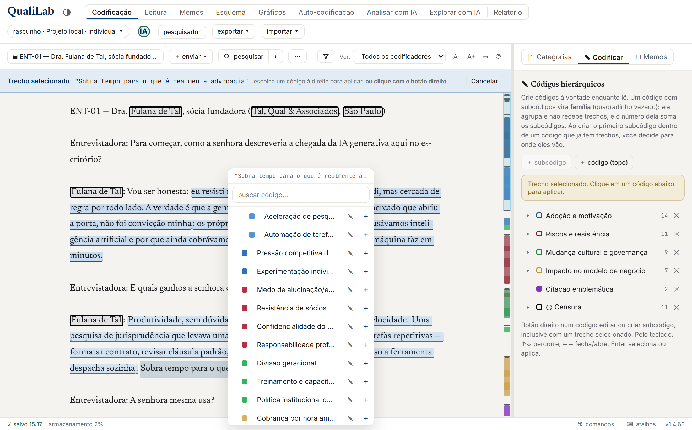

1. **Selecione** o trecho no texto com o mouse.
2. **Clique com o botão direito** sobre a seleção.
3. No menu de contexto, clique no código desejado; ele é aplicado na hora.
   - Ou clique em **+ Criar novo código**: digite o nome, escolha se é uma **nova família (nível 0)** ou um **subcódigo de "…"**, e clique em **Criar e aplicar**.

> Ao aplicar, o grifo aparece no texto com a cor do código. **A linha embaixo do grifo só aparece quando há mais de um código sobrepondo o mesmo trecho**. É o sinal de sobreposição. Trecho com um código só fica apenas tintado, sem linha, para não poluir.

### 5.3. Remover um código de um trecho
Você **não precisa selecionar de novo**:
1. Clique com o **botão direito sobre o grifo** existente.
2. No menu, em **Remover código** (admins em projeto coletivo veem "Rejeitar / remover código"), clique no código que quer tirar.

> Em projeto coletivo na nuvem, você só remove codificações **suas**. Não dá para apagar o grifo de outro pesquisador. (Em projeto individual, tudo é seu.)

### 5.4. Desfazer (Ctrl+Z)
**Ctrl+Z** desfaz a **última codificação aplicada** na sessão atual (até as últimas 50). Funciona só na aba Codificação e fora de campos de texto. Não há desfazer para outras ações (excluir documento, categoria, código etc.). Essas são definitivas.

### 5.5. Censura (mascarar trechos sensíveis)
Um código pode ser marcado como **censura** (no [Esquema](#7-esquema), por um admin). Trechos com esse código aparecem como uma caixa preta e saem mascarados como `[trecho censurado]` nas **saídas de transparência** ([Relatório](#12-relatório)) e no que vai para a **IA** ([seção 17](#17-codificar-e-analisar-com-ia)), útil para publicar mantendo nomes/dados sensíveis ocultos.

**Onde a censura NÃO se aplica, e por quê.** Os formatos de **trabalho e migração** (`.qualilab`, QDPX, QDC, CSV, JSON) saem **completos**, com os trechos censurados em claro. Não é esquecimento: é por esses arquivos que você leva o **seu próprio** material para o ATLAS.ti, o MAXQDA ou o NVivo e traz de volta, e mascarar ali destruiria o texto original de forma irreversível, além de fazer você **perder o próprio trabalho de censura** na migração. O menu **exportar ▾** avisa isso na hora, em âmbar, quando o projeto usa código de censura. Para material que sai da equipe, use a aba **Relatório**.

**A censura protege o que você marcou, não o termo.** Marcar "Banca Exemplo Advogados" num parágrafo não protege as outras cinco menções ao mesmo escritório. Para isso existe a aba **Repetir Codificação** (em [Codificar Automaticamente](#172-codificar-automaticamente-cinco-assistentes-em-abas)): ela pega os trechos que o código já tem e mostra as demais ocorrências **idênticas** no corpus, para você aprovar uma a uma. Ela não acha **variantes**: "Banca Exemplo" sozinha, ou "a banca", continuam sendo caso de [pesquisar +](#57-buscar-no-documento-e-no-projeto-inteiro), onde o julgamento é seu. Antes de publicar, veja [12.4](#124-antes-de-publicar-trabalhe-no-laboratório-publique-de-uma-cópia).

### 5.6. Controles de leitura
A barra no topo do leitor ajusta **só a leitura** (preferência salva no navegador):
- **A-** / **A+**: diminui/aumenta a fonte.
- **⬍ / ⬌**: alterna a largura da coluna (padrão ↔ coluna estreita de leitura).
- **◔ / ◗ / ◕**: tema do leitor: claro / sépia / escuro (independente do tema da interface).

### 5.7. Buscar (no documento e no projeto inteiro)
Clique em **🔍︎ pesquisar** (a lupa). Digite o termo: as ocorrências são destacadas por cima dos grifos, com navegação **‹ anterior / próxima ›** (e **Enter** / **Shift+Enter**), com volta ao início ao chegar no fim.

O botão **+** colado na lupa abre o **pesquisar +**: a mesma busca, mas em **todos os documentos do projeto**. Os resultados vêm agrupados por documento, cada um com o trecho em volta para você reconhecer o contexto; **clicar numa ocorrência abre aquele documento exatamente nela**, já com a busca ativa no leitor.

As duas buscas compartilham três opções (os botõezinhos ao lado do campo):
- **Aa**: diferencia maiúsculas de minúsculas. Desligado, `réu` e `RÉU` são a mesma coisa (acento, porém, conta: `reu` não encontra `réu`).
- **ab⃒**: só **palavras inteiras**: procurando `reu`, ignora `reunião` e `ocorreu`.
- **`.*`**: trata o que você digitou como **expressão regular**, para padrões em vez de texto fixo. Ex.: `\d+/\d{4}` acha números de processo como `123/2020`; `réu|ré` acha as duas formas. Com a opção desligada, caracteres como `.` e `(` são procurados literalmente. Padrão inválido é avisado na hora.

> As opções valem para as duas buscas ao mesmo tempo: se você liga **regex** no **pesquisar +** e clica num resultado, o leitor abre com o mesmo padrão e as mesmas opções.

#### Termos parecidos (≈ termos)

O quarto botão, **≈ termos**, resolve o problema de *não saber com que palavra o material fala do assunto*. Você digita a ideia que procura (uma ou duas palavras bastam) e ele mostra **as palavras do seu próprio corpus** que estão no mesmo campo de sentido, com quantas vezes cada uma aparece.

Procurando *"medo de perder o emprego"*, ele sugere **receio**, **demissão**, **insegurança**, palavras que a busca normal jamais encontraria a partir do que você digitou, porque não têm letra em comum com a sua pergunta.

As sugestões incluem **expressões de até cinco palavras**, não só palavras soltas: *"crise do Estado"* traz **crise da democracia**, **crise fiscal**, **Estado Regulador**. São expressões tiradas do seu próprio material: só entram as que se repetem, porque uma sequência de palavras que aparece uma vez só costuma ser acaso da escrita, não um termo do campo.

**Clique nas sugestões que servirem.** Os termos aceitos entram na busca junto com o que você digitou, e cada ocorrência que veio de um deles aparece marcada com `≈ palavra`, para você nunca perder de vista por que aquele resultado está ali. Clicar leva ao documento, com a palavra grifada, como em qualquer busca.

> **Por que sugerir palavras em vez de mostrar trechos direto?** Porque o programa erra, e é melhor que ele erre à vista. Palavras raras ou muito abstratas às vezes produzem vizinhas sem sentido; vendo "perícia" na lista você simplesmente não clica, e perdeu um segundo. Se o erro viesse embutido numa lista de trechos, você perderia minutos lendo material que não tinha nada a ver, sem saber por quê.

**Na primeira vez é preciso ler o vocabulário** do projeto: o botão aparece assim que você liga a opção. Isso baixa um modelo de linguagem (de ~113 MB a ~220 MB, conforme o que o seu navegador suporta; uma vez só, depois fica guardado nele) e percorre as palavras do corpus, com barra de progresso e opção de interromper. Quando você acrescenta ou edita documentos, o programa avisa que o corpus mudou e oferece ler de novo.

> **Nada sai do seu computador.** Diferente das telas de IA, isto não conversa com nenhum servidor: o modelo roda dentro do navegador e o vocabulário fica na sua máquina. Funciona offline depois do primeiro download e não precisa de chave de API.

### 5.8. Filtro "Ver:" (de quem é o que aparece)
O seletor **Ver:** controla **de quem** são os grifos e as respostas de categoria exibidos. Aparece em projeto coletivo e também quando há mais de um codificador (ex.: dados importados com vários autores). Em projeto coletivo, as opções são:
- **Individuais (todos)**: sobrepõe os grifos de todos + o gabarito ao mesmo tempo (só leitura).
- **Minhas**: só o seu trabalho (editável).
- **(nome de cada pesquisador)**: o trabalho de um colega específico (só leitura).
- **Final / gabarito**: a camada consolidada (só leitura aqui; edita-se na Reconciliação).

Em projeto individual com mais de um autor importado, o seletor mostra **Todos os codificadores** e o nome de cada autor.

> **Por que algumas visualizações são só leitura?** Editar enquanto vê o trabalho de *outra* pessoa gravaria sob a *sua* identidade. Por isso só **Minhas** (ou projeto individual) permite editar a resposta de categoria ali. O gabarito se edita na Reconciliação.

---

## 6. Categorias (atributos do documento)

No painel **Categorias** (direita, na aba Codificação) você responde os atributos do **documento aberto**.

### Os sete tipos
| Tipo | Como preenche |
|---|---|
| **Texto Fechado** | Lista suspensa, escolhe **um** |
| **Texto Aberto** | Campo livre |
| **Número** | Campo numérico (pode escrever `12,5`; o app guarda `12.5`) |
| **Data** | DD / MM / AAAA, com partes opcionais (pode pôr só o ano) |
| **Sim/Não** | Dois botões |
| **Múltipla Escolha** | Botões, escolhe **um** |
| **Caixa de Seleção** | Botões, escolhe **vários** |

> **Por que Número e Sim/Não são tipos, e não texto.** O que você escreve num campo de texto o app não sabe ordenar nem somar, e ao exportar chega ao MAXQDA ou ao NVivo como texto — lá também sem ordenar. Como Número, o valor sai tipado no `.qdpx` (Integer ou Float, conforme os valores) e volta tipado; como Sim/Não, sai como Boolean. O que **não** for número não é aceito no campo (fica em vermelho): é isso que garante que a coluna inteira continue valendo como número.

Cada categoria pode ter uma **descrição/instrução** e habilitar duas opções especiais: **"Não informado"** e **"Outros"** (com valor livre).

> **A descrição é a instrução de codificação, e cabe um verbete inteiro.** O campo é multilinha e as quebras de linha são preservadas onde ele aparece, então vale escrever ali o que de fato governa o preenchimento: a definição numa frase, o que conta como cada valor, as fronteiras e desempates, o que ignorar. Vale a pena porque é **um texto só para os dois avaliadores**: é o que o codificador humano lê ao responder e é o que entra no prompt das telas de IA. Se você já respondeu alguns documentos e não sabe como escrever esse verbete, a aba [Definir Categoria](#1723-definir-categoria-escrever-a-instrução-a-partir-do-que-você-já-respondeu) propõe um a partir das suas próprias respostas.

> **Dica de pesquisa.** Crie uma categoria só se você for **comparar ou contar** por ela depois (ano, tribunal, perfil do entrevistado). É isso que alimenta os filtros e os [Gráficos](#10-gráficos). Categoria que nunca entra numa comparação vira peso morto. Pense nelas como as **colunas** que você quereria numa planilha para cruzar com os temas (que são os códigos).

### Quem define e quem preenche
- **Definir o esquema** (criar categorias, tipos, opções): admin, no item **"Gerenciar esquema de categorias"** (dentro do painel Categorias) ou na aba **Esquema → Categorias**.
- **Preencher**: qualquer membro responde a **sua** versão; o admin define o **gabarito**.
- A resposta exibida segue o filtro **Ver:** (ver a de outro pesquisador é só leitura).

---

## 7. Esquema

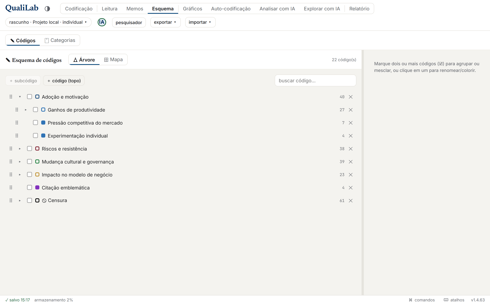

A aba **Esquema** é uma tela cheia (sem documento aberto) para organizar tudo de uma vez. Tem duas sub-abas.

### 7.1. Categorias

Mesma edição do painel de Categorias, mas focada em montar o esquema: criar, editar tipos e opções, e **reordenar arrastando** pelo punho **⠿** (o item arrastado fica translúcido; uma linha azul mostra onde vai cair).

**O nome e a descrição só valem quando você clica em "Salvar".** Enquanto houver algo por salvar, o botão fica em destaque e aparece um **descartar** ao lado, que devolve os dois campos ao que está gravado; sem nada pendente, ele mostra **"Salvo ✓"**. É assim de propósito: a descrição é a instrução que a equipe e a IA seguem, e um esbarrão no campo não deve mudar o esquema do projeto. O que você escreveu não se perde se trocar de tela e voltar — e, quando o painel "Gerenciar esquema de categorias" está recolhido, um aviso no título dele avisa que há alteração não salva. O resto do cartão (o tipo, os valores, as caixas "Não informado" e "Outros") vale na hora, porque são cliques que você desfaz clicando de novo.

O campo da descrição é **redimensionável**: arraste o canto inferior direito dele para escrever o verbete inteiro com folga.

### 7.2. Códigos (reorganização em lote)
Pensado para quem terminou uma codificação aberta com **centenas de códigos soltos** e quer organizá-los. É uma árvore com **caixas de seleção**; o painel da direita muda conforme a seleção:

- **Clique simples em um código** (na linha, não na caixa) → editar nome/cor + **Promover a Hierarquia 0** (se for subcódigo) + **⑃ Dividir em subcódigos** (se ele tiver trechos).
- **Marque 2 ou mais** (caixas) → aparecem duas ações:
  - **Agrupar**: os marcados viram **filhos** de um código (existente, escolhido na lista, ou novo). Continuam separados, só ganham um pai. Adotam a cor do pai. Se o pai escolhido já tiver trechos próprios, ele vira família e o QualiLab pergunta antes para onde vão esses trechos.
  - **Mesclar**: escolhe um **sobrevivente** (sugestão = o mais frequente); as codificações dos demais são **reatribuídas** a ele e os outros são excluídos. **Irreversível**: confirma antes. Os filhos dos mesclados são preservados (passam para o sobrevivente).
- **Reordenar entre irmãos**: arraste pelo punho **⠿** (só reordena dentro do mesmo pai; para mudar de pai, use **Agrupar**).

#### Dividir um código em subcódigos

O inverso do Mesclar, e a ferramenta para quando um código ficou **largo demais**: você o abre e distribui os trechos dele entre vários subcódigos novos, de uma vez.

Selecione o código e clique em **⑃ Dividir em subcódigos**. A tela tem:

1. **os subcódigos novos** — quantos quiser, um por linha;
2. **uma tabela** com um trecho por linha e uma coluna por subcódigo. Marque as células. Um trecho pode ir para **mais de um** subcódigo: o primeiro recebe o trecho original (com a nota, se houver) e os demais recebem uma cópia;
3. **teclas 1 a 9** marcam a coluna correspondente na linha em foco, e as setas ↑↓ percorrem as linhas. É o que torna viável distribuir dezenas de trechos;
4. **Mutuamente exclusivo**: cada trecho só pode ir para um subcódigo. Marque se você calcula **concordância entre codificadores** — o coeficiente pressupõe isso dentro de um mesmo domínio;
5. o que você **não marcar** vai para o `(geral)`, cujo nome dá para trocar.

Ao final, o código dividido vira família (0 trechos próprios) e passa a mostrar a soma dos filhos. **É ação de administrador**, porque move codificações de todos os pesquisadores.

> **Nota de método.** A divisão é o momento de fazer as distinções ficarem explícitas: ao separar "Ganhos de produtividade" em "Aceleração de pesquisa" e "Automação de tarefas", você está registrando um argumento sobre o material, não só arrumando a árvore. Vale escrever no **memo** de cada subcódigo o que ele inclui e exclui, enquanto o critério está fresco.

### 7.3. Ver os códigos como Mapa (quadro branco espacial)

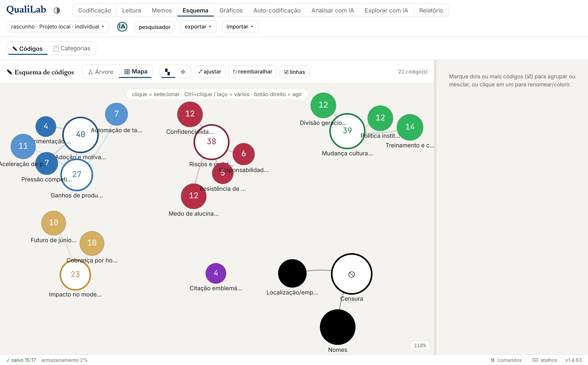

No alto do painel de códigos, o seletor **⛼ Árvore / ⊞ Mapa** troca a lista hierárquica por um **quadro branco espacial**: cada código vira uma **bolha** (o tamanho reflete o número de trechos; a cor é a da família) e linhas ligam pai e filho. É outra forma de enxergar e reorganizar o mesmo esquema, útil quando há muitos códigos.

- **Arraste** as bolhas para posicioná-las como quiser; o layout **fica salvo** com o projeto. **⤢ ajustar** enquadra tudo na tela; **↻ reembaralhar** recalcula as posições (sobrescreve o layout); **☑ linhas** mostra/esconde as ligações de hierarquia.
- **Selecionar**: clique numa bolha; **Ctrl+clique** ou o **laço** (ferramenta **▚**, arrastando no vazio) marcam várias. A ferramenta **✜** move a tela; a **roda do mouse** dá zoom.
- **Botão direito** sobre uma bolha abre um menu cujo alvo é o **destino**: criar subcódigo, **mover** a seleção para dentro dele, **mesclar** a seleção ali (o alvo sobrevive), **promover** ao topo, **agrupar** sob um novo pai, ou **excluir**. São as mesmas operações da Árvore, com as mesmas proteções.

### 7.4. Cores e censura (admin)
Ao editar um código, o admin pode:
- Escolher a **cor da família** por um controle de **matiz** (0–359) e um de **saturação**, ou **preto**, propagada aos subcódigos.
- Marcar o código como **censura** (força a cor preta). Veja [5.5](#55-censura-mascarar-trechos-sensíveis).

**A censura acompanha a posição na árvore.** Subcódigo criado dentro de uma família de censura já nasce censurado, e **mover ou agrupar** um código para dentro dela também o marca, junto com os subcódigos dele. O QualiLab avisa antes, dizendo quantos códigos e quantos trechos passam a ser mascarados; em pesquisa coletiva isso conta como alteração de censura, então é ação de admin. O caminho inverso é diferente de propósito: tirar um código de dentro da família **não** desmarca a censura dele, porque desmarcar deve ser uma decisão explícita, tomada na caixa **censura** do próprio código. Se você **mesclar** um código de censura em um código normal, os trechos dele deixam de ser mascarados: o QualiLab avisa e pede confirmação, mas quem decide é você.

> **Importante:** o painel de Códigos da aba **Codificação** continua existindo e é independente. A reorganização em lote é só aqui no Esquema, de propósito (menos mudança de hábito na tela de codificar).

---

## 8. Reconciliação

*Só em projeto coletivo.* É onde a equipe consolida o **gabarito** a partir do trabalho individual de cada pesquisador. A coluna da esquerda escolhe entre **Categorias** e **Códigos**, e navega por documento, incluindo a opção **(Todos os documentos)**, que reconcilia o projeto inteiro de uma vez.

**Categorias.** Para cada documento e categoria, você vê o **Gabarito** (que o admin define) e, abaixo, a resposta de cada pesquisador com **✓** (igual ao gabarito) ou **✗** (diferente). No modo (Todos os documentos), escolhe-se uma categoria e ela é consolidada documento a documento.

**Códigos.** Cada **grupo** reúne as codificações que se **sobrepõem** no mesmo código, com o trecho e quem codificou. O selo **"N de M · consenso"** mostra quantos codificadores marcaram aquele trecho; quando todos concordam, o card ganha destaque. Você **consolida** cada grupo na camada final (**Consolidar no final →**) ou, se já estiver lá, pode **remover do final**.

- **Consolidar em massa**: havendo grupos pendentes, aparecem **Consolidar tudo feito por mim (N)** e **Consolidar tudo (N)**, do documento aberto ou, em (Todos os documentos), do projeto inteiro (respeitando o filtro de código). É irreversível; o app confirma antes.
- **Atalho pelo leitor**: na aba Codificação, o admin pode aceitar um grifo direto no gabarito pelo **botão direito → "Aceitar no gabarito"**, sem passar por esta tela.

O resultado vira a camada **Final**, usada nos relatórios e gráficos quando você escolhe "gabarito".

---

## 9. Leitura

É a tela de **reler o que já foi codificado** — no material ou no esquema —, em dois modos, nas
sub-abas **▤ Documentos** e **✎ Trechos**. Na Codificação você marca; aqui você lê o resultado. A
tela abre em **Documentos**; vindo de um clique nos [Gráficos](#10-gráficos), abre direto nos
**Trechos** do código clicado. O filtro [**Ver:**](#58-filtro-ver-de-quem-é-o-que-aparece) fica na
barra das sub-abas e vale para os dois modos: recorta os grifos do documento e os trechos do código.

> Esta aba se chamava **Visualização** até a versão 1.4.6. O nome mudou porque "visualização" é o
> que a aba [Gráficos](#10-gráficos) faz, e porque, com o modo Documentos, esta virou de fato uma
> tela de leitura.

### ▤ Documentos — a leitura do material

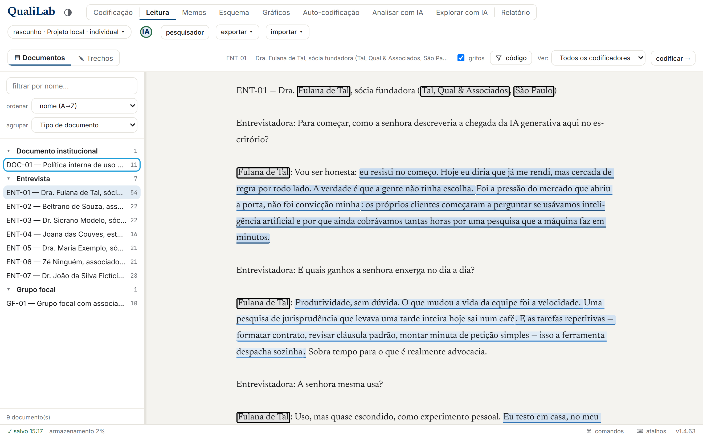

Escolha um documento à esquerda e leia **o documento inteiro**, com os grifos no contexto em que
foram feitos. É a mesma leitura que o [Relatório Interativo](#12-relatório) entrega a quem avalia a
pesquisa, disponível enquanto você trabalha — e onde você responde "o que eu já fiz aqui?".

- **Passar o mouse** num grifo mostra o código e quem o aplicou; **clicar** abre uma faixa embaixo
  com o caminho do código, a camada (individual ou gabarito) e a **nota analítica** do trecho, mais
  um atalho para abrir aquele trecho na Codificação.
- A caixa **grifos** desliga todos de uma vez, para ler o texto limpo.
- A lista à esquerda tem o mesmo filtrar/ordenar/agrupar do leitor, mais o **número de trechos** de
  cada documento — o que a torna também um mapa do que ainda **não** foi codificado. Agrupada por
  uma categoria, ela funciona como um primeiro esboço de **pastas**.
- O documento que aparece aqui é o mesmo que você tem aberto na Codificação, e o botão
  **codificar →** leva você de volta para lá.

Aqui não se codifica: selecionar texto não aplica código e não há menu de contexto. Para trabalhar
no documento, use a Codificação.

### ✎ Trechos — a leitura do esquema

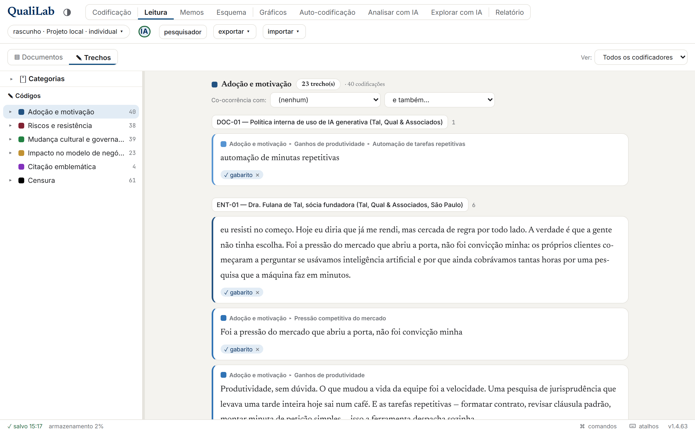

Escolha um código à esquerda e leia **todos os trechos dele em todo o projeto**, em tipografia de
leitura, agrupados por documento. É onde você responde "o que eu chamei de X?".

> **Duas contagens, duas perguntas.** Em pesquisa coletiva, o mesmo trecho costuma ter mais de uma
> marca: a de cada codificador e a do gabarito. A pílula do cabeçalho conta **trechos** (pedaços de
> texto, o que você vê na tela, e a soma dos números ao lado de cada documento); quando há mais de
> uma marca sobre o mesmo pedaço, aparece ao lado a contagem de **codificações** — *"2 trechos · 6
> codificações"*. A segunda é a que a **árvore de códigos** à esquerda e os **Gráficos** usam, então
> não estranhe se os números diferirem: eles respondem a perguntas diferentes. Trechos com bordas
> diferentes (um codificador marcou uma frase, outro marcou a frase e mais um pedaço) contam
> separado, porque não são o mesmo pedaço.

Recursos:
- **Trechos idênticos, um card só**: quando **mais de um pesquisador** marca o **mesmo trecho com o mesmo código**, ele aparece **uma vez**, com um **balão de nome por pesquisador** embaixo, em vez de cards repetidos. Cada balão traz um **×** para remover aquela marcação específica.
- **Nota analítica (●)**: um balão com **●** avisa que aquele trecho tem uma nota analítica; clique no **●** para **ler a nota ali mesmo**. (A nota se escreve pelo menu de contexto do leitor, em "Anotar trecho".)
- **Abrir no leitor**: clique no **texto do trecho** para pular até ele na aba Codificação, **no lugar exato do grifo**: ele pisca por um instante para você achar.
- **Filtro por categoria**: restringe aos documentos que atendem certos atributos.
- **Co-ocorrência**: mostra trechos onde dois códigos aparecem juntos.
- **Aceitar no gabarito** *(admin, projeto coletivo)*: consolida um trecho individual direto na camada final, sem ir à Reconciliação.

---

## 10. Gráficos

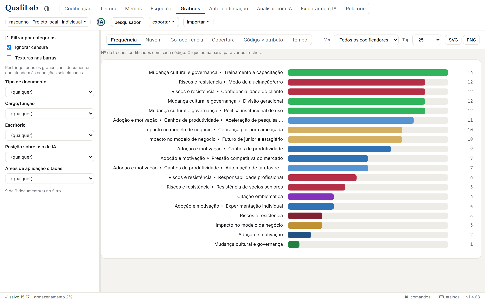

A aba **Gráficos** é um explorador: filtros à esquerda, um gráfico por vez à direita (escolhido nas abas). Todos os gráficos são desenhados em SVG (sem bibliotecas) e podem ser **exportados em SVG ou PNG**.

### Abas disponíveis
| Aba | O que mostra |
|---|---|
| **Frequência** | Quantas vezes cada código foi usado |
| **Nuvem** | Nuvem de palavras dos trechos codificados (cor do código predominante) |
| **Co-ocorrência** | Matriz de pares de códigos que se sobrepõem |
| **Cobertura** | % do corpus coberto por cada código |
| **Código × atributo** | Cruzamento de um código com uma categoria (heatmap) |
| **Tempo** | *(se houver categoria de data)* distribuição ao longo do tempo |
| **Codificadores** | *(só coletivo)* produção e concordância entre pesquisadores |

### Filtros (coluna esquerda)
- **Por categoria**: restringe **todos** os gráficos aos documentos que passam ("X de Y documentos no filtro").
- **Ignorar censura**: **ligado por padrão**; remove dos gráficos os trechos de códigos de censura.
- **Nuvem**: uma árvore com caixas seleciona de quais códigos vem o vocabulário (marcar um código marca a subárvore); abaixo dela, a lista de **palavras ignoradas** (veja adiante).
- **Co-ocorrência**: dois seletores escolhem os eixos **X** (colunas) e **Y** (linhas); vazio = os 12 mais frequentes.
- **Ver:** e **Top:** (10/25/50/Todos) refinam o recorte.

> **Do gráfico para os trechos.** Clique numa **barra** (Frequência, Cobertura, Concordância) ou numa **célula** (Co-ocorrência, Código × atributo) para abrir a **Leitura** já naquele código: o filtro de categorias e o recorte "Ver:" viajam junto, então os trechos exibidos batem com o número do gráfico.

### Palavras ignoradas na nuvem

A nuvem já descarta as palavras funcionais do português (*que*, *para*, *com*...), mas numa entrevista o que domina costuma ser outra coisa: "entrevistado", "pesquisador", "moderador", o nome de quem fala. A lista de **palavras ignoradas**, no painel esquerdo da aba **Nuvem**, resolve isso:

- **Clique numa palavra da própria nuvem** para tirá-la dali; ela vira um item da lista, e o **✕** ao lado devolve a palavra à contagem.
- **Termine com `*` para pegar as variações**: `entrevistad*` cobre *entrevistado*, *entrevistada* e *entrevistados*. (A nuvem não faz lematização — conta formas, não lemas.)
- A lista **pertence ao projeto**: viaja no `.qualilab` e, em pesquisa coletiva, vale para a equipe, como as demais decisões de método.
- **Usar a lista padrão (português)** pode ser desmarcado: corpus em outro idioma, ou análise em que as palavras funcionais são justamente o objeto.

A lista muda **só o que a nuvem conta e desenha** — nada de codificação é alterado.

---

## 11. Memos

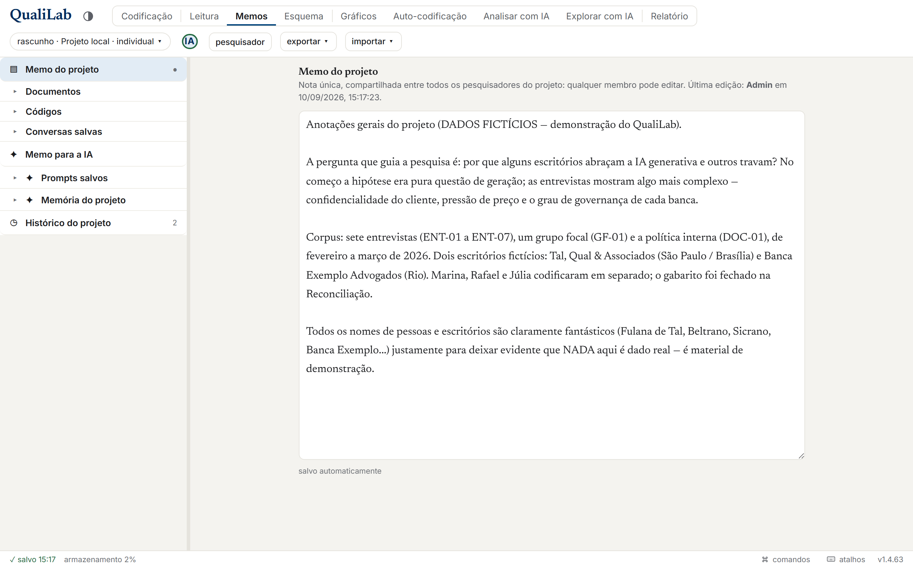

A aba **Memos** guarda **notas analíticas**, texto livre que você anexa a um alvo do projeto, compartilhado entre os membros e com salvamento automático. Se a codificação **organiza** o material, o memo é onde a **interpretação acontece**: é aqui que você registra o que um código quer dizer, uma hipótese que surgiu, uma dúvida a resolver. Memoar cedo e com frequência é um dos hábitos que mais distinguem uma boa análise qualitativa. A coluna da esquerda navega por alvo:

- **Memo do projeto**: uma nota geral do projeto (rascunho livre; veja o aviso sobre a IA abaixo).
- **Documentos**: uma nota por documento.
- **Códigos**: uma nota por código (sua definição, regra de aplicação etc.).
- **Trechos anotados**: a nota ancorada num **grifo** específico (a seção aparece quando há alguma). Escreve-se pelo **botão direito sobre o grifo → "Anotar trecho (nota analítica)"**, ou aqui nos Memos. Em pesquisa coletiva ela é **compartilhada**: você pode anotar o grifo de qualquer colega que consiga ver (o menu mostra de quem é o grifo), e a equipe lê e edita a mesma nota. Sob **codificação cega** isso não se aplica, porque você não vê os grifos alheios, nem as notas deles. *(Por enquanto o grifo anotado não ganha marca no leitor de codificação; você reencontra a nota nesta seção ou no [Relatório Interativo](#121-relatório-interativo-ati).)*

No [Relatório Interativo (ATI)](#121-relatório-interativo-ati), a **nota de trecho** é o que aparece ao clicar num grifo, e a **nota de código** aparece na legenda (em árvore): é assim que as duas alimentam a transparência ativa.

**Seções de IA** (aparecem com a IA ligada, abaixo das anteriores):

- **Memo para a IA**: o contexto do projeto escrito **para a IA**, injetado nos prompts por padrão. É **diferente** do *Memo do projeto* comum, que **deixou de ser enviado automaticamente** à IA (virou rascunho livre): se você quer que a IA leve o objetivo da pesquisa em conta, escreva-o aqui.
- **Prompts salvos**: a sua **biblioteca de prompts** (os que você salva na tela [Analisar com IA](#173-analisar-com-ia-leitura-assistida-do-material)): abra, renomeie ou apague cada um.
- **Conversas salvas**: cada conversa do [Analisar com IA](#173-analisar-com-ia-leitura-assistida-do-material) que você guardou, aberta por inteiro ao clicar.
- **Memória do projeto**, o **diário de insights da IA**: memórias curtas (fatos/decisões) que entram no contexto entre sessões; você adiciona à mão ou aprova as que a IA sugere, e liga/desliga quais usar.

---

## 12. Relatório

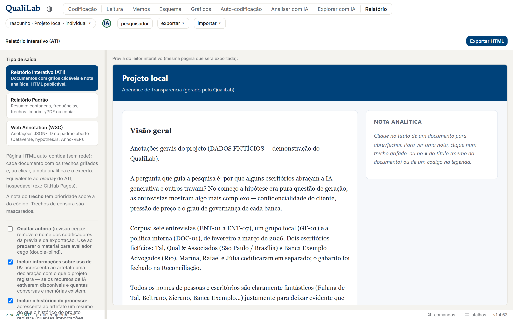

A aba **Relatório** é o **hub de publicação**. Na coluna esquerda você escolhe entre três saídas. Em projeto coletivo, todas respeitam a **camada** escolhida (gabarito final ou individuais); em todas, trechos de **censura** saem mascarados. As saídas de transparência (ATI e W3C) ainda oferecem **anonimizar autoria**, que omite os nomes de quem codificou, útil para publicar sem expor a equipe. *Atenção: isso não anonimiza o conteúdo dos documentos. Veja [Dados sensíveis e responsabilidade](#0-a-ideia-do-qualilab).*

### 12.1. Relatório Interativo (ATI)
Uma **página HTML auto-contida** (sem servidor): cada documento aparece com os trechos grifados clicáveis. Clicar num **grifo** abre, num painel lateral, a **nota daquele trecho** (a *nota analítica por trecho* da [seção 11](#11-memos)); um trecho sem nota própria mostra "sem nota", e a definição do código fica na legenda. Os **títulos de documento** e os **códigos da legenda** abrem, no mesmo painel, o memo do documento e o memo do código. A **legenda de códigos vem em árvore** (mesma hierarquia do [Esquema](#7-esquema)), recolhível e com filtro, para escalar a projetos grandes; documentos vêm colapsados. É o equivalente ao *overlay* da **Annotation for Transparent Inquiry (ATI)** do QDR, mas hospedável por você (ex.: GitHub Pages, Dataverse como anexo).

### 12.2. Relatório Padrão
Um **montador**: marque as seções na coluna esquerda e o texto se monta ao vivo. Seções: resumo, lista de documentos, contagens e listas do esquema, frequência de códigos, distribuição por categoria, trechos por código, códigos não utilizados. Depois:
- **Copiar texto**: texto simples pronto para colar em Word/Google Docs.
- **Imprimir / PDF**: abre a impressão do navegador (força tinta escura sobre branco, mesmo se o app estiver em tema escuro).
- Opção de **creditar o QualiLab** no resumo.

### 12.3. Web Annotation (W3C)
Exporta as anotações no padrão aberto **[W3C Web Annotation Data Model](https://www.w3.org/TR/annotation-model/)** (JSON-LD): cada trecho vira uma anotação com seletor de posição/citação + nota analítica. É a "língua de dados" comum ao ATI, ao [hypothes.is](https://web.hypothes.is/), ao Anno-REP e ao Dataverse, interoperável sem casar com nenhuma ferramenta.

### 12.4. Antes de publicar: trabalhe no laboratório, publique de uma cópia

Este é o fluxo recomendado, e ele resolve um problema que nenhuma ferramenta resolve sozinha.

**O problema.** A censura protege **o que você marcou dentro do texto**. Ela não toca em três coisas que viajam em toda saída, inclusive no Relatório Interativo e no W3C:

- o **título do documento** (é ele que aparece como cabeçalho de cada documento no relatório interativo);
- os **valores de categoria** (cargo, cidade, escritório, órgão);
- os **memos** (é comum anotar "o entrevistado da Tal & Qual disse que...").

Num caso real de teste, o corpo do documento saía com o nome do escritório mascarado e o título dizia, em letras garrafais, *"ENT-01 — Dra. Fulana de Tal, sócia fundadora (Tal, Qual & Associados, São Paulo)"*. A máscara estava perfeita e inútil.

**O fluxo.** Mantenha **dois projetos**:

1. o **laboratório**, onde você trabalha com o material como ele é (nomes reais nos títulos, tudo à mão para você se orientar);
2. a **cópia de publicação**, que é o que sai para fora.

Para criar a cópia: **exportar ▾ → .qualilab**, depois crie um projeto novo (**trocar projeto → novo**) e **importar ▾ → .qualilab** nele. Agora limpe a cópia:

- **renomeie os documentos** para rótulos sem identificação (`ENT-01`, `GF-02`): a chave que liga rótulo a pessoa fica **fora** do QualiLab, com você;
- revise os **valores de categoria**: troque "Tal, Qual & Associados" por "escritório de grande porte", ou o que o seu desenho de pesquisa exigir;
- releia os **memos**, que é onde nome próprio aparece sem ninguém perceber;
- confira a **censura** no corpo (veja abaixo por que ela costuma estar incompleta).

Depois exporte pela aba **Relatório**. As prévias de ATI e W3C são **ao vivo**: o que você vê ali é exatamente o que sai, então use-as como conferência final.

**Por que uma cópia e não um "modo publicação" dentro do app.** Foi uma decisão deliberada. Um modo desses guardaria, para cada título, valor e memo, uma versão real e uma versão publicável, e você exportaria uma **transformação que não consegue ver**. Pior: o próprio mapeamento entre as duas versões se tornaria o dado mais sensível do projeto. Com a cópia, **o que está na tela é o que sai**. É mais confiável justamente porque é mais manual.

> **O jeito mais barato é prevenir.** Nomear os documentos como `ENT-01` **desde o início** economiza toda essa limpeza, porque não há renomeação em lote: na cópia, os títulos se corrigem um por um. Nove documentos são dois minutos; trezentos, não.

**Uma frase para levar:** o QualiLab **não anonimiza**. Ele mascara o que você marcou, nas saídas de transparência e no que vai para a IA. O resto é decisão metodológica sua, tomada na cópia de publicação.

### 12.5. Declaração sobre uso de IA

No painel esquerdo há a caixa **"incluir informações sobre uso de IA"**, **ligada por padrão**, ao lado da de revisão cega. Com ela marcada, as três saídas — Relatório Padrão, Relatório Interativo e Web Annotation — levam um bloco curto com **o que o seu projeto registra**.

Ele **relata, não promete**, e isso não é preciosismo de redação: uma frase do tipo "este projeto declara não usar IA desde tal data" pressupõe que houve uso antes, o que é falso no caso mais comum — o projeto que nasceu sem IA. O bloco diz duas coisas, e as mantém separadas:

- se os recursos de IA **estiveram disponíveis** neste projeto (e, quando estão restritos agora, para quem);
- **quantas conversas e memórias de IA** estão registradas.

São fatos diferentes. Um projeto que ativou a IA e nunca a usou aparece como tendo tido os recursos disponíveis, **sem** conversas registradas — não como tendo usado. E um projeto que nunca ativou diz exatamente isso, sem data e sem promessa.

O bloco também carrega o seu próprio limite: ele descreve **o que passou pelo QualiLab**, e não é garantia técnica de que nada foi levado a outra ferramenta por fora.

Desmarcando a caixa, o bloco simplesmente não sai, e o app não insiste. Vale saber que, se você usou IA e não declara, isso é uma escolha sua sobre como reportar a sua pesquisa — a ferramenta oferece o caminho honesto como padrão e não fiscaliza ninguém.

Para desligar a IA do projeto (e não só declará-la), veja [17.7](#177-desligar-a-ia-neste-projeto).

---

## 13. Colaboração

*(Projeto coletivo, modo nuvem.)*

### Convidar pessoas
Abra a **pílula do projeto** (cabeçalho) → ali está o **código de acesso**. Compartilhe-o; quem recebe entra por **"Meus projetos" → Entrar com código**. No modo nuvem, o código também aparece na própria pílula (`nuvem · Projeto · CÓDIGO · coletivo ▾`).

### Gerenciar membros e o projeto
Ainda na pílula do projeto, o admin pode: ver a **lista de membros** e mudar papéis (**admin/membro**), **renomear**, **limpar conteúdo**, **excluir** o projeto, mudar o **tipo** e ajustar a **conexão** (credenciais Supabase).

### Distribuir documentos e codificação cega
*(Só admin, projeto coletivo na nuvem.)* No hub do projeto, o card **Distribuição e sigilo → Distribuir documentos…** abre uma **matriz de documentos × pesquisadores**, onde você marca quem codifica o quê. Um selo **C** mostra quem **já codificou** cada documento; o botão de **rodízio automático** distribui tudo de uma vez (1 ou mais pessoas por documento). Sozinha, a matriz é só um **plano de trabalho**: ela vira regra quando você liga um dos dois interruptores (**independentes**):

- **Distribuição restritiva**: cada pesquisador só **enxerga** os documentos atribuídos a ele. Serve para **dividir o corpus** (cada um cuida da sua parte, ninguém codifica em duplicidade). Documento sem ninguém atribuído fica só com os administradores; desligada, todos veem o corpus inteiro.
- **Codificação cega (*true blind*)**: cada pesquisador só **enxerga as próprias** codificações e respostas. Para **confiabilidade entre codificadores**, atribua o **mesmo** documento a duas pessoas (fica duplo-cego). Enquanto está ligada, o gabarito também fica oculto para os membros (revelá-lo no meio contamina); desligue para reconciliar em conjunto. Administradores continuam vendo tudo.

> As duas regras são impostas pelo **servidor**, não só escondidas na tela: o membro não alcança pela API o que está oculto (nem o texto do trecho, nem o PDF, nem a **nota analítica** escrita sobre um trecho que ele não pode ver). Para o membro em projeto cego somem o filtro **"Ver:"** e a aba **Reconciliação**. Mudanças na distribuição aparecem ao **recarregar** (não em tempo real). É recurso **só da nuvem coletiva** (depende de contas de vários pesquisadores) e **não** viaja no `.qualilab`.

### Enviar para a nuvem
Se o projeto ativo for **rascunho** ou **arquivo**, a pílula mostra **"Enviar para a nuvem"**: cria um projeto novo na nuvem e copia tudo (documentos, categorias, códigos, codificações, memos) de uma vez, sem exportar/importar `.qualilab` na mão.

### Tempo real (e seus limites)
**Codificações** e **respostas de categoria** sincronizam ao vivo entre colaboradores. Já mudanças no **esquema de categorias** ou na **árvore de códigos** só aparecem para os outros ao **recarregar a página**.

---

## 14. Minha conta

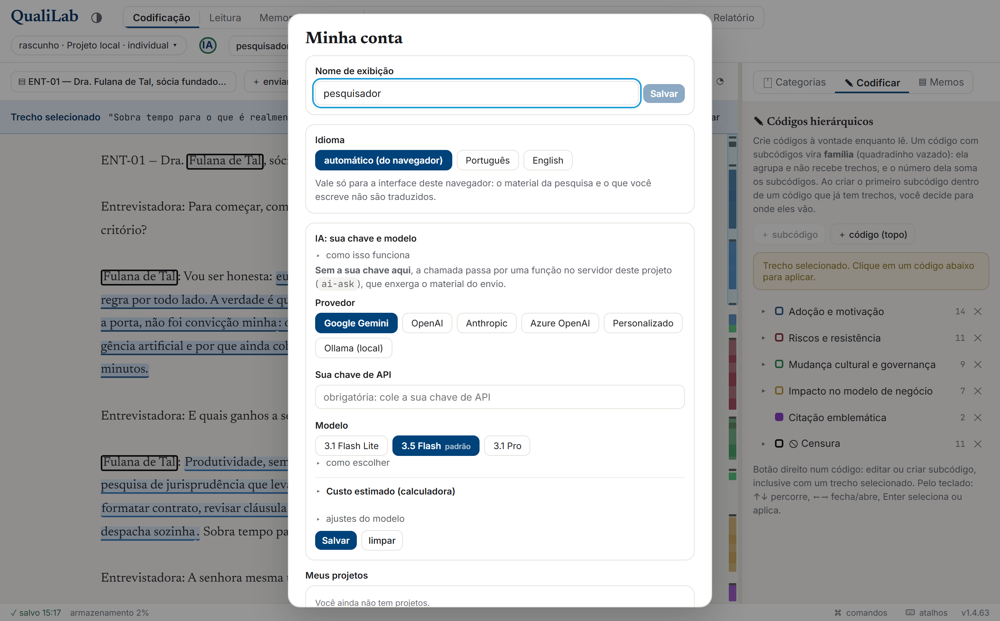

Clique no **seu nome** no cabeçalho para abrir **Minha conta** (funciona **em todos os modos**: nuvem, rascunho e arquivo):
- Trocar o **nome de exibição** (usado nas codificações).
- Alterar a **senha** (só contas com e-mail; some nos modos rascunho/arquivo).
- Ver **todos os seus projetos** num lugar só, com ações diretas: abrir, renomear (admin), sair ou excluir (admin).
- Configurar a sua **chave/modelo de IA** (BYOK), incluindo o **Ollama local** (ver [seção 17](#17-codificar-e-analisar-com-ia)).
- **Sair da conta** (só no modo nuvem).

> É por Minha conta que você chega à configuração de IA em **qualquer modo**, inclusive offline, para apontar o **Ollama local**.

> Esqueceu a senha? Não precisa estar logado: use **Esqueci minha senha** na tela de acesso (ver [seção 18](#18-solução-de-problemas)). Já o **e-mail** da conta não pode ser trocado no app.

---

## 15. Importar e exportar

Os menus **exportar ▾** e **importar ▾** ficam no cabeçalho (aparecem quando há documentos).

### Exportar (menu "exportar ▾")
| Item | O que é |
|---|---|
| **.qualilab (projeto completo, nativo)** | Tudo (documentos, categorias, valores, códigos, codificações, memos) para reabrir no QualiLab. É o backup completo do projeto |
| **JSON (projeto)** | Projeto completo com camadas e autores |
| **CSV (trechos codificados)** | Um trecho por linha (documento, código, camada, autor) |
| **CSV (atributos por documento)** | Um documento por linha, com os valores de categoria. **Tem caminho de volta**: preencha na planilha e reimporte, ver [abaixo](#preencher-categorias-numa-planilha-e-trazer-de-volta-passo-a-passo) |
| **QDPX (ATLAS.ti / MAXQDA / NVivo)** | Padrão REFI-QDA; prefere a camada final quando consolidada |
| **QDC (codebook REFI-QDA)** | Só o livro de códigos |

> **O que acontece com as categorias no QDPX.** O padrão REFI-QDA guarda **um valor por documento por atributo**, sem autor e sem tipo rico. Na prática: viaja o **gabarito** (as respostas individuais de cada pesquisador ficam só no `.qualilab`); **Número**, **Sim/Não** e **Data** saem tipados (Integer/Float, Boolean, Date) e chegam ordenáveis do outro lado — mas só quando **todos** os valores daquela categoria cabem no tipo: basta um "Não informado", ou uma data sem o dia, para a categoria inteira sair como texto, porque um pacote com valor fora do tipo é recusado inteiro por importadores estritos. Os demais tipos saem como **texto**, com o tipo real numa descrição que só o próprio QualiLab lê de volta; e uma **Caixa de Seleção** com vários valores viaja como um texto único ("a | b"), porque nem o MAXQDA nem o NVivo têm atributo de múltiplos valores. Nada disso se perde no `.qualilab`, que é o único formato sem perda.

> **Trechos com mais de um código no QDPX.** Quando **você** aplica dois códigos ao mesmo trecho, o QDPX leva **uma citação com os dois códigos** — que é como as outras ferramentas representam isso — e não duas citações idênticas sobrepostas. A **nota analítica** do trecho viaja junto e volta inteira na importação. O agrupamento é conservador de propósito em dois casos, e nos dois a citação continua repetida: quando o trecho foi codificado por **pessoas diferentes** (a outra ferramenta lê o codificador da citação, e juntar trocaria a autoria) e quando **dois códigos do mesmo trecho têm nota própria** (só cabe uma nota por citação).

> **Todos os itens acima saem completos, sem mascarar nada**, inclusive os trechos marcados como **censura**. São formatos de trabalho e migração: quem exporta está levando o próprio material para outra ferramenta, e mascarar ali seria perda irreversível. As saídas de **transparência** (Relatório Interativo / W3C) ficam na aba **Relatório**, não neste menu, e essas sim mascaram. Antes de mandar qualquer coisa para fora da equipe, veja [12.4](#124-antes-de-publicar-trabalhe-no-laboratório-publique-de-uma-cópia).

### Importar (menu "importar ▾")
| Item | O que traz |
|---|---|
| **.qualilab** | Mescla um projeto exportado. Em destino **coletivo**, preserva a resposta de cada pesquisador de origem; o gabarito vira gabarito |
| **QDPX** | Projeto REFI-QDA de outras ferramentas. O tipo de categoria que a origem **declara** (número, Sim/Não, data) é respeitado; o que ela declara só como texto é **inferido** (revise no esquema). Inclui importação reforçada de `.qdpx` do **ATLAS.ti** com PDFs |
| **.sqlite3 (Taguette)** | Projeto nativo do Taguette: documentos, tags (hierarquia por `/` ou `.`) e trechos. Sem atributos nem autor por trecho |
| **.qdc (codebook REFI-QDA)** | Só o livro de códigos |
| **planilha (.csv / .xlsx → documentos + categorias)** | **Cada linha vira um documento**, veja abaixo |
| **planilha (.csv / .xlsx → atualizar categorias)** | **Preenche categorias de documentos que já existem**, casando pelo nome. Não cria documento nenhum, veja abaixo |
| **pasta do Zotero (Zotero RDF)** | **Cada referência com PDF vira um documento**; os metadados viram categorias e a referência vira memo, veja abaixo |

> Em projeto **coletivo na nuvem**, **importar é uma ação de administrador** (o import cria dados compartilhados e pode escrever o gabarito). Em rascunho, arquivo ou projeto individual, qualquer usuário importa.

#### Importar uma coleção do Zotero (passo a passo)
1. **No Zotero**: botão direito na coleção → **Exportar coleção…** → formato **Zotero RDF**, com **Exportar arquivos** marcado. Ele cria uma **pasta** (um `.rdf` mais uma subpasta `files/`).
2. **No QualiLab**: **importar ▾ → pasta do Zotero** e escolha **a pasta inteira** (não o `.rdf` sozinho: sem os arquivos não há texto para codificar).
3. A tela de mapeamento mostra quantas referências têm PDF e deixa você decidir três coisas:
   - **quais metadados viram categorias.** Tipo de item, ano, autores, publicação e palavras-chave vêm marcados; idioma, DOI, URL e páginas vêm desmarcados. Você muda o tipo de cada um ou deixa de fora, e só aparecem os campos que alguma referência preencheu;
   - **o nome do documento**: "Autor (ano) · título" ou só o título. Como a lista de documentos é ordenada por nome, a primeira forma deixa o corpus na ordem de uma bibliografia;
   - **se o PDF original fica guardado** (é o que habilita "ver original", o número da página nos trechos e o OCR).
4. Antes de confirmar, abra **"O que não vai entrar"**: ali estão, pelo nome, as referências sem PDF, as com anexo que é página salva em vez de PDF, e as cujo arquivo não está na pasta.

- O texto sai do PDF do mesmo jeito que no `＋ enviar`, então tudo o que depende do PDF funciona igual. **PDF sem camada de texto (escaneado) entra vazio de propósito**: abra o documento e use **⋯ → ler com OCR**.
- A **referência completa, o resumo e as notas que você escreveu no Zotero** vão para o **memo do documento** (aba [Memos](#11-memos)), não para uma categoria: são texto seu *sobre* a fonte, e resumo em campo de categoria fica ilegível.
- O **ano** vira uma categoria de **Data**, então a aba **Tempo** dos [Gráficos](#10-gráficos) passa a funcionar. Quando a data da referência é ambígua (`11/13/2014` pode ser 13 de novembro ou 11 de dezembro), o QualiLab guarda **só o ano** em vez de chutar o dia.
- **Não vêm códigos nem trechos codificados**: uma biblioteca de referências não tem isso, e as marcações feitas no leitor de PDF do Zotero não saem na exportação dele.

#### Importar uma planilha (passo a passo)
1. **importar ▾ → planilha (.csv / .xlsx)** e escolha o arquivo.
2. No **modal de mapeamento**, para cada coluna escolha o papel: *Ignorar*, **Texto (conteúdo)**, **Nome do documento**, **Memo do documento**, ou **Categoria · <tipo>**.
3. É obrigatório marcar **exatamente uma** coluna como **Texto**.
4. Para categorias fechadas, as opções são deduzidas dos valores observados. Confirme em **Importar**.
- Linhas sem texto na coluna de conteúdo são ignoradas (o resumo informa quantas). O `.csv` detecta o separador (`,`/`;`/tab); o Excel importa a **primeira aba**.

> **Colunas que viram memo.** A coluna "Observações", "Parecer" ou "Resumo do caso" não é dado nem atributo: é o que **você** anotou sobre aquela linha, e texto longo em campo de categoria fica ilegível. Marque-a como **Memo do documento** e ela vai para a aba [Memos](#11-memos). Dá para marcar **várias**: o memo é então **costurado**, um bloco por coluna, na ordem em que elas aparecem na planilha. Cada bloco é identificado pelo **título da coluna** (numa planilha, o cabeçalho é a única coisa que diz o que aquele texto é) — dá para desligar numa caixa de seleção, e o modal mostra uma **prévia** do resultado antes de importar. Célula vazia não vira bloco vazio, e linha sem nenhuma dessas colunas preenchida não ganha memo.

#### Preencher categorias numa planilha e trazer de volta (passo a passo)

Responder o mesmo atributo em 200 documentos é onde a tela trabalha contra você: numa planilha, é
arrastar uma coluna. Este caminho é o **de volta** do CSV de atributos — o arquivo da ida é o mesmo
da volta, não há formato novo.

1. **exportar ▾ → CSV (atributos por documento)**. Você recebe uma linha por documento, uma coluna
   por categoria.
2. Abra no Excel (ou no LibreOffice) e **preencha as células**. Não mexa na coluna `documento`: é
   por ela que cada linha reencontra o seu documento.
3. **importar ▾ → planilha (.csv / .xlsx → atualizar categorias)** e escolha o arquivo.
4. A tela mostra **o que vai mudar antes de gravar**: quantas respostas serão preenchidas, quantas
   alteradas (com o valor atual ao lado do novo), quantas já estão iguais, e quais linhas não
   corresponderam a nenhum documento. Confirme em **Aplicar**.

O que ele faz e o que não faz:

- **Nenhum documento é criado, renomeado ou excluído.** Para criar documentos a partir de uma
  planilha, use o outro item do menu.
- **Cada linha casa com o documento de mesmo nome** (acento, caixa e espaço a mais não atrapalham).
  Nome que não existe no projeto, ou que aparece em **dois** documentos, é ignorado e listado: o
  QualiLab não escolhe por você. Se você renomeou documentos depois de exportar, exporte de novo.
- **Célula em branco não apaga nada**, porque o arquivo exportado já vem em branco no que nunca foi
  preenchido. Para esvaziar respostas de propósito, marque **"Célula em branco apaga a resposta"**.
- **Valor que ainda não existe numa categoria fechada é acrescentado às opções**, e a tela diz
  quais são antes de aplicar — é ali que se percebe um erro de digitação virando opção nova.
- **Coluna que não corresponde a nenhuma categoria nasce ignorada** (é o caso do `n_trechos`, que é
  calculado). Qualquer coluna pode virar uma **categoria nova**, escolhendo o tipo.
- **Datas**: valem `04/07/2013`, `2013-07-04`, `07/2013` e `2013` (só o ano). O que não dá para
  entender é recusado e informado, nunca chutado.
- Em projeto **coletivo**, você escolhe se está preenchendo o **gabarito da equipe** (administrador)
  ou a **sua resposta**.

> Depois de importar de outra ferramenta, vale revisar o esquema de categorias (os tipos podem ter sido inferidos).

---

## 16. Salvamento, backup e modos de armazenamento

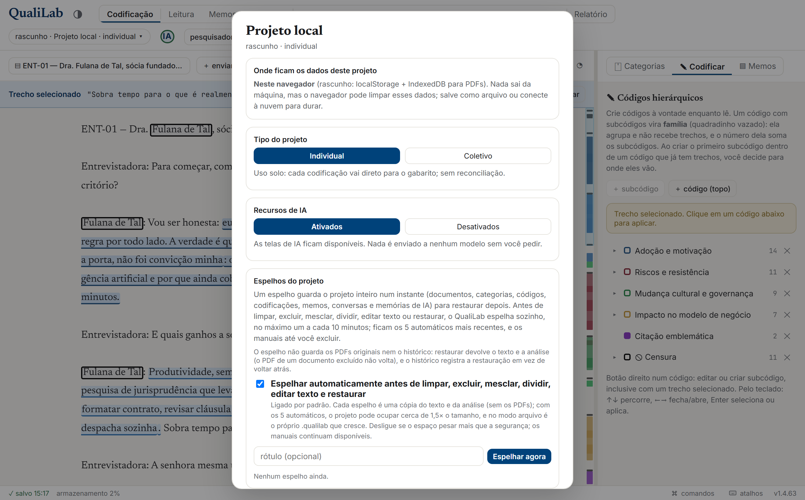

O QualiLab **salva sozinho** a cada ação. *Onde* ele salva depende do modo:

| Modo | Onde fica | Indicador | Quando usar |
|---|---|---|---|
| **Arquivo local** | Um `.qualilab` no disco | `arquivo ·` | Dados sensíveis, offline, sem rede |
| **Rascunho** | `localStorage` do navegador | `rascunho ·` | Só testar rápido (efêmero) |
| **Nuvem** | Supabase | `nuvem ·` | Equipes, vários dispositivos |

### Sensibilidade dos dados: o que é seguro habilitar
Antes de escolher o modo, decida **o quanto da ferramenta você pode usar** conforme a **sensibilidade do material**. Não é uma escolha neutra. Primeiro, para onde o material vai em cada caminho:

- **Arquivo / Rascunho:** ficam **no seu dispositivo** e **não saem dele**.
- **Nuvem:** vão a um **servidor de terceiros** (Supabase) para sincronizar entre pessoas e aparelhos. Saem do seu controle direto e ficam sujeitos aos termos do provedor.
- **IA de nuvem:** os trechos que você analisar vão ao **provedor de IA** que você usar, exceto o que estiver marcado como **censura**, mascarado antes do envio ([seção 17](#17-codificar-e-analisar-com-ia)).
- **Publicação:** o que você divulgar (relatório ATI / anotações W3C) fica **público**. A censura é mascarada por padrão, mas confira antes.

Use a matriz para decidir (regra **safe-by-default**: na dúvida, trate como mais sensível):

| Nível | Exemplo | Nuvem (Supabase) | IA remota (provedor) | IA local | Publicar (ATI/W3C) |
|---|---|---|---|---|---|
| **Público / sintético** | Decisões públicas, dados já abertos, exemplo sintético | OK | OK (qualquer provedor) | OK | OK |
| **Sensível trafegável** | Entrevistas sem vedação formal; dado que você prefere proteger | OK, com ciência | Preferir a **sua própria** chave (paga/institucional) e conferir o que sai e a censura | Preferível | Caso a caso, com a censura conferida |
| **Vedado** | Comitê de ética que proíbe saída, saúde identificável, segredo de justiça | **Não** | **Não**, desligue a IA para essa análise | Só se for **local de verdade** (offline + modelo na máquina) | **Não** |

> Há um limite honesto: **privacidade total e o conjunto completo de recursos não coexistem** numa ferramenta que roda no navegador. Dado vedado empurra você para o canto **offline/arquivo**, e é nesse mesmo canto que mora a **IA local** (Ollama na sua máquina). É uma restrição real, não um detalhe.

**O que a censura e a anonimização _não_ fazem.** O QualiLab **não identifica nem mascara dados pessoais no conteúdo** dos documentos (nomes, CPF, dados de saúde). Duas coisas parecem "anonimização" mas **não são**: a **censura** mascara só os trechos que **você** marcou (não varre o texto atrás do que é sensível); a opção **anonimizar** das exportações de transparência apenas **omite a autoria**. Ou seja, confiar na censura é confiar que **você** marcou, à mão, cada detalhe identificável **antes de cada envio**, e disciplina perfeita não é um controle de segurança. Anonimizar, obter consentimento e escolher o modo adequado é **responsabilidade sua**. Duas ajudas concretas: a aba **Repetir Codificação** ([5.5](#55-censura-mascarar-trechos-sensíveis)) acha as outras ocorrências idênticas de um termo que você já censurou, e o fluxo de **projeto de publicação** ([12.4](#124-antes-de-publicar-trabalhe-no-laboratório-publique-de-uma-cópia)) cuida de título, valores de categoria e memos, que a censura não alcança.

### Modo arquivo (Chrome/Edge)
O projeto é um arquivo `.qualilab` **visível no sistema de arquivos** (qualquer pasta, HD externo, volume criptografado). Zero rede, zero `localStorage`, 100% offline. Comece em **"Meus projetos" → Novo arquivo… / Abrir arquivo…**. O app reabre o último arquivo na sessão seguinte (com permissão do navegador).

### Modo nuvem (Supabase): o que é, e como os dados ficam protegidos (ou não)
A **nuvem** guarda o seu projeto num banco de dados online para que ele **sincronize** entre pessoas e aparelhos. Esse banco roda no **Supabase**, um serviço de infraestrutura de terceiros (banco de dados + login) muito usado por aplicativos. O QualiLab não tem servidor próprio; ele apenas conversa com um projeto Supabase.

A pergunta que mais importa é **de quem é esse Supabase**:

- **Servidor padrão do QualiLab** (o que você usa ao clicar "Entrar na nuvem" sem configurar nada): os dados vão para o **Supabase do autor**. Ele mantém o serviço no ar e, por ser dono do banco, **tecnicamente consegue** acessar o conteúdo. É prático, mas significa confiar os dados a um projeto pessoal, sem garantia institucional (releia o *Aviso legal* na [seção 0](#0-a-ideia-do-qualilab)). O autor **não quer** estar nessa posição com dado sensível, daí a recomendação no fim desta seção.
- **Seu próprio Supabase** (a pílula do projeto fica **violeta**, "nuvem pessoal"): você aponta o app para um projeto Supabase **seu** (criar um é gratuito). O banco passa a ser seu; só você e quem você autorizar têm as chaves. Continua hospedado pela empresa Supabase, mas o dono dos dados é você. Configure no hub do projeto, em **Conexão (Supabase)** ("Conectar ao meu Supabase").

**O que protege os seus dados na nuvem:**
- **Login** (e-mail e senha, via Supabase Auth): só quem tem conta entra.
- **Isolamento entre usuários** (a chamada *Row Level Security*): as regras do banco garantem que cada pessoa só enxerga os **projetos de que é membro**. Um colega não vê os seus outros projetos, e quem não foi convidado não vê nada.
- **Trânsito criptografado** (HTTPS) e **criptografia em repouso** no disco do Supabase, o padrão de qualquer serviço de nuvem sério.

**O que a nuvem NÃO faz:**
- **Não é criptografia ponta a ponta.** Os dados ficam **legíveis** para quem administra o banco: no servidor padrão, isso inclui o **autor**; no seu Supabase, inclui **você**; e, nos dois casos, a empresa **Supabase** como hospedeira. O isolamento acima protege você dos *outros usuários*, não do *dono do banco*.
- **Não guarda cópia do que você apaga** no servidor: excluir projeto ou documento é definitivo (baixe um `.qualilab` antes).
- **Não substitui o modo offline.** Desde a v1.4.7 o que você **escreve** sem conexão fica guardado e sobe sozinho (veja o quadro abaixo), mas **ler** continua exigindo rede: sem conexão, abrir um documento que ainda não foi carregado ou trocar de projeto não funciona. Para trabalhar de verdade sem internet, use o **modo arquivo**.

> **Se a nuvem falhar, você não perde o que estava fazendo.** Quando o servidor não responde por um motivo passageiro (conexão caiu, servidor fora do ar), a alteração **fica guardada neste navegador e continua na tela**; ela sobe sozinha assim que a nuvem responder. O cabeçalho mostra **quantas estão aguardando** — clique ali para tentar na hora. Pode continuar trabalhando, e **fechar a aba não perde a fila**: ela volta quando você reabrir o projeto. Isso vale para o trabalho do dia a dia (codificações, respostas de categoria, notas, conversas salvas da IA e memórias). Mudanças **estruturais** — criar/excluir documento, mexer no esquema de códigos, gestão do projeto e importações — avisam na hora se falharem, de propósito: numa pesquisa coletiva, reaplicá-las minutos depois produziria um estado que ninguém pediu. E se a nuvem **recusar** de vez uma alteração (o seu papel no projeto mudou, ou outra pessoa excluiu o alvo), aparece um aviso do que foi recusado, com atalho para baixar um `.qualilab` antes de refazer.

Vale, então, a mesma lógica de confiança da [seção 17.5](#175-para-onde-vão-os-seus-dados-provedores-e-configuração): a nuvem é ótima para colaborar e sincronizar, mas usá-la é **confiar o conteúdo a quem administra o banco**. Para dado **sensível**, prefira o **seu próprio Supabase**, o **modo arquivo** ou o **rascunho local**, onde o conteúdo não passa pelo servidor de outra pessoa — e isso vale **também quando você usa a IA**, porque com a **sua** chave o navegador fala direto com o provedor, sem intermediário ([17.1](#171-como-a-ia-funciona-aqui)). O que a IA muda é a outra ponta: o **provedor que você escolher** vê o material enviado ([17.5](#175-para-onde-vão-os-seus-dados-provedores-e-configuração)).

> **PDF original na nuvem.** Guardar os *bytes* do PDF original na nuvem (para "ver original"/OCR em outro aparelho) é **opcional** e pede um **consentimento explícito** no envio, porque aí quem administra o banco passa a poder abrir o **PDF inteiro**, não só o texto que você codificou. Sem marcar, sobe só o texto e a codificação. Para dado sensível, mantenha o PDF no **modo arquivo**.

### Backup automático em pasta (modo rascunho, Chrome/Edge)
Mantém um `backup-automatico.qualilab` sempre atualizado numa pasta sua, como espelho do `localStorage`. Ative em **pílula do projeto → Backup automático em pasta → Escolher pasta…**.

### Salvar/baixar manualmente
**exportar ▾ → .qualilab (projeto completo, nativo)** baixa o projeto inteiro a qualquer momento, em qualquer modo. Bom para versões e backups manuais. (O mesmo arquivo é oferecido pelo atalho da faixa de erro, quando o salvamento automático falha.)

### Quando o salvamento falha
Se o navegador não conseguir gravar (`localStorage` cheio, permissão de pasta revogada, disco removido), aparece uma **faixa vermelha persistente** avisando que as últimas alterações **não** foram salvas, com um atalho para **baixar .qualilab** na hora. Ela só some quando um salvamento volta a funcionar. **Não ignore esse aviso**: baixe o backup antes de continuar.

### Modo nuvem offline
O cabeçalho mostra `offline` (âmbar) quando a conexão cai e, ao lado, **quantas alterações estão aguardando envio**. **Você pode continuar codificando**: o que você escreve fica guardado neste navegador e sobe sozinho quando a nuvem voltar a responder (é a fila descrita no quadro acima, e ela sobrevive a fechar a aba).

O que **não** funciona sem rede é **ler** o que ainda não foi carregado: abrir um documento que você não abriu nesta sessão, ou trocar de projeto. Por isso o modo nuvem **não substitui o modo arquivo** para trabalhar de fato offline — e, se você vai passar um tempo longo sem conexão, baixe um `.qualilab` antes, como segurança.

---

## 17. Codificar e Analisar com IA

> As telas de IA são **opt-in** e ficam no cabeçalho. Os princípios da [seção 0](#0-a-ideia-do-qualilab) valem aqui como **regras**: opt-in, transparência, e a IA nunca decide por você. Nada é enviado a um provedor de IA sem que você configure uma chave e peça a análise.

A IA do QualiLab não "codifica sozinha" nem escreve no seu projeto sem permissão. Ela aparece em três telas: *Codificar Automaticamente* (assistentes que **propõem** mudanças ao seu projeto, você revisa item a item), *Analisar com IA* (leitura e interpretação de um material que você recorta) e *MCP/RAG* (a IA busca o material sozinha; veja [17.6](#176-mcprag-a-ia-pede-o-material-em-vez-de-receber)). Em todas, o resultado é uma **proposta** ou um **texto** que você revisa. Aplicar qualquer mudança é sempre um ato seu.

### 17.1 Como a IA funciona aqui

- **Onde a chamada vai.** Com a **sua** chave (o caso normal, veja o item seguinte), o **navegador fala direto com o provedor** que você escolheu: o material **não passa por nenhum servidor do QualiLab**. Duas exceções, uma em cada ponta: o **Ollama local** vai direto para a **sua máquina** (nada sai dela); e um endpoint **Personalizado**/**Azure** que não libere chamadas de navegador (a regra de CORS é de quem serve a API) faz a chamada ser **refeita** por uma função no servidor deste projeto (Supabase Edge Function `ai-ask`) — que então enxerga o material daquele envio. O card de IA em **Minha conta** diz, para a **sua** configuração, por qual caminho ela vai. Para onde **cada provedor** manda o dado, e o que isso implica para material sensível, veja [17.5](#175-para-onde-vão-os-seus-dados-provedores-e-configuração).
- **De quem é a chave (BYOK).** O padrão é **você trazer a sua própria chave** e modelo, configurados em **Minha conta** (veja 17.4). Eles ficam **só neste navegador**: a chave acompanha apenas a requisição ao provedor, e não é gravada em servidor nenhum. (Uma instância que hospede a própria pode, opcionalmente, configurar uma **chave de servidor**; aí as chamadas dela passam pela função `ai-ask`, que é quem guarda essa chave. A versão pública não tem.)
- **Ver e configurar o prompt (⚙).** Toda tela de IA tem, no topo, o botão **⚙ Configurar Prompt**. Ele abre a **prévia exata** do que será enviado, seção por seção (papel, memo, memória, material, regras, tarefa), com o modelo ativo, as contagens, a **estimativa de tokens e de custo (≈ R$)** e um botão **copiar prompt**. No mesmo painel você ajusta o que a IA recebe: nas telas de *Codificar*, as **instruções próprias à IA**, os **memos injetados** e a **memória do projeto**; em *Analisar*, isso **e** a **postura** metodológica (veja [17.3](#173-analisar-com-ia-leitura-assistida-do-material)). **Nada sai do navegador sem passar por aqui**. É a face concreta da regra de transparência.
- **Provedores suportados** (com chave própria): **Gemini**, **OpenAI**, **Anthropic**, **Azure OpenAI**, **Personalizado** (qualquer API compatível com o formato OpenAI `/chat/completions`: DeepSeek, Mistral, Qwen hospedado, ou um servidor próprio Ollama/vLLM exposto numa URL pública) e **Ollama local** (modelo na sua própria máquina, chamado **direto pelo navegador**, sem passar pelo servidor, veja [17.5](#175-para-onde-vão-os-seus-dados-provedores-e-configuração)).
- **Censura sempre antes do envio.** Trechos de códigos marcados como **censura** ([5.5](#55-censura-mascarar-trechos-sensíveis)) são substituídos por `[trecho censurado]` **antes** de o material sair do navegador. Em *Analisar com IA*, você pode optar por incluir um código de censura específico naquela análise (opt-in explícito, por código).
- **Ajuste das respostas.** A IA vem calibrada para respostas focadas e consistentes (não "criativas"), adequadas à análise. Você não precisa configurar nada.
- **Limites de tamanho (e o aviso quando o material é cortado).** Há um teto por envio: cerca de **400.000 caracteres (~133 páginas) por documento** e **600.000 no total (~200 páginas)**. Cabe uma seleção generosa (várias entrevistas, um acórdão inteiro, os trechos de um código inteiro), mas não o corpus todo de uma vez. O que passa disso é **cortado para caber**, e o corte é de dois tipos, com efeitos bem diferentes:
  - **a seleção inteira passou do total**: os **últimos itens da lista ficam de fora por completo** (num assistente de codificação, os documentos que ficaram de fora não recebem sugestão nenhuma). Em *Organizar Códigos* o corte é outro: a **lista de códigos vai sempre inteira** e quem encolhe é a amostra de trechos;
  - **um documento passou do teto por documento**: ele entra, mas **só pelas primeiras ~133 páginas**. O resto do texto não vai à IA. Aqui a saída não é selecionar menos: é **dividir o documento** em documentos menores.

  **Sempre que algo é cortado, uma faixa amarela aparece na tela**, na coluna de configuração, dizendo quantos documentos ficaram de fora e quantos entraram só pelo começo. A prévia do **⚙ Configurar Prompt** mostra o tamanho em páginas e marca no texto o ponto exato do corte. Vale confiar no aviso e não no silêncio: sem ele, um resultado montado sobre metade do material se parece com um resultado completo.
- **Estimativa de custo.** Com a **sua própria** chave paga, o **⚙ Configurar Prompt** mostra, **antes de enviar**, o custo aproximado do envio (**≈ R$**, ao lado da estimativa de tokens), e assim você sabe o preço estimado *antes* de rodar. E, no *Analisar com IA*, **cada resposta** traz o **custo estimado** (em R$, com o total acumulado da conversa). As duas são **estimativas de teto** (não descontam cache); a de antes do envio ainda **presume um tamanho de resposta** (a saída real varia). **Quando uma tela dispara várias chamadas** — a avaliação às cegas do *Sugerir Categorização* e o *Definir Categoria*, que lê um documento por vez —, a estimativa soma **todas** elas, e uma nota ao lado do número diz quantas são; a barra de material continua medindo a **maior** chamada, que é a que pode ser cortada. No *Definir Categoria*, o **teste nos documentos guardados** é outro clique e tem estimativa própria, ao lado do botão. O câmbio e, para provedores sem tabela de preços, a sua tarifa se ajustam em **Minha conta**. Com o **Ollama local** o custo é zero.

> ⚠️ **A IA pode errar e inventar.** Trate toda saída como hipótese a conferir contra o trecho citado. É exatamente por isso que a regra é "a IA propõe, você decide".

### 17.2 Codificar Automaticamente: cinco assistentes em abas

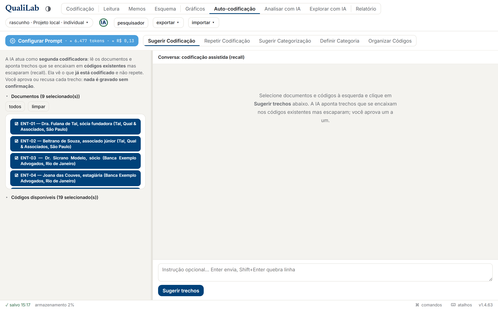

A tela **Codificar Automaticamente** reúne **cinco assistentes** em abas, no topo: **Sugerir Codificação** (que abre por padrão), **Repetir Codificação**, **Sugerir Categorização**, **Definir Categoria** e **Organizar Códigos**. Todos seguem o mesmo padrão: o assistente **propõe**, você **aprova ou recusa item a item**, e **nada é gravado sem a sua confirmação**.

> **Uma das cinco não usa IA.** A **Repetir Codificação** ([17.2.5](#1725-repetir-codificação-sem-ia)) é mecânica: não precisa de chave, não manda nada para fora e funciona offline. É por isso que a tela se chama "Codificar Automaticamente" e não "Codificar com IA". As outras quatro são as que conversam com o provedor, e o que segue abaixo (prompt, custo, censura) vale para elas. O **Memo para a IA** e a memória do projeto entram como contexto ([seção 11](#11-memos)), a censura é mascarada, e o botão **⚙ Configurar Prompt** mostra o prompt inteiro e deixa ajustar as *instruções próprias à IA*, os *memos injetados* e a *memória do projeto* (veja [17.1](#171-como-a-ia-funciona-aqui)). Se a resposta for muito longa e vier cortada, o QualiLab aproveita os itens completos e descarta só o último (incompleto).

O botão **⚙ Configurar Prompt** (no topo de cada assistente) abre a janela abaixo. Em cima ficam os **controles**: **Instruções próprias à IA** (guias que entram em todo prompt, compartilhadas com o Analisar com IA), **Memos injetados** (por padrão o *Memo para a IA*; dá para incluir outros) e a **Memória do projeto** (liga/desliga quais insights entram no contexto). Embaixo, a **prévia exata do que será enviado**: o modelo ativo, a contagem de material (em **páginas**), **quantos códigos de censura foram mascarados**, a **estimativa de tokens e de custo (≈ R$)** e o prompt **seção por seção** (papel e princípios, memos, memória do projeto, material), com o ponto do corte marcado no texto quando o material não coube. Um botão **copiar prompt** leva tudo para a área de transferência. **Nada sai do navegador sem passar por aqui**: é a face concreta da regra de transparência.

#### 17.2.1 Sugerir Codificação: a segunda codificadora

*(A aba que abre por padrão.)* A IA atua como uma **segunda codificadora**: lê os documentos e aponta **trechos que se encaixam em códigos existentes mas escaparam** da sua primeira leitura. Ela **não cria códigos novos**. Selecione os **documentos** e os **códigos** que ela pode usar.

Para cada trecho proposto, a IA **copia o trecho do texto**, e o QualiLab o **localiza no documento** (vira um grifo de verdade). Cada item mostra o trecho, o código e um selo **"novo"** (ou **"≈ localização aproximada"** quando o casamento não é exato). Trechos que já estão codificados com aquele código **não** são repropostos (a IA vê a codificação existente); trechos que não puderam ser localizados no texto são descartados e contados. Censura nunca é codificada. Ao aprovar e aplicar, cada trecho vira uma **codificação** na sua camada. Confira no leitor da aba Codificação.

#### 17.2.2 Sugerir Categorização: preencher categorias já existentes

A IA **não cria categorias**: ela ajuda a **preencher o valor** das categorias que você já definiu (no Esquema), documento por documento. Selecione à esquerda quais **categorias** e quais **documentos** entram; a IA lê o texto e, para tipos de opção fechada, sugere **exatamente uma das opções** válidas.

As categorias vêm **antes** dos documentos porque a escolha delas alimenta o filtro **"sem valor (N)"**, ao lado de "todos" e "limpar": um clique seleciona só os documentos em que ao menos uma das categorias marcadas ainda está vazia — que costuma ser o trabalho que resta. Cada documento da lista mostra quantas categorias faltam ali, ou **"completo"** quando não falta nenhuma.

O detalhe importante: a IA recebe o que **já está preenchido** e só devolve **diferenças** ou **campos vazios**: se concorda com o valor atual, não propõe nada. Cada sugestão mostra um selo: **"já aplicada"** (com o valor atual → o sugerido) ou **"vazia"** (preenchimento novo). Aprove as que quiser e aplique: os valores entram na sua camada de respostas (ou no gabarito, em projeto individual), como se você os tivesse digitado na aba Codificação.

**A caixa "Avaliação às cegas" muda o que esta aba é.** No uso descrito acima a IA **vê** o que você já preencheu: é ótimo como conferente barato e não serve como medida, porque quem enxerga o gabarito antes de responder não está sendo avaliado. Marcando a caixa, a IA responde **todas** as categorias selecionadas **sem ver nenhuma resposta sua**, e a comparação com o seu gabarito é feita **aqui, depois** — não por ela. É **uma chamada por documento** (para que o documento que caísse no fim de uma lista longa não respondesse num contexto diferente do que caísse no começo), e por isso a barra de progresso conta documentos.

O resultado é um **placar de concordância**, categoria por categoria, com quatro colunas separadas de propósito: **concorda**, **diverge**, **a IA não respondeu** e **sem gabarito**. Só as duas primeiras entram na conta. "A IA não respondeu" é falha de rede, resposta sem formato ou valor que não cabia no tipo/nas opções — contar isso como erro rebaixaria o número pelo motivo errado; **"sem gabarito"** é documento que você ainda não respondeu, onde não há com o que comparar (essas respostas aparecem logo abaixo como sugestão de preenchimento, como no modo normal).

Como ler o número, e isto também está dito na tela: ele mede **concordância com aquele gabarito**, não acerto — onde os dois divergem, quem pode estar incompleto é a **definição da categoria**, mas a sua resposta também pode ser; e, com poucos casos, ele não distingue 27 de 28. Leia como ordem de grandeza, não como nota. No modo cego **não há conversa de acompanhamento**, de propósito: não se refina uma medida conversando com quem está sendo medido. O que se refina é a **definição** da categoria — e é para isso que serve a aba seguinte. Trocar de modo **limpa a conversa**, porque as duas respondem perguntas diferentes.

Uma última diferença, visível no **⚙ Configurar Prompt**: no modo cego o prompt **não** leva o *Memo para a IA* nem a *memória do projeto*. São campos de texto livre onde uma resposta sua pode estar escrita, e uma entrada de memória pode até ter sido proposta pela IA numa rodada em que ela via os valores preenchidos — bastaria isso para o placar medir a lembrança do vazamento em vez da definição. As duas seções aparecem na prévia **declaradas como omitidas**, em vez de sumirem sem explicação.

#### 17.2.3 Definir Categoria: escrever a instrução a partir do que você já respondeu

*As respostas que você já deu **contêm** a regra que você aplicou; o que falta é escrevê-la.* Esta aba lê uma amostra dos documentos que você já respondeu numa categoria e propõe a **definição** dela — o mesmo campo **descrição/instrução** do [Esquema](#7-esquema) que o codificador humano lê e que entra no prompt das telas de IA. Serve principalmente para o **começo do zero**: sem nenhuma definição escrita não há o que refinar, e é aí que um laço de "conferir e ajustar" não ajuda.

Como funciona, na ordem:

1. **Escolha a categoria.** Ao lado dela a aba diz quantos documentos já foram respondidos. Com menos de **seis** ela se recusa a rodar, e explica por quê: com tão poucos casos qualquer texto sairia conjectura com aparência de critério.
2. **Defina a amostra:** quantos casos de **treino** e quantos **guardados**. Os guardados são separados **antes de qualquer chamada** e **não entram no prompt** — é neles que a regra pode ser testada depois, porque decorar um caso que a IA já viu aparece como acerto. A amostra é **equilibrada por valor** (com 90 "Não" e 10 "Sim", uma amostra ao acaso ensinaria "quase sempre Não"), e um cartão mostra a repartição que de fato saiu, valor por valor.
3. **Propor definição.** Roda em dois tempos: primeiro uma **passada de localização** — uma chamada curta por caso de treino, que **não decide nada**, só copia do documento o trecho literal que sustenta a resposta que **você** já deu (é o que faz um corpus longo caber numa indução) — e depois a chamada que escreve o verbete.
4. **Edite e aplique.** O texto vem num campo editável; **Aplicar à categoria** grava. Como a definição faz parte do esquema, gravá-la exige permissão de **administrador**.

Junto da definição vêm três listas, e a primeira é a que paga a feature:

- **Casos que a regra não explica.** A IA é obrigada a aplicar a própria regra a cada caso recebido e a listar aqueles em que ela daria uma resposta **diferente da sua** — sem ajustar a regra para explicar todos. Ou a sua codificação está inconsistente nesses pontos, ou existe um critério que você aplica sem ter percebido: nos dois casos, é aí que está o trabalho. **Lista vazia é motivo de desconfiança, não elogio**: uma regra que explica 100 de 100 quase sempre decorou os exemplos.
- **Pontos que os exemplos não decidem.** Onde os casos não bastam, a IA é proibida de completar com o que soa razoável; o ponto fica declarado em aberto, e escrever a escolha é seu.
- **Casos sem nada no texto que sustente a resposta.** Sai de graça da passada de localização, que não julga nada. Pode ser resposta vinda de fora do documento, engano de preenchimento ou extração ruim do texto.

**O teste nos guardados, e o laço.** Com a definição no campo, o botão **Testar a definição** responde os documentos guardados **às cegas** e compara com o que você respondeu. É o **mesmo motor e o mesmo placar** da avaliação cega da aba anterior, de propósito: os dois números medem a mesma coisa e podem ser comparados. Ele testa o **texto do campo** (o rascunho), não o que está gravado — a graça é saber antes de aplicar —, e avisa se você editar o texto depois do teste. Onde a definição errou, cada caso aparece com a sua resposta ao lado da resposta da IA, e um botão **refaz a indução incluindo esses casos**: eles entram no treino da volta seguinte, e os novos guardados saem só de documentos que **nunca entraram em prompt nenhum**.

Três limites que convém saber antes de confiar no número:

- **Esta aba precisa da sua própria chave** (Minha conta). A saída é estruturada por ferramenta e conversa direto com o provedor, sem passar pela função do servidor.
- **Depois de várias voltas o número tende a ficar otimista**: o conjunto guardado é novo a cada volta, mas as suas escolhas passaram a depender do que você viu. Para uma medida limpa, separe documentos que você não vai usar em volta nenhuma — isso é método, não botão.
- **O controle de "quem já entrou em prompt" vale para a sessão**: trocar de categoria ou sair da tela recomeça a contagem.

As **cinco regras da indução** (escrever instrução e não descrição; a regra vale para o caso 101; só escrever critério que os casos sustentam; declarar o que não conseguiu explicar; a anatomia do verbete) são fixas e vão em todo prompt. Elas aparecem inteiras no **⚙ Configurar Prompt** e podem ser editadas ali: são o piso, não algema — regra que não sirva ao seu estudo se edita. A edição vale **para a sessão** e não fica guardada no projeto.

#### 17.2.4 Organizar Códigos: arrumar o livro de códigos

Ajuda quem terminou uma codificação aberta com **dezenas ou centenas de códigos soltos** a arrumar o esquema, no espírito da *grounded theory* (a teoria que se constrói a partir dos próprios dados). A IA lê a **lista completa de códigos** (com hierarquia e contagem de trechos) e, opcionalmente, uma **amostra de até 3 trechos por código**, e propõe **operações**, cada uma com sua justificativa:

| Operação | O que faz |
|---|---|
| **Mesclar** | Funde códigos redundantes num só |
| **Agrupar** | Reúne códigos sob uma família (existente ou nova) |
| **Mover** (reparent) | Muda um código de pai |
| **Renomear** | Sugere um nome melhor |
| **Promover** | Eleva um subcódigo a Hierarquia 0 |

As operações aparecem **dentro da resposta da IA** (no chat), cada uma com aprovar/recusar; aplique as aprovadas para mudar o esquema. Refine pedindo ajustes num follow-up. Códigos de **censura** ficam de fora desta reorganização (não são categoria analítica).

#### 17.2.5 Repetir Codificação (sem IA)

Esta aba **não usa IA**: não precisa de chave, não manda nada para fora, funciona offline e o resultado é sempre o mesmo. Ela pega os trechos que um código **já tem** e mostra as outras ocorrências **idênticas** deles no projeto inteiro, para você aprovar uma a uma.

Como usar: selecione um ou mais **códigos** à esquerda e clique em **Procurar ocorrências**. Cada resultado mostra o documento e o trecho **com o texto em volta**, que é o que permite decidir se aquela ocorrência merece o código. Aprove ou recuse item a item e clique em **Aplicar**. Ocorrências que você já aplicou ficam marcadas e saem da conta, então clicar de novo não duplica nada.

Detalhes que importam:

- **"Palavra inteira" já vem ligada.** Sem ela, um termo curto casa dentro de outra palavra ("Tal" dentro de "Total"). Os três botões (`Aa` diferencia maiúsculas, `ab⃒` palavra inteira, `.*` interpreta como expressão regular) são os mesmos da busca.
- **Ocorrências que já têm aquele código são ignoradas** e aparecem só na contagem ("N já codificada(s) com este código"). Se outro código diferente já cobre o trecho, a proposta continua valendo: dois códigos no mesmo trecho é legítimo.
- **Acha texto idêntico, não variante.** Se você marcou "Banca Exemplo Advogados", esta aba **não** encontra "Banca Exemplo" nem "a banca". Para essas, use [pesquisar +](#57-buscar-no-documento-e-no-projeto-inteiro) e decida caso a caso: só você sabe se "a banca" é o mesmo escritório.
- Serve a **qualquer código**, não só censura. É especialmente útil com termos recorrentes (nome de parte, órgão, expressão padrão). Com códigos cujos trechos são frases longas, o normal é não achar nada, porque frase longa raramente se repete igual.

**Por que ela existe.** A censura protege **o que você marcou**, e é fácil marcar um nome numa página e deixar passar as outras cinco menções. A alternativa seria o QualiLab avisar "há N ocorrências não protegidas", e isso foi **descartado de propósito**: um aviso desses, quando não encontra nada, é lido como "está tudo limpo", o que a ferramenta não tem como garantir (identificação também acontece por combinação de pistas, não só por nome). Uma lista de propostas para você aprovar não promete nada disso, porque quem decide é você.

### 17.3 Analisar com IA: leitura assistida do material

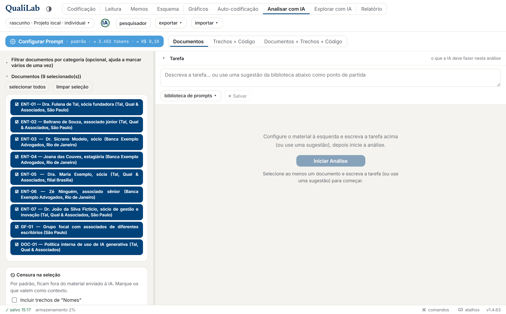

Ajuda a **interpretar** o material, sempre **citando as fontes**, numa **conversa** iterativa. Você escolhe o **escopo** (que material entra) e descreve uma **tarefa** (a pergunta ou o pedido de análise). As conversas úteis podem ser **salvas**: passam a aparecer na aba **Memos**, em "Conversas salvas".

A tela é um **chat**. Na **barra do topo** ficam o botão **⚙ Configurar Prompt** (à esquerda, veja abaixo) e o seletor de **Material** (o escopo). À **esquerda** você seleciona o material (documentos em lista, ou uma **árvore de códigos** com cores e contagem) e marca/desmarca a censura. À **direita** ficam a **Tarefa** (no cabeçalho, recolhível), a **conversa** e a **caixa de mensagem fixa embaixo**. As respostas saem formatadas (títulos, listas) e, enquanto a IA pensa, aparece um indicador animado. *(Na primeira vez, um aviso convida a abrir o "Configurar Prompt" antes de analisar.)*

**A Tarefa (o que você quer que a IA faça).** O campo da tarefa é **texto livre**, e é aqui que mora o essencial: **os melhores resultados vêm da tarefa que _você_ escreve**, com as suas palavras e a sua pergunta de pesquisa. Não há uma tarefa "certa" pré-pronta: a análise é sua, e a IA responde ao que você pedir.

Para não partir do zero (ou para se inspirar), o botão **biblioteca de prompts ▾** oferece duas coisas: **prompts de exemplo** do QualiLab e os **prompts que você mesmo salvou**. Qualquer item se **insere** no campo como um **ponto de partida editável**: ajuste-o antes de enviar. Quando montar um pedido que funcione bem, clique em **✦ salvar** para guardá-lo (ele passa a aparecer aqui e na aba **Memos → "Prompts salvos"**, onde dá para renomear ou apagar): assim você vai construindo a **sua própria biblioteca**, que é o objetivo. Os **prompts de exemplo** (só um ponto de partida, não um menu fechado) variam conforme o escopo:

- **Documentos** (texto integral dos documentos escolhidos): *Temas emergentes* · *Síntese analítica* · *O inesperado* · *Diferenças entre casos*.
- **Trechos + Código** (os trechos de cada código, tratado como categoria analítica): *O que há no código* · *Coerência & saturação* · *Código vs. definição* · *Diferenças entre casos*.
- **Documentos + Trechos + Código** (a codificação lida em contexto, uma "segunda leitura"): *O que escapou* · *Validação em contexto* · *Trecho em contexto* · *Síntese contextualizada*.

**Configurar o prompt (⚙).** O botão **⚙ Configurar Prompt** (no topo) abre o painel onde você ajusta a **voz** da IA e confere **exatamente** o que será enviado:

- **Postura** (Papel e princípios): a **lente metodológica** da análise, num único clique. *Padrão* (sem privilegiar uma abordagem), *Indutivo* (constrói categorias a partir do próprio material), *Dedutivo* (avalia o material à luz do esquema de códigos já existente), *Abdutivo* (busca a explicação que melhor dê conta dos dados, inclusive do inesperado) ou *Personalizado* (abre um campo para você descrever a postura com as suas palavras). O texto de cada postura aparece logo abaixo dos botões, e entra no prompt como parte do papel da IA.
- **Instruções próprias à IA**: guias que entram em **todo** prompt (ex.: "priorize a linguagem dos entrevistados"). *(Compartilhadas com o Codificar com IA.)*
- **Memos injetados**: quais memos a IA recebe. Por padrão, o **Memo para a IA** ([seção 11](#11-memos)); você pode incluir outros (de projeto, documento, código ou trecho).
- **Memória do projeto**: liga/desliga quais entradas do **diário de insights** ([seção 11](#11-memos)) entram no contexto desta análise.
- **Categorias como metadados**: opcionalmente, anexa a cada documento as suas categorias preenchidas (atributos do caso), para a IA situar cada fala. Desligado por padrão.
- **Prévia e proveniência**: abaixo dos controles, o prompt aparece **seção por seção**, com o **modelo** ativo, as contagens (material em **páginas**) e a **estimativa de tokens e de custo (≈ R$)**, e um botão **copiar prompt**. Se o material não couber, o corte é avisado na tela e marcado no texto da prévia (veja [17.1](#171-como-a-ia-funciona-aqui)).

**Passo a passo:**
1. Abra a aba **Analisar com IA**.
2. No topo, escolha o **escopo** e, à esquerda, **selecione o material** (há um filtro por categoria, colapsável, para marcar vários documentos de uma vez; os códigos aparecem em árvore).
3. Escreva a **Tarefa** (à direita), do zero, ou partindo de uma sugestão da **biblioteca de prompts**. Se quiser, abra o **⚙ Configurar Prompt** para definir a postura e conferir a prévia.
4. Clique em **Iniciar Análise**; depois **refine por follow-up** quantas vezes quiser, pela caixa de mensagem embaixo. "Analisar de novo" recomeça com a seleção atual; "Limpar conversa" zera.
5. **Salve** as conversas que valerem (botão *Salvar Conversa (Memos)*). Elas passam a aparecer na aba **Memos → Conversas salvas**, onde abrem por inteiro.

A IA recebe, junto, o **memo de cada código** e (se você ligar o toggle *Categorias como metadados* no Configurar Prompt) as **categorias preenchidas** de cada documento, para ancorar cada observação na sua **fonte** (documento, autor, camada), coerente com a ideia, lá da [seção 0](#0-a-ideia-do-qualilab), de manter a evidência ao lado da interpretação.

> **Botão "Sugerir memórias".** Ao fim de uma conversa, ele pede à IA que proponha entradas curtas para a **Memória do projeto** ([seção 11](#11-memos)): fatos ou decisões que valem lembrar entre sessões. Você aprova, edita ou recusa cada uma antes de gravar.

### 17.4 Configurar a sua chave (opcional)

Em **Minha conta → IA (sua chave e modelo)**:
1. Escolha o **provedor**.
2. Para *Azure*, *Personalizado* ou *Ollama local*, informe a **URL base** (no Ollama ela já vem preenchida com `http://localhost:11434/v1`).
3. Cole a **sua chave de API** (obrigatória, o app usa a **sua** chave; o Ollama local normalmente dispensa chave). Ao **trocar de provedor**, os campos vêm limpos: chave, modelo e URL base pertencem a um provedor. Voltar ao provedor que está salvo **repõe** a configuração dele, e o card avisa se a chave colada tiver cara de outro provedor.
4. Escolha o **modelo** (ou o nome do *deployment*, no Azure; no Ollama, digite o nome do modelo baixado, ex.: `qwen2.5:14b`). Em geral, modelos maiores são mais capazes, porém mais lentos e caros.
5. **salvar**, ou **limpar** para remover a sua chave.

O mesmo card traz ainda o **câmbio US$→R$** e, para provedores sem tabela de preços (*Personalizado*/*Azure*), a **sua tarifa** por milhão de tokens, usados na estimativa de custo ([17.1](#171-como-a-ia-funciona-aqui)).

> A sua chave fica **só neste navegador** (não é gravada em servidor nenhum); ela só acompanha a requisição que o próprio navegador faz ao provedor.

### 17.5 Para onde vão os seus dados: provedores e configuração

Com a sua própria chave, o navegador manda o material **direto** ao **provedor que você escolheu** (Gemini, OpenAI, Anthropic, Azure ou Personalizado), sem passar por servidor do QualiLab. Todos seguem a **mesma lógica**: o QualiLab envia o material, o provedor processa e devolve — e é **no provedor** que mora a decisão de confiança. Duas exceções: o **Ollama local**, em que o navegador fala com o modelo na sua própria máquina e **nada** vai à internet; e um endpoint **Personalizado**/**Azure** que recuse chamadas de navegador, caso em que a chamada é refeita por uma função no servidor deste projeto (Supabase `ai-ask`), que passa a ver o material daquele envio (a chave continua não sendo guardada lá).

**Retenção e treino: confie no provedor, não na cláusula.** Você não tem como auditar o que um provedor faz com o seu material; depende de acreditar na política dele, que muda com o tempo e vive de tecnicalidades ("não treinamos, mas retemos por segurança"). Por isso a regra mais honesta não é decorar quem treina:

> **Regra de bolso:** *se você não submeteria este dado num chat com o ChatGPT / Gemini / Claude, mesmo com o "usar meus dados" desligado, não o submeta pela API.* Mandar pela API muda os detalhes da política, não o fato de que o dado sai para um terceiro em quem você precisa **confiar**.

Quando a resposta for "não confio", não troque por outra promessa. Troque por algo que **não dependa de confiança**: **retenção zero contratual** (institucional, com recurso legal de verdade) ou **local** (Ollama, em que o dado não sai da máquina).

Para constar, o que as políticas *dizem* hoje (e pode mudar): camadas **gratuitas e de consumidor** (inclusive a **chave grátis do Google AI Studio**) costumam **treinar** com o seu conteúdo, e o próprio Google avisa "não envie informações sensíveis"; as **APIs da OpenAI e da Anthropic** dizem **não** treinar por padrão, mas **retêm** por dias. Serve para escolher entre opções de baixo risco, não para confiar dado sensível a uma promessa.

**Ollama local, na prática.** Como o navegador chama o `localhost` direto (sem passar pelo servidor), duas regras de segurança do navegador entram em jogo: é preciso **autorizar a origem do app** ao iniciar o Ollama (com `OLLAMA_ORIGINS`) e, se o app estiver em **HTTPS**, alguns navegadores bloqueiam a chamada a `http://localhost`. O caminho mais confiável é **rodar o app localmente** (o `index.html` baixado, ou `python -m http.server 8000`). Aí não há conflito. Os detalhes técnicos estão no [README](README.md).

> **Para dado vedado**, a única combinação que mantém tudo na sua máquina é o **Ollama local com o app rodando localmente**, offline. Modelos locais pequenos são menos precisos, mas nas tarefas que exigem um formato estrito o QualiLab já ativa um modo que força a saída correta.

### 17.6 MCP/RAG: a IA pede o material, em vez de receber

> **Esta tela é experimental**, e o app diz isso nela. Ela funciona e não altera nada, mas é a superfície mais nova do QualiLab: o formato das respostas e o conjunto de ferramentas ainda podem mudar entre versões. Não a use como o único registro de uma análise — o que você quiser guardar, guarde em memo ou no relatório.

Nas outras telas de IA **você monta o recorte** antes de perguntar: escolhe documentos, códigos, escopo, e a IA recebe aquilo pronto. Aqui é o contrário: você pergunta, e **a IA busca o material sozinha**, pedindo o que precisa por meio de um conjunto de ferramentas de leitura — ler um documento, buscar um termo, listar os trechos de um código, ver os memos. **Cada pedido aparece na tela**, com a ferramenta, os argumentos e um resumo do que voltou.

Isso muda o tipo de pergunta que cabe. Nas outras telas você pergunta sobre um material que já delimitou; aqui dá para perguntar sobre o corpus **inteiro** sem saber de antemão onde está a resposta:

- *"Que documentos falam de prazo, e como o tema aparece em cada um?"*
- *"Compare como os codificadores usaram a família Riscos."*
- *"Ache trechos que contradigam a nota que escrevi no projeto."*

**O que ela pode e o que não pode.** Todas as ferramentas são de **leitura**: nenhuma cria, altera ou apaga nada no seu projeto. A censura vale aqui como vale em todo lugar — trechos marcados chegam mascarados, e a máscara preserva o tamanho do texto, então as posições continuam corretas. E a tela mostra **o que de fato foi pedido**, não o que a IA diz que pediu: se a resposta afirmar algo que nenhuma leitura sustenta, a lista de chamadas denuncia.

**Precisa da sua chave** (veja [17.4](#174-configurar-a-sua-chave-opcional)), e consome mais que as outras telas: cada pergunta vira várias idas ao provedor, porque a IA lê, pensa e lê de novo. Há tetos automáticos — de passos de leitura e de quantidade de material — e, quando algum é atingido, a tela avisa em vez de parar sem explicação.

**Quando preferir as outras telas.** Se você já sabe qual material quer analisar, *Analisar com IA* é mais direto e mais barato. Esta tela ganha quando a pergunta é de **busca**: quando achar o material é parte do problema.

### 17.7 Desligar a IA neste projeto

Nem toda pesquisa quer IA por perto, e há dois motivos bem diferentes para isso: a pesquisa que precisa **declarar** que não usou (para o comitê de ética, para o parecerista, para o leitor do artigo), e a coordenação que teme **codificação de modelo entrando como julgamento humano** — o que contamina concordância entre codificadores, saturação, tudo. O QualiLab atende os dois com uma chave só, mudando o **alcance**.

**A pergunta vem na criação.** Todo projeto novo — na nuvem, em arquivo ou rascunho — pergunta se os recursos de IA ficam disponíveis. Nenhuma opção vem marcada, e **não responder é não ativar**. No cabeçalho, **entre a pílula do projeto e o seu nome**, um selo mostra sempre o estado da IA neste projeto — vermelho quando está desativada, verde quando está ativada. Clicar nele oferece trocar, com confirmação. Você também muda em **Projeto → Recursos de IA** (clique na pílula do projeto):

| escolha | quem fica com as telas de IA |
|---|---|
| **Ativados** | todos |
| **Só para administradores** | a coordenação; os demais pesquisadores não |
| **Desativados** | ninguém, você inclusive |

*Desativados* inclui você de propósito: é o que permite dizer à equipe "ninguém aqui usa, eu inclusive", e é o que impede reabrir a porta na pressa de um prazo.

**O que some, e o que fica.** Somem as telas de IA do cabeçalho e a configuração que só serve a elas (o **Memo para a IA** e os **Prompts salvos**, na tela Memos). **Fica** o registro do que já aconteceu: as **conversas salvas** e a **memória do projeto** continuam onde estavam. Esconder o registro seria o oposto da transparência que a declaração promete — e é ele que o relatório conta.

**A decisão acompanha o projeto.** Ela viaja dentro do `.qualilab`: salvar como arquivo, reabrir depois ou enviar para a nuvem preserva o que você escolheu. Importar material de um projeto sem IA para dentro de um projeto com IA ativa **não** muda a sua configuração (a decisão é do projeto que recebe, não do arquivo que chega), mas o resumo da importação avisa que aquele material vinha de um projeto assim. E conversas de IA guardadas num arquivo **não entram** num projeto que desativou a IA — o resumo diz quantas ficaram de fora, e por quê.

**O relatório passa a dizer isso.** Veja [12.5](#125-declaração-sobre-uso-de-ia).

> **Isto não é um bloqueio técnico, e é importante que você leia assim.** Qualquer pessoa pode copiar um trecho e colar noutra ferramenta, e nenhum software impede isso. O que a chave faz é tirar do aplicativo o trabalho **em massa** — e é o volume que desloca a análise, não uma consulta avulsa: três trechos copiados à mão não movem a concordância entre codificadores; duzentas sugestões aceitas numa varredura substituem o julgamento de um codificador inteiro. **Quem desativa a IA não deve ler "100% manual" como prova de coisa alguma.** É também a troca a fazer de olhos abertos: com as telas abertas você **vê** quanto de IA entrou; com elas fechadas entra muito menos, e o que entrar por fora chega indistinguível de trabalho manual.

---

## 18. Solução de problemas

**O app não carrega / tela em branco ao abrir o arquivo baixado.**
Ele precisa de internet na **primeira vez** (para baixar as bibliotecas). Se a política do navegador bloquear o `file://`, sirva por um servidor local: `python -m http.server 8000` na pasta do `index.html`.

**Não vejo "Novo arquivo…" nem o backup em pasta.**
Esses recursos usam a File System Access API, que só existe em **Chrome/Edge**. No Firefox/Safari, use o modo nuvem ou rascunho.

**Faixa vermelha "as últimas alterações NÃO foram salvas".**
O armazenamento encheu ou ficou indisponível. Clique em **baixar .qualilab** imediatamente; depois libere espaço (modo rascunho tem limite de ~5–10 MB) ou migre para o modo **arquivo**/**nuvem**.

**Um colega não vê meus códigos / categorias novas.**
Esquema de categorias e árvore de códigos não sincronizam ao vivo, peça para **recarregar a página**. (Codificações e respostas de categoria, sim, sincronizam.)

**Importei um `.qdpx` e as categorias vieram com o tipo errado.**
Os tipos são inferidos quando o arquivo vem de outra ferramenta. Ajuste em **Esquema → Categorias** (ou "Gerenciar esquema").

**Importei um `.qdpx` e as respostas de categoria estão todas no meu nome.**
Limitação do formato REFI-QDA, que não guarda autoria de atributos (só de trechos). Para preservar autoria por pesquisador, use o `.qualilab` nativo.

**Apaguei um código/categoria/documento sem querer.**
Não há desfazer para isso (Ctrl+Z só cobre a última *codificação de trecho*). Recupere de um backup `.qualilab`, se tiver.

**Criei a conta e não consigo entrar / o código não é aceito.**
A confirmação do cadastro é por **código digitado**, não por link: o e-mail traz um número, e você o digita na tela **"Confirme seu cadastro"**. Digite **todos** os números dele. Recusado, o motivo mais comum é ter **expirado** (vale por uma hora) ou você estar lendo um e-mail antigo depois de ter pedido **Reenviar código** — nesse caso só vale o do e-mail **mais recente**. Confira o **spam**. Se a conta já estiver confirmada, use **"Já confirmei — quero entrar"** e faça login normalmente.

**Esqueci minha senha.**
Na tela de acesso à nuvem, clique em **Esqueci minha senha**, informe o e-mail da conta e envie. Chega um link por e-mail que abre o QualiLab já na tela de **criar uma senha nova**. Feito isso, você entra direto. O link vale por pouco tempo e só pode ser usado uma vez; se der "Link expirado", peça outro na mesma tela. Confira o **spam**. Por segurança, a mensagem na tela é a mesma exista ou não uma conta com aquele e-mail (o app não confirma quem está cadastrado).

Se aparecer **"O servidor atingiu o limite de e-mails desta hora"**, não é problema com a sua conta:
o servidor tem uma cota de envio por hora, compartilhada entre confirmações de cadastro e
recuperações de senha, e ela se esgotou. Espere alguns minutos e tente outra vez; se insistir, avise
quem administra o servidor (a cota sobe configurando um SMTP próprio).

**A IA não falou de alguns documentos que eu selecionei (ou parou no meio de um).**
A seleção passou do que cabe num envio e foi cortada. Volte à coluna de configuração e procure a **faixa amarela**: ela diz quantos documentos ficaram **de fora** (esses não recebem sugestão nenhuma) e quantos entraram **só pelas primeiras ~133 páginas**. Para os que ficaram de fora, selecione menos documentos e rode outra vez; para um documento longo demais, divida-o em documentos menores. Os limites e o que cada corte significa estão em [17.1](#171-como-a-ia-funciona-aqui).

**O PDF importou com o texto bagunçado.**
PDFs muito visuais (colunas, tabelas, digitalizações) podem extrair mal. Tabelas não são reconstruídas. Quando possível, prefira `.docx`/`.txt`, ou cole o texto limpo.

---

## 19. Atalhos de teclado

| Atalho | Onde | Ação |
|---|---|---|
| **Botão direito** sobre uma seleção | Codificação | Menu para aplicar/criar código |
| **Botão direito** sobre um grifo | Codificação | Remover código / Anotar trecho |
| **Ctrl+Z** | Codificação | Desfazer a última codificação aplicada |
| **Enter** / **Shift+Enter** | Busca (🔎) | Próxima / anterior ocorrência |
| **Enter** / **Esc** | Renomear documento | Confirmar / cancelar |
| **Delete** / **Backspace** | Codificação | Excluir o grifo em foco (clique num grifo para focá-lo) |
| **↑ ↓** | Árvore de códigos | Percorrer os códigos |
| **← →** | Árvore de códigos | Fechar / abrir o nó |
| **Home** / **End** | Árvore de códigos | Primeiro / último código visível |
| **Enter** / **Espaço** | Árvore de códigos | Selecionar o código (ou aplicá-lo, se há trecho selecionado) |
| **Tab** / **Shift+Tab** | Janela de diálogo | Circular pelos controles, sem sair da janela |
| **Esc** | Janela de diálogo | Fechar (o foco volta ao botão que a abriu) |
| **← →** | Divisa de painel | Ajustar a largura (16 px por toque) |
| **Duplo clique** | Divisa de painel | Voltar à largura padrão |

---

## 20. Glossário

- **Código**: rótulo aplicado a um trecho; hierárquico (família → subcódigos).
- **Categoria / atributo**: propriedade do documento inteiro (sete tipos de campo).
- **Codificação**: uma aplicação de um código a um trecho específico (com autor e camada).
- **Camada**: *individual* (de cada pesquisador) ou *final* (gabarito consolidado).
- **Gabarito**: a camada final consolidada da equipe.
- **Reconciliação**: tela onde a equipe consolida o gabarito (projeto coletivo).
- **Memo**: nota analítica por projeto/documento/código/trecho.
- **Censura**: código que mascara trechos sensíveis nas saídas de transparência e no que vai para a IA. Os formatos de trabalho (`.qualilab`, QDPX, QDC, CSV, JSON) saem completos, ver [5.5](#55-censura-mascarar-trechos-sensíveis).
- **Co-ocorrência**: dois códigos aplicados ao mesmo trecho (ou sobrepostos).
- **Modo (armazenamento)**: onde os dados ficam (arquivo, rascunho ou nuvem).
- **Tipo de projeto**: individual (sem reconciliação) ou coletivo.
- **Papel**: admin (define esquema/gabarito/membros) ou membro.
- **REFI-QDA / QDPX / QDC**: padrão aberto de intercâmbio entre ferramentas de QDA.
- **ATI**: *Annotation for Transparent Inquiry*, método de transparência do QDR.
- **W3C Web Annotation**: padrão aberto de dados de anotação (base do ATI, hypothes.is etc.).
- **Opt-in**: recurso desligado por padrão que só age quando você o aciona (a regra da IA no QualiLab).
- **BYO-key** (*bring your own key*): usar a sua própria chave de API de um provedor de IA (o padrão no QualiLab; guardada só no seu navegador).
- **MCP/RAG**: a tela (experimental) em que a IA **pede** o material de que precisa, em vez de receber um recorte que você montou antes; cada pedido dela fica visível. Ver [17.6](#176-mcprag-a-ia-pede-o-material-em-vez-de-receber).
- **Provedor / LLM**: o serviço de modelo de linguagem que a IA chama (Gemini, OpenAI, Anthropic, Azure, um compatível com OpenAI, ou o **Ollama local** na sua própria máquina).
- **Ollama local**: modelo de linguagem rodando na sua máquina (via [Ollama](https://ollama.com/)), chamado **direto pelo navegador**, sem passar pelo servidor, a opção em que o material **não sai do seu computador**.

---

QualiLab, o seu laboratório de pesquisa qualitativa. Desenvolvido por Luiz Pimenta Filho (LabDados / FGV Direito SP). Licença MIT.

